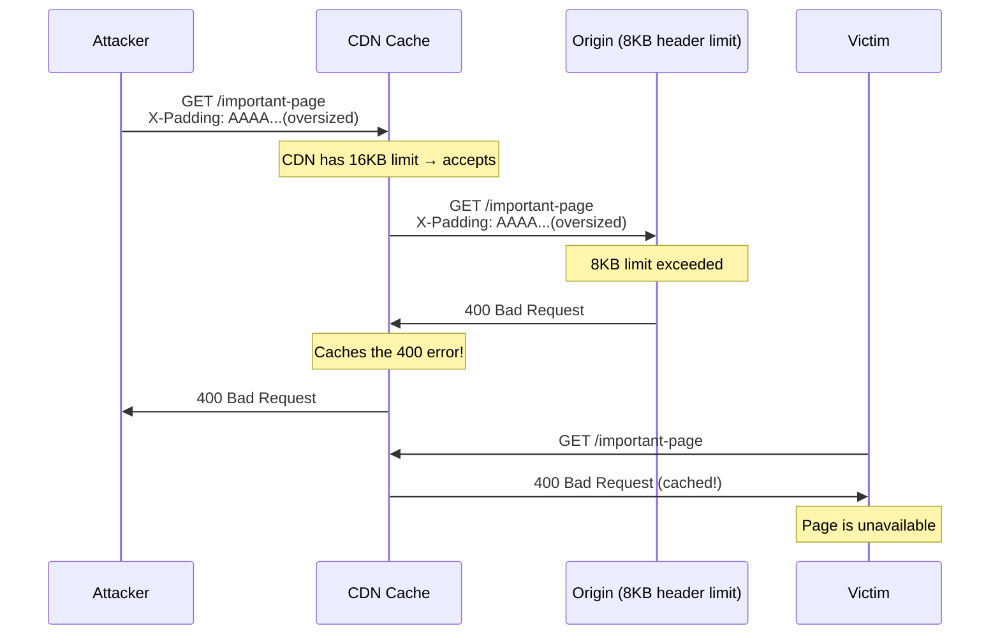

> **Planned** — This use case requires a dedicated `rules-cache-security` rule set that is not yet implemented.

Cache Poisoned Denial of Service (CPDoS) is a specialized form of cache poisoning where the attacker's goal is not to serve malicious content but to make a resource completely unavailable. The attacker sends a request that causes the origin server to return an error response (400, 405, 501), and the cache stores this error for all subsequent users. The resource becomes inaccessible until the cache expires.

## Why RFC 9110 Alone Is Insufficient

RFC 9110 notes that certain error responses (404, 405, 410, 501) are cacheable by default. The interaction between _cacheable error responses_ and _attacker-controlled inputs that trigger errors_ is a cross-specification concern spanning both RFC 9110 (semantics) and RFC 9111 (caching). No existing conformance rule addresses this combination.

## How It Works

Three variants documented by researchers Nguyen, Lo Iacono, and Federrath (ACM CCS 2019):

### HTTP Header Oversize (HHO)



### HTTP Meta Character (HMC)

Attacker injects meta characters (`\n`, `\r`, `\a`) in header values. The CDN forwards them; the origin rejects with 400. The cache stores the error.

### HTTP Method Override (HMO)

```http
GET /resource HTTP/1.1
X-HTTP-Method-Override: DELETE
```

The cache keys on `GET /resource`. The origin processes it as DELETE and returns an error or empty body. All subsequent GET requests receive the cached error.

## Rules That Would Be Needed

As part of a `rules-cache-security` package:

- Error responses (4xx/5xx) triggered by request-specific inputs SHOULD include `Cache-Control: no-store`
- 400 responses SHOULD NOT be cached by default (stricter than RFC 9111)
- `X-HTTP-Method-Override` MUST NOT be honored on cacheable requests
- Responses to requests with unusual or oversized headers SHOULD NOT be cached

## Further Reading

- Hoai Viet Nguyen, Luigi Lo Iacono, Hannes Federrath, ["Your Cache Has Fallen: Cache-Poisoned Denial-of-Service Attack"](https://cpdos.org/) (ACM CCS 2019) — The original CPDoS research
- [CPDoS.org](https://cpdos.org/) — Dedicated research site with details on all three variants
- [RFC 9111, Section 3 — Storing Responses in Caches](https://www.rfc-editor.org/rfc/rfc9111#section-3) — Which responses are cacheable by default
