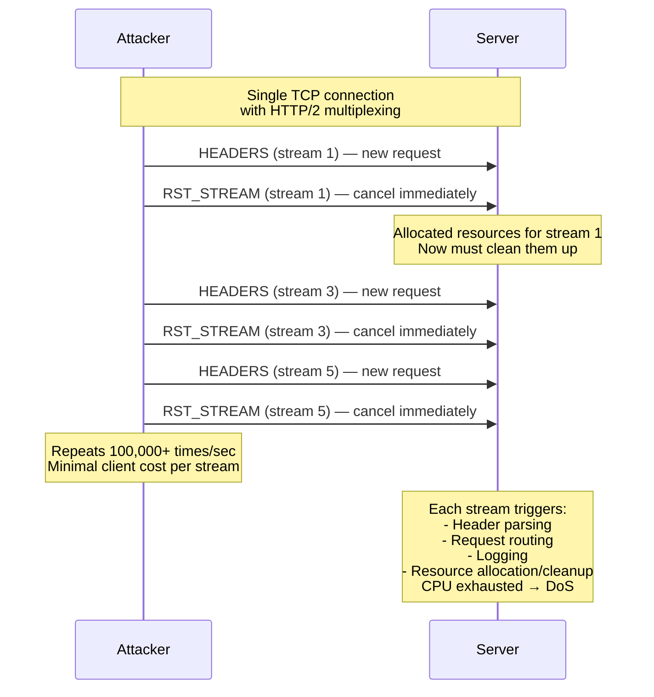

> **Planned** — This use case requires a dedicated `rules-h2-security` rule set that is not yet implemented.

In October 2023, Cloudflare, Google, and Amazon Web Services jointly disclosed CVE-2023-44487 — a novel denial-of-service technique exploiting a fundamental feature of HTTP/2. HTTP/2 allows multiplexing many streams (requests) over a single TCP connection. The Rapid Reset attack opens streams and immediately sends `RST_STREAM` frames to cancel them. The server allocates resources for each stream (parsing headers, routing, logging), but the client frees its resources immediately on reset. This asymmetry allows an attacker to generate hundreds of thousands of requests per second from a single connection, overwhelming servers with minimal client cost.

## Why RFC 9110 Alone Is Insufficient

RFC 9110 defines HTTP semantics independent of framing. Stream multiplexing, RST_STREAM frames, and connection-level flow control are HTTP/2 framing concerns defined in RFC 9113. The attack exploits a design-level feature of the protocol, not a conformance violation.

## How It Works

The attack produced some of the largest DDoS attacks ever recorded. Cloudflare reported attacks exceeding 200 million requests per second. The attack was effective against virtually every HTTP/2 implementation, as `RST_STREAM` is a fundamental protocol mechanism, not an edge case.

## Rules That Would Be Needed

As part of a `rules-h2-security` package:

- Rate limiting on new stream creation per connection
- Detection of `RST_STREAM` immediately following `HEADERS` (likely attack pattern)
- Enforcement of `SETTINGS_MAX_CONCURRENT_STREAMS` to reasonable values
- Connection-level rate limiting for stream creation and reset
- Tracking of reset-to-request ratio as an abuse indicator

## Further Reading

- [CVE-2023-44487](https://nvd.nist.gov/vuln/detail/CVE-2023-44487) — HTTP/2 Rapid Reset Attack
- Cloudflare, ["HTTP/2 Rapid Reset: deconstructing the record-breaking attack"](https://blog.cloudflare.com/technical-breakdown-http2-rapid-reset-ddos-attack/) (October 2023) — Technical breakdown
- Google, ["How it's possible to get hacked by an HTTP/2 feature"](https://cloud.google.com/blog/products/identity-security/how-it-works-the-novel-http2-rapid-reset-ddos-attack) (October 2023) — Google's analysis
- [RFC 9113, Section 6.4 — RST_STREAM](https://www.rfc-editor.org/rfc/rfc9113#section-6.4) — The RST_STREAM frame specification
