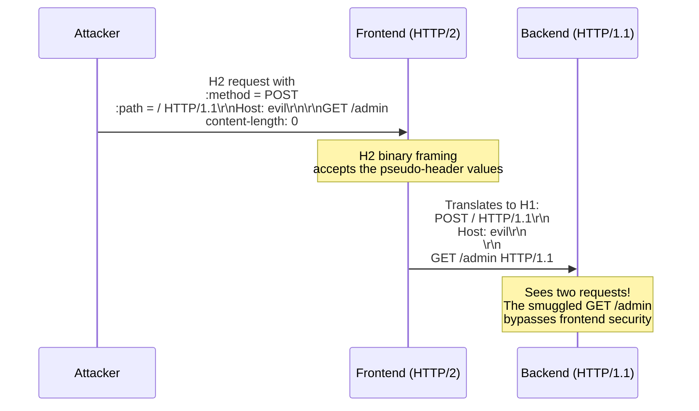

> **Planned** — This use case requires a dedicated `rules-h2-security` rule set that is not yet implemented.

HTTP/2 uses binary framing with explicit length fields, which eliminates the Content-Length vs Transfer-Encoding ambiguity that enables classic request smuggling. However, most production architectures use HTTP/2 on the frontend (CDN, reverse proxy) and downgrade to HTTP/1.1 for the backend. This protocol translation reintroduces smuggling opportunities: HTTP/2 pseudo-headers, binary framing, and header representation differences can be exploited during the conversion to inject or manipulate HTTP/1.1 requests on the backend.

## Why RFC 9110 Alone Is Insufficient

RFC 9110 defines HTTP semantics independent of the wire format. The smuggling occurs during _protocol translation_, which is an implementation concern outside the semantics specification. The HTTP/2 spec (RFC 9113) has its own rules, but the translation gap between the two protocols is undercovered by either specification.

## How It Works



Key translation vulnerabilities include:

- **Header injection via pseudo-headers** — HTTP/2 pseudo-headers (`:method`, `:path`, `:authority`) are translated to HTTP/1.1 request line and Host header. If these contain CRLF characters, the translation can inject additional H1 headers.
- **Content-Length mismatch** — H2 allows sending a body with `content-length: 0`, which the frontend may not validate. The backend receives a mismatched Content-Length.
- **Transfer-Encoding in H2** — `Transfer-Encoding` is forbidden in HTTP/2 but some implementations fail to strip it during downgrade, reintroducing the CL/TE conflict.
- **Case sensitivity** — H2 headers are always lowercase; H1 is case-insensitive. This difference can be exploited to bypass header-based security checks.

## HTTP Examples

**H2 request with injected newlines in :path:**

```
:method: GET
:path: / HTTP/1.1\r\nHost: evil.com\r\n\r\nGET /admin
:authority: target.com
```

When translated to H1, the `:path` value creates a complete injected request.

**H2 request with Transfer-Encoding (forbidden but sometimes passed through):**

```
:method: POST
:path: /api
transfer-encoding: chunked
content-length: 5

0

G
```

If the frontend passes `transfer-encoding` during downgrade, the backend faces the classic CL/TE conflict.

## Rules That Would Be Needed

A `rules-h2-security` package would need to detect:

- Pseudo-header values containing CR, LF, or NUL characters
- `Transfer-Encoding` headers in HTTP/2 messages (must be rejected)
- Content-Length mismatches between H2 frame length and header value after translation
- `:path` values containing full URIs or authority components when unexpected

## Further Reading

- James Kettle, ["HTTP/2: The Sequel is Always Worse"](https://portswigger.net/research/http2) (Black Hat USA 2021) — H2/H1 desync exploitation
- Emil Lerner, ["HTTP Request Smuggling via Higher HTTP Versions"](https://standoff365.com/phdays10/schedule/tech/http-request-smuggling-via-higher-http-versions) (2021) — Advanced H2 smuggling techniques
- [CVE-2021-33193](https://nvd.nist.gov/vuln/detail/CVE-2021-33193) — Apache HTTP Server H2 request smuggling
- [RFC 9113 — HTTP/2](https://www.rfc-editor.org/rfc/rfc9113) — HTTP/2 framing and header requirements
