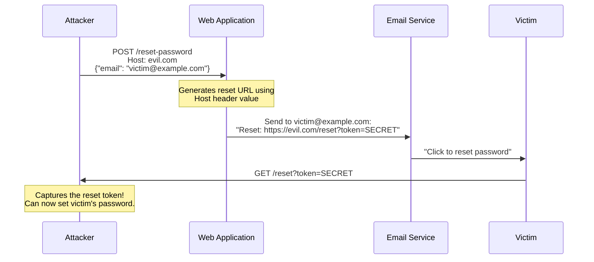

> **Planned** — This use case requires a dedicated `rules-host-security` rule set that is not yet implemented.

The `Host` header determines where an HTTP request is routed — which virtual host, which application, which backend. When applications use the Host header value to generate URLs, redirects, or email links, they become vulnerable to Host header injection. An attacker can supply a malicious Host value and trick the application into generating URLs that point to the attacker's domain. This is most devastating in password reset flows, where the reset link is emailed to the victim but points to the attacker's server.

## Why RFC 9110 Alone Is Insufficient

RFC 9110 requires the Host header to be present and mandates rejection of requests with multiple Host headers. Thymian's existing rules enforce this. However, RFC 9110 does not:

- Restrict how applications _use_ the Host value (e.g., for URL generation)
- Address discrepancies between `Host`, `X-Forwarded-Host`, and `:authority` (H2)
- Prevent routing confusion when intermediaries rewrite the Host header

## How It Works

### Password Reset Poisoning

### Routing Confusion

When multiple Host values are present (via `Host`, `X-Forwarded-Host`, or duplicate headers), different components may route to different backends, enabling access to internal services or administrative interfaces.

## Rules That Would Be Needed

A `rules-host-security` package would need to detect:

- Response content (redirects, links, URLs) that reflects raw Host header values without validation against an allowlist
- Requests with multiple conflicting `Host` headers
- Discrepancies between `:authority` (H2) and `Host` (H1) in translated requests
- `X-Forwarded-Host` headers honored from untrusted sources
- Application-generated URLs derived from the Host header rather than a configured base URL

## Further Reading

- James Kettle, ["Cracking the Lens: Targeting HTTP's Hidden Attack Surface"](https://portswigger.net/research/cracking-the-lens-targeting-https-hidden-attack-surface) (Black Hat USA 2017) — Host header attack surface research
- [PortSwigger Web Security Academy — Host Header Attacks](https://portswigger.net/web-security/host-header) — Comprehensive guide to Host header attack variants
- [CVE-2016-10073](https://nvd.nist.gov/vuln/detail/CVE-2016-10073) — Password reset poisoning via Host header
