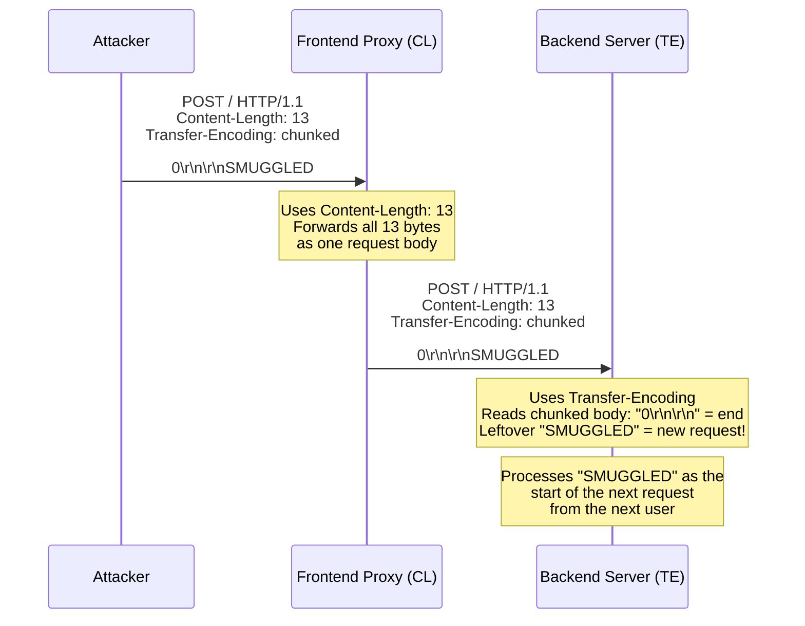

> **Planned** — This use case requires a dedicated `rules-http-smuggling` rule set that is not yet implemented.

HTTP request smuggling via CL/TE desync is one of the most critical classes of web vulnerabilities. It exploits a fundamental ambiguity: when an HTTP message contains both a `Content-Length` header and a `Transfer-Encoding: chunked` header, which one determines the message boundary? Different implementations answer differently, and this disagreement lets an attacker "smuggle" a second request inside the first.

## Why RFC 9110 Alone Is Insufficient

RFC 9110 (Section 8.6) states that senders MUST NOT forward messages with incorrect Content-Length, and the existing Thymian rules catch individual messages with invalid Content-Length values. However:

- The smuggling attack requires _two systems_ that disagree — checking each message in isolation misses the cross-system parsing discrepancy
- The conflict between Content-Length and Transfer-Encoding is a _framing_ concern (RFC 9112), not a _semantics_ concern (RFC 9110)
- Obfuscated Transfer-Encoding values (extra whitespace, mixed casing, vertical tabs) trick some parsers while passing others' validation
- The attack surface is the _interaction_ between components, not any single message's conformance

## How It Works

There are three classic variants:

### CL.TE — Front-end uses Content-Length, back-end uses Transfer-Encoding



### TE.CL — Front-end uses Transfer-Encoding, back-end uses Content-Length

The reverse: the front-end processes the chunked encoding correctly but the backend reads only Content-Length bytes, leaving the rest of the chunked body as a smuggled request.

### TE.TE — Both support Transfer-Encoding but one is tricked

```http
POST / HTTP/1.1
Transfer-Encoding: chunked
Transfer-Encoding: x
```

One system processes `chunked`, the other sees the invalid `x` and falls back to Content-Length. The disagreement creates the smuggling opportunity.

## HTTP Examples

**CL.TE smuggling payload:**

```http
POST / HTTP/1.1
Host: vulnerable.example.com
Content-Length: 30
Transfer-Encoding: chunked

0

GET /admin HTTP/1.1
X: x
```

The frontend forwards 30 bytes (the whole body). The backend reads the chunked body (`0\r\n\r\n` = empty, end of chunks), then interprets `GET /admin HTTP/1.1` as the next request.

**TE.TE obfuscation techniques:**

```http
Transfer-Encoding: chunked
Transfer-Encoding: cow

Transfer-Encoding : chunked

Transfer-Encoding: chunked
Transfer-Encoding: identity

Transfer-Encoding:
 chunked

Transfer-Encoding: xchunked
```

Each of these has been shown to cause different behavior in different HTTP implementations, creating the disagreement needed for smuggling.

## Rules That Would Be Needed

A `rules-http-smuggling` package would need to detect:

- Messages containing both `Content-Length` and `Transfer-Encoding` headers simultaneously
- Obfuscated `Transfer-Encoding` values (whitespace, mixed casing, null characters)
- Multiple conflicting `Content-Length` values
- Chunked encoding terminators that do not conform to the expected format
- Content-Length values that do not match actual body length across a proxy hop

## Further Reading

- Linhart, Heydt-Benjamin, Neville, Novik, ["HTTP Request Smuggling"](https://www.cgisecurity.com/lib/HTTP-Request-Smuggling.pdf) (Watchfire, 2005) — The original paper
- James Kettle, ["HTTP Desync Attacks: Request Smuggling Reborn"](https://portswigger.net/research/http-desync-attacks-request-smuggling-reborn) (DEF CON 27, 2019) — Modern exploitation against CDNs and load balancers
- [RFC 9112, Section 6.3 — Message Body Length](https://www.rfc-editor.org/rfc/rfc9112#section-6.3) — HTTP/1.1 framing rules for CL vs TE priority
- [CVE-2023-25690](https://nvd.nist.gov/vuln/detail/CVE-2023-25690) — Apache HTTP Server mod_proxy request smuggling
