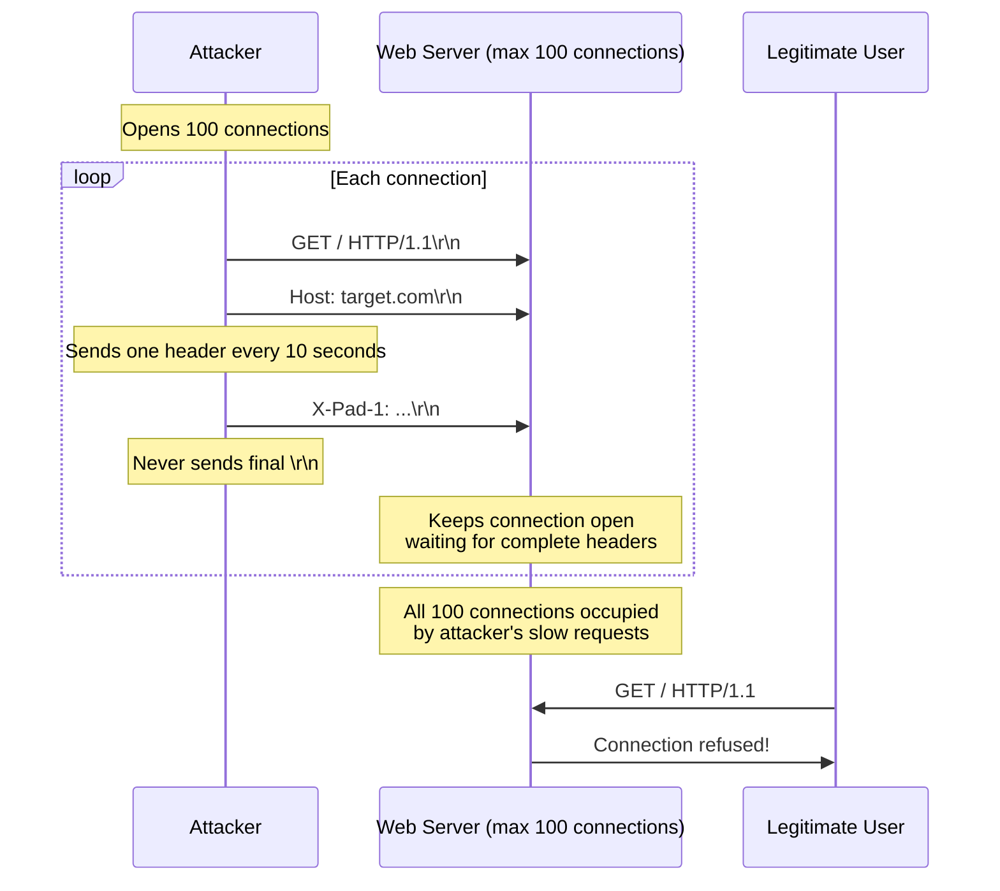

> **Planned** — This use case requires a dedicated `rules-dos-prevention` rule set that is not yet implemented.

Slow HTTP attacks exploit the server's patience. Instead of flooding a server with traffic (which requires significant attacker bandwidth), these attacks open many connections and send data as slowly as possible. Each slow connection occupies a server thread or socket, and when all connections are consumed by the attacker's slow requests, legitimate users cannot connect. A single laptop can take down a web server.

## Why RFC 9110 Alone Is Insufficient

RFC 9110 defines no timeouts, minimum data rates, or connection limits. The protocol is designed to be tolerant of slow networks and unreliable connections — exactly the property attackers exploit. Timeout and rate enforcement is an implementation concern outside the scope of HTTP semantics.

## How It Works

### Slowloris

### Slow POST

The attacker sends valid headers with a large `Content-Length`, then sends the body at 1 byte per second. The server allocates resources waiting for the full body.

### Slow Read

The attacker sends a legitimate request but reads the response extremely slowly (1 byte/second), keeping the server-side socket and buffers allocated.

## Rules That Would Be Needed

A `rules-dos-prevention` package would need to detect:

- Minimum data rate thresholds for request headers and body
- Maximum time for receiving complete request headers
- Maximum time for receiving complete request body relative to Content-Length
- Concurrent connection limits per client IP
- Connections with no data transfer for extended periods

## Further Reading

- Robert "RSnake" Hansen, ["Slowloris HTTP DoS"](https://web.archive.org/web/2009*/ha.ckers.org/slowloris/) (2009) — The original Slowloris tool and technique
- Sergey Shekyan, ["Are You Ready for Slow Reading?"](https://blog.qualys.com/vulnerabilities-threat-research/2012/01/05/slow-read) (Qualys, 2012) — Slow read attack research
- [OWASP — Slow HTTP Denial of Service Attack](https://owasp.org/www-community/attacks/Slow_Http_attack) — Overview and mitigations
