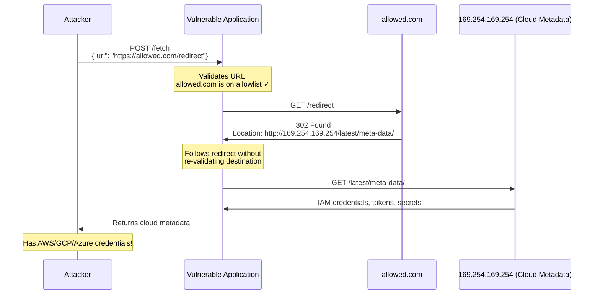

> **Planned** — This use case requires a dedicated `rules-ssrf-prevention` rule set that is not yet implemented.

Server-Side Request Forgery (SSRF) occurs when an attacker tricks a server-side application into making HTTP requests to unintended destinations — typically internal services, cloud metadata endpoints, or other protected resources. HTTP redirects make SSRF dramatically harder to defend against: even if an application validates the initial URL against an allowlist, a redirect from the allowed host can point to an internal resource, bypassing all checks.

## Why RFC 9110 Alone Is Insufficient

RFC 9110 defines redirect semantics (3xx status codes) but intentionally does not restrict which URLs a client should follow. The protocol is designed for interoperability across the open internet. SSRF prevention requires _application-level_ restrictions on redirect targets — something no protocol spec can or should mandate.

## How It Works

The 2019 Capital One data breach — one of the largest in US history, exposing 100+ million customer records — exploited SSRF to access AWS metadata credentials.

## Rules That Would Be Needed

A `rules-ssrf-prevention` package would need to detect:

- Redirects targeting private/reserved IP ranges (RFC 1918, link-local, loopback)
- Redirects to cloud metadata endpoints (169.254.169.254, fd00::, etc.)
- Redirect chains exceeding a maximum depth
- Protocol downgrades in redirects (HTTPS to HTTP)
- Redirects to non-HTTP schemes (file://, gopher://, dict://)
- DNS rebinding: resolved IP re-validation after redirect

## Further Reading

- Orange Tsai, ["A New Era of SSRF"](https://www.blackhat.com/docs/us-17/thursday/us-17-Tsai-A-New-Era-Of-SSRF-Exploiting-URL-Parser-In-Trending-Programming-Languages.pdf) (Black Hat USA 2017) — URL parsing exploitation for SSRF
- [Capital One Data Breach Analysis](https://krebsonsecurity.com/2019/07/capital-one-data-theft-impacts-106m-people/) — SSRF exploitation of AWS metadata in the wild
- [OWASP — Server-Side Request Forgery](https://owasp.org/www-community/attacks/Server_Side_Request_Forgery) — Overview and prevention
