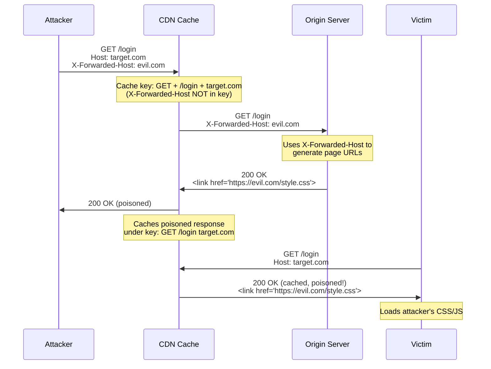

> **Planned** — This use case requires a dedicated `rules-cache-security` rule set that is not yet implemented.

Web cache poisoning exploits the gap between what a cache uses as its key (typically the URL and Host header) and what actually influences the response content. When a request header affects the response but is not included in the cache key, an attacker can send a request with a malicious header, cause the poisoned response to be cached, and then every subsequent user requesting that URL receives the attacker's content.

## Why RFC 9110 Alone Is Insufficient

RFC 9110 defines the `Vary` header for content negotiation, and Thymian's existing rules validate its presence. However:

- `Vary` only covers standard content negotiation dimensions — it does not address application-specific inputs like `X-Forwarded-Host` that influence response content
- Caching behavior (cache keys, storage, revalidation) is defined in RFC 9111, not RFC 9110
- The fundamental problem is _application-level_: which inputs are reflected in responses. No protocol spec can fully address this.
- Cache key construction differs across CDN vendors, making it impossible to validate with protocol-level checks alone

## How It Works

Common unkeyed inputs exploited include:

- `X-Forwarded-Host`, `X-Forwarded-Scheme`, `X-Forwarded-Proto`
- `X-Original-URL`, `X-Rewrite-URL`
- `X-HTTP-Method-Override`
- Fat GET requests (GET with a body)
- URL path normalization differences (`/path` vs `/path/` vs `/PATH`)

## Rules That Would Be Needed

A `rules-cache-security` package would need to detect:

- Responses that reflect `X-Forwarded-Host` or similar headers in content without including them in `Vary` or marking the response uncacheable
- GET requests with bodies being cached
- Responses reflecting unvalidated `Host` header values in URLs, redirects, or link elements
- `X-HTTP-Method-Override` headers on cacheable GET requests
- Cacheable responses that vary by unkeyed inputs

## Further Reading

- James Kettle, ["Practical Web Cache Poisoning"](https://portswigger.net/research/practical-web-cache-poisoning) (Black Hat USA 2018) — The foundational research on modern cache poisoning
- James Kettle, ["Web Cache Entanglement: Novel Pathways to Poisoning"](https://portswigger.net/research/web-cache-entanglement) (Black Hat USA 2020) — Advanced techniques
- Hoai Viet Nguyen et al., ["Web Cache Deception Escalates!"](https://www.usenix.org/conference/usenixsecurity23/presentation/nguyen) (USENIX Security 2023) — Academic study
- [RFC 9111 — HTTP Caching](https://www.rfc-editor.org/rfc/rfc9111) — Cache key and storage semantics
