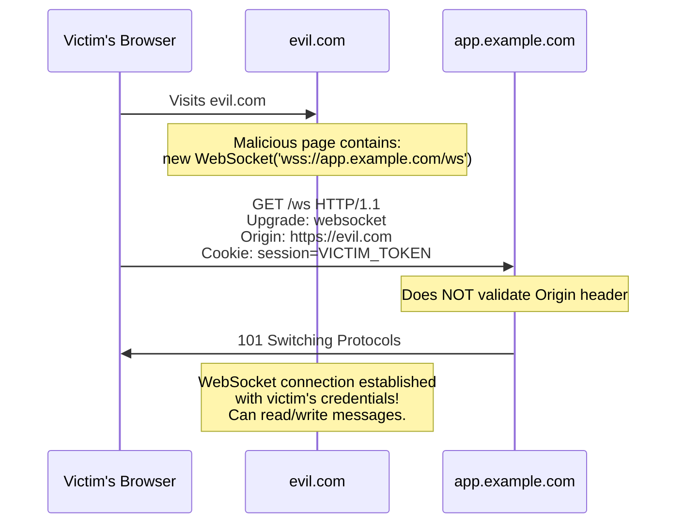

> **Planned** — This use case requires a dedicated `rules-websocket-security` rule set that is not yet implemented.

WebSocket connections start as HTTP requests that are "upgraded" to a persistent bidirectional channel. This upgrade mechanism creates two distinct attack surfaces: **cross-site WebSocket hijacking** (CSWSH), where an attacker's web page initiates a WebSocket connection to a victim's authenticated service, and **WebSocket smuggling**, where attackers exploit the fact that reverse proxies stop inspecting traffic after the HTTP-to-WebSocket upgrade.

## Why RFC 9110 Alone Is Insufficient

RFC 9110 defines the `Upgrade` mechanism but explicitly defers WebSocket specifics to RFC 6455. The cross-origin validation, post-upgrade security, and authentication concerns are entirely outside the HTTP semantics scope.

## How It Works

### Cross-Site WebSocket Hijacking

### WebSocket Smuggling

After the HTTP upgrade, some reverse proxies stop inspecting traffic on that connection. An attacker can send raw HTTP requests through the WebSocket tunnel, bypassing the WAF, rate limiting, and IP-based access controls that the reverse proxy enforced.

## Rules That Would Be Needed

A `rules-websocket-security` package would need to detect:

- Missing `Origin` header validation during WebSocket upgrade handshakes
- Missing or malformed `Sec-WebSocket-Key` in upgrade requests
- Missing `Sec-WebSocket-Accept` with correct hash in upgrade responses
- WebSocket connections that rely solely on cookies for authentication (vulnerable to CSWSH)
- Post-upgrade traffic patterns that indicate smuggling attempts

## Further Reading

- Christian Schneider, ["Cross-Site WebSocket Hijacking"](https://christian-schneider.net/CrossSiteWebSocketHijacking.html) (2013) — The original CSWSH documentation
- Mikhail Egorov, ["WebSocket Smuggling"](https://github.com/0ang3el/websocket-smuggle) (2021) — Post-upgrade smuggling research
- [RFC 6455 — The WebSocket Protocol](https://www.rfc-editor.org/rfc/rfc6455) — WebSocket handshake and security requirements
- [PortSwigger — WebSocket Security Vulnerabilities](https://portswigger.net/web-security/websockets) — Practical exploitation guide
