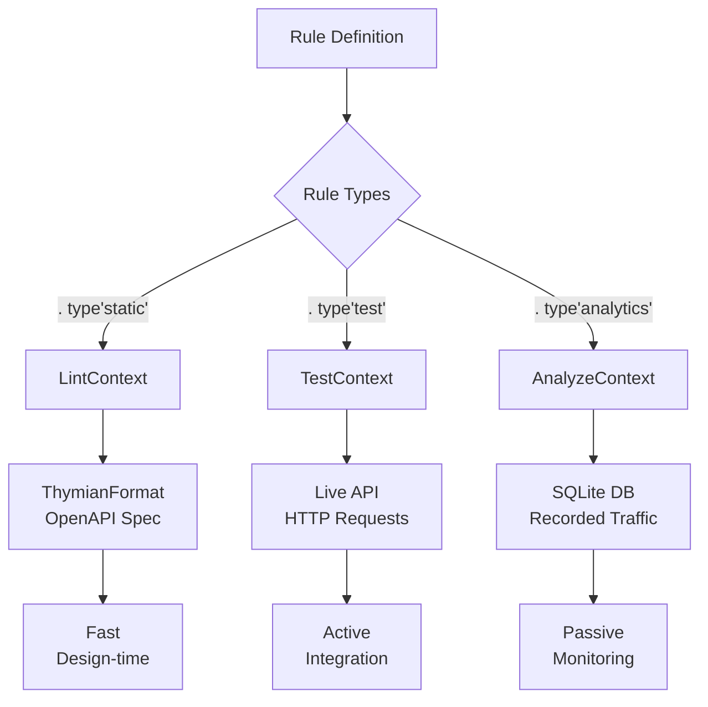
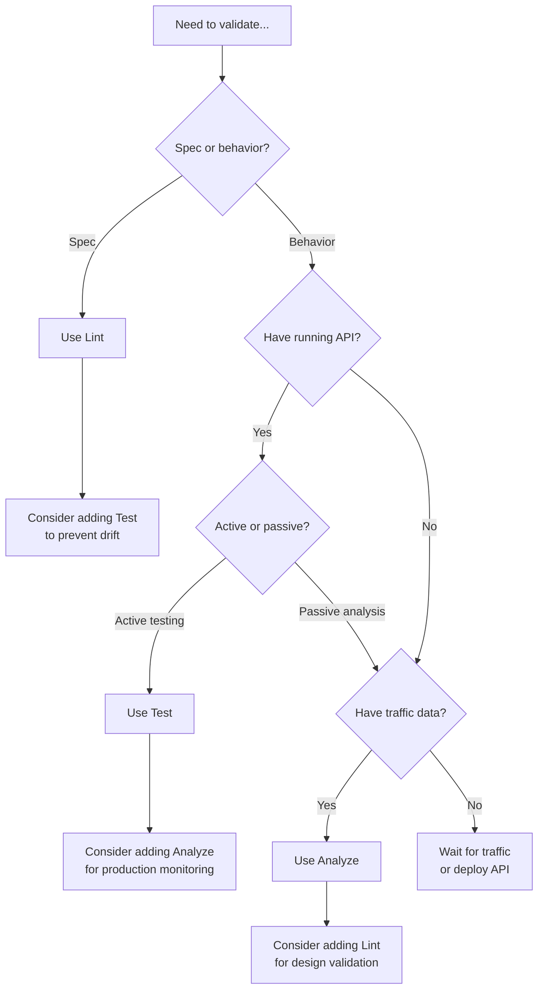

Thymian provides three validation contexts, each designed for a specific stage in the API development lifecycle. Understanding when and how to use each context helps you create effective validation rules.

## Context Overview



Each context provides different capabilities and trade-offs:

| Context     | Speed         | Network | Data Source      | Use Case              |
| ----------- | ------------- | ------- | ---------------- | --------------------- |
| **Lint**    | ⚡ Very Fast  | No      | OpenAPI spec     | Design validation     |
| **Test**    | ⏱️ Variable\* | Yes     | Live API         | Integration testing   |
| **Analyze** | ⚡ Fast       | No      | Recorded traffic | Production monitoring |

_\*Test speed depends on API endpoint performance and network conditions_

## Lint Context

### What It Does

The **lint context** validates API specifications without making any HTTP calls. It analyzes the Thymian format (derived from OpenAPI documents) to check that your API design follows rules.

### When to Use

- **During design phase** — Catch issues before writing code
- **In CI/CD pipelines** — Fast feedback on spec changes
- **Design-first workflows** — Validate specs as you create them
- **API governance** — Enforce organizational standards

### Advantages

- ✅ **Very fast** — No network latency, validates in milliseconds
- ✅ **No dependencies** — Doesn't require a running API
- ✅ **Comprehensive coverage** — Checks all defined endpoints
- ✅ **Early feedback** — Catches issues before implementation

### Limitations

- ❌ **Spec-only** — Can't validate actual API behavior
- ❌ **No runtime checks** — Can't detect implementation issues
- ❌ **Limited to definitions** — Only validates what's documented

### Example Usage

```typescript
import { httpRule } from '@thymian/core';
import { statusCode, not, responseHeader } from '@thymian/core';

export default httpRule('require-rate-limit-headers')
  .severity('warn')
  .type('static') // Lint context only
  .description('All responses must define rate limiting headers')
  .appliesTo('server')
  .rule((ctx) => ctx.validateCommonHttpTransactions(statusCode(200), not(responseHeader('x-ratelimit-limit'))))
  .done();
```

### What Gets Validated

The lint context checks:

- Request/response definitions in OpenAPI specs
- Header presence and schemas
- Status code definitions
- Media type declarations
- Path parameter definitions
- Query parameter schemas

### Common Use Cases

**1. Enforce header requirements:**

```typescript
// Ensure all error responses define Content-Type
.
type('static')
  .rule((ctx) =>
    ctx.validateCommonHttpTransactions(
      statusCodeRange(400, 599),
      not(responseHeader('content-type'))
    )
  )
```

**2. Validate status codes:**

```typescript
// Check that DELETE operations define 204 responses
.
type('static')
  .rule((ctx) =>
    ctx.validateCommonHttpTransactions(
      method('DELETE'),
      not(statusCode(204))
    )
  )
```

**3. Check request bodies:**

```typescript
// POST requests should define request bodies
.
type('static')
  .rule((ctx) =>
    ctx.validateCommonHttpTransactions(
      method('POST'),
      not(hasRequestBody())
    )
  )
```

## Test Context

### What It Does

The **test context** generates and executes HTTP requests against a live API. It actively tests endpoints to validate that the implementation follows rules.

### When to Use

- **Integration testing** — Validate API implementation
- **CI/CD pipelines** — Test changes before deployment
- **Continuous validation** — Ensure API compliance
- **Behavior verification** — Test actual server responses

### Advantages

- ✅ **Tests real implementation** — Validates actual behavior
- ✅ **Discovers runtime issues** — Finds problems specs don't catch
- ✅ **Verifies compliance** — Confirms servers follow standards
- ✅ **Active probing** — Tests edge cases and error scenarios

### Limitations

- ❌ **Speed depends on API** — Performance varies based on endpoint response times and network conditions
- ❌ **Requires running API** — Can't test without deployment
- ❌ **May affect state** — Tests can modify data
- ❌ **Limited coverage** — Only tests what you configure

### Example Usage

```typescript
import { httpRule } from '@thymian/core';
import { not, responseHeader } from '@thymian/core';

export default httpRule('test-request-id-propagation')
  .severity('error')
  .type('test') // Test context only
  .description('Live API must return X-Request-ID for request tracking')
  .appliesTo('server')
  .rule((ctx) => ctx.validateHttpTransactions(not(responseHeader('x-request-id'))))
  .done();
```

### What Gets Validated

The test context checks:

- Actual HTTP responses from live endpoints
- Header values in real responses
- Status codes returned by servers
- Response bodies and formats
- Server behavior under specific conditions

### Advanced: Custom Test Logic

For complex scenarios, override the default test behavior:

```typescript
import { httpRule } from '@thymian/core';
import { and, method, not, statusCode } from '@thymian/core';
import { singleTestCase } from '@thymian/core';

export default httpRule('server-supports-get-head')
  .severity('error')
  .type('test')
  .description('Server must support GET and HEAD methods')
  .appliesTo('server')
  .overrideTest((ctx) =>
    ctx.httpTest(
      singleTestCase()
        .forTransactionsWith(method('GET'))
        .run({ checkResponse: false })
        .expectForTransactions(not(statusCode(501)))
        .done(),
    ),
  )
  .done();
```

### Test Options

The test context supports options for controlling test behavior:

```typescript
type Options = {
  testAllEndpoints?: boolean;
};

const schema: JSONSchemaType<Options> = {
  type: 'object',
  properties: {
    testAllEndpoints: {
      type: 'boolean',
      nullable: true,
      default: false,
    },
  },
};

export default httpRule('configurable-test')
  .options<Options>(schema)
  .type('test')
  .overrideTest((ctx, options) => {
    // Use options.testAllEndpoints in test logic
  })
  .done();
```

## Analyze Context

### What It Does

The **analyze context** validates recorded HTTP transactions stored in a SQLite database. It analyzes real traffic that has already occurred.

### When to Use

- **Production monitoring** — Validate live traffic patterns
- **Post-deployment analysis** — Discover issues in production
- **Traffic auditing** — Ensure compliance with policies
- **Debugging** — Analyze problematic transactions

### Advantages

- ✅ **Real-world data** — Validates actual usage patterns
- ✅ **No impact** — Passive analysis, doesn't affect services
- ✅ **Historical analysis** — Can analyze past traffic
- ✅ **SQL optimization** — Efficient queries on large datasets

### Limitations

- ❌ **Requires recorded data** — Need traffic collection
- ❌ **Passive only** — Can't test, only analyze
- ❌ **Coverage depends on traffic** — Only checks what was recorded
- ❌ **After the fact** — Discovers issues after they occurred

### Example Usage

```typescript
import { httpRule } from '@thymian/core';
import { statusCode, not, responseHeader } from '@thymian/core';

export default httpRule('analyze-401-responses')
  .severity('error')
  .type('analytics') // Analyze context only
  .description('Recorded 401 responses must include WWW-Authenticate')
  .appliesTo('server')
  .rule((ctx) => ctx.validateCommonHttpTransactions(statusCode(401), not(responseHeader('www-authenticate'))))
  .done();
```

### What Gets Validated

The analyze context checks:

- Recorded HTTP request/response pairs
- Header values from real traffic
- Status code patterns
- Response formats and content
- Transaction sequences and flows

### SQL Optimization

The analyze context automatically compiles filter expressions to SQL for efficiency:

```typescript
// This filter...
ctx.validateCommonHttpTransactions(not(responseHeader('x-correlation-id')));

// ...is compiled to SQL like:
// SELECT * FROM http_transactions
// WHERE NOT EXISTS (
//   SELECT 1 FROM request_headers
//   WHERE header_name = 'x-correlation-id'
// )
```

This makes analytics rules perform well even on large datasets.

### Advanced: Custom SQL Queries

For complex analysis, write custom SQL:

```typescript
export default httpRule('analyze-auth-flow')
  .severity('warn')
  .type('analytics')
  .description('Validate authentication flow patterns')
  .appliesTo('server')
  .overrideAnalyticsRule((ctx) => {
    const db = ctx.repository.db;

    // Custom SQL for complex analysis
    const query = `
      SELECT t1.id, t2.id
      FROM http_transactions t1
      JOIN http_transactions t2 ON t1.request_url = t2.request_url
      WHERE t1.response_status = 401
        AND t2.response_status = 200
        AND t2.timestamp > t1.timestamp
    `;

    const violations = [];
    const stmt = db.prepare(query);

    for (const row of stmt.iterate()) {
      const [req, res] = ctx.repository.readTransactionById(row.id);

      if (needsValidation(req, res)) {
        violations.push({
          location: { elementType: 'edge', elementId: row.id },
        });
      }
    }

    return violations;
  })
  .done();
```

## Choosing the Right Context

### Decision Tree



### Common Patterns

**Pattern 1: Design + Implementation**

```typescript
.
type('static', 'test')  // Catch drift between spec and code
```

**Pattern 2: Implementation + Production**

```typescript
.
type('test', 'analytics')  // Validate both testing and live
```

**Pattern 3: Complete Coverage**

```typescript
.
type('static', 'test', 'analytics')  // Validate everywhere
```

## Next Steps

- Learn about [combining rule types](../guides/HTTP%20rules/combining-types.md) for hybrid validation
- Explore [how to use rules](../guides/HTTP%20rules/how-to-use-rules.md) in your projects
- See the [CLI reference](cli.md) for rule management commands
