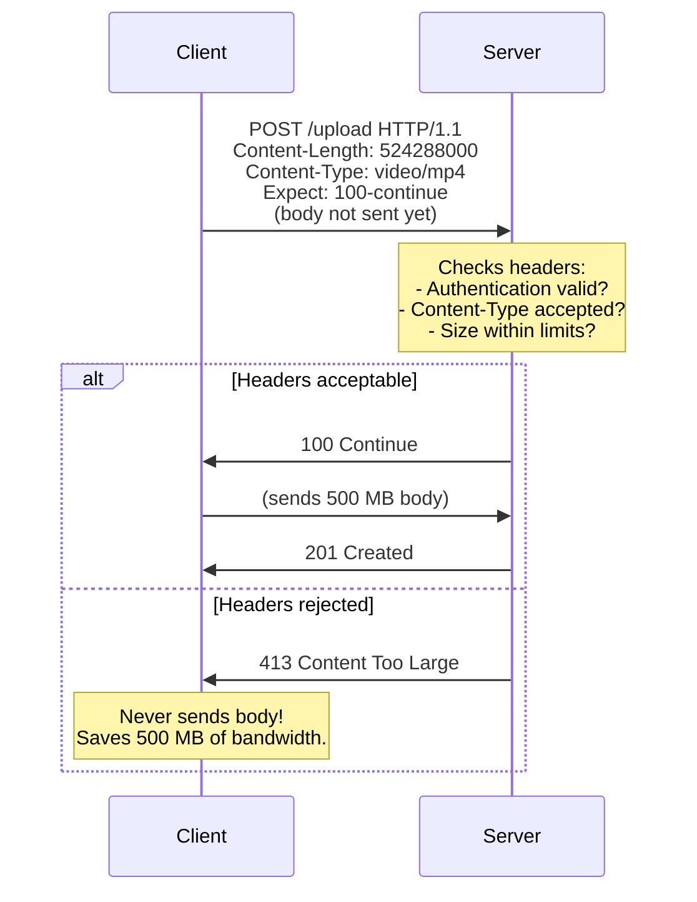
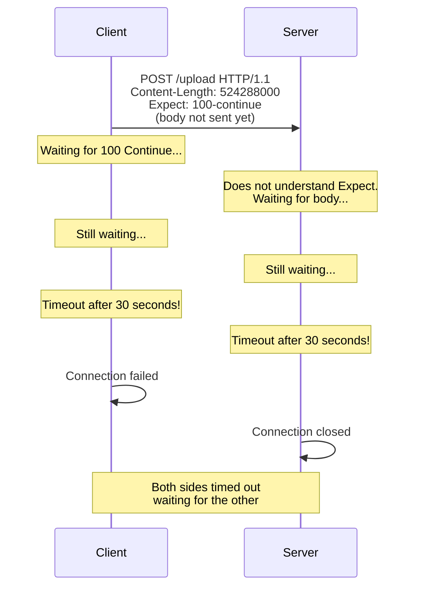

When a client needs to upload a large file or send a substantial request body, it faces a dilemma: should it send the entire body immediately, only to find out the server will reject it (wrong credentials, unsupported media type, payload too large)? Or should it wait for permission first? HTTP solves this with the `Expect: 100-continue` mechanism — the client sends headers with `Expect: 100-continue`, waits for the server to respond with `100 Continue` (go ahead) or an error (stop), and then either sends the body or aborts. When either side misimplements this handshake, the result is a deadlock: the client waits for permission, the server waits for the body, and both time out.

## Why This Matters

- **Upload deadlocks** — The client sends `Expect: 100-continue` and waits. The server does not recognize or ignores the `Expect` header and waits for the body. Both sides wait indefinitely until a timeout fires. This manifests as slow or failed uploads with no clear error message.
- **Wasted bandwidth** — Without `100-continue`, a client uploading a 500 MB file sends the entire file before learning the server will reject it with `401 Unauthorized` or `413 Content Too Large`. On slow connections, this wastes minutes of upload time and significant bandwidth.
- **Timeout cascading in microservices** — In microservice architectures, a deadlock between one service pair cascades through the chain. Service A waits for B's `100 Continue`, B waits for A's body, upstream services time out waiting for A, and the entire request chain fails.
- **HTTP/1.0 incompatibility** — Older servers that speak HTTP/1.0 do not understand `Expect: 100-continue`. If they do not ignore it gracefully (as required), the client waits forever for a response that will never come.

## How It Works

The correct `100-continue` flow:



The deadlock scenario:



## HTTP Examples

**Correct flow — server responds to Expect immediately:**

```http
# Step 1: Client sends headers with Expect
POST /api/files HTTP/1.1
Host: storage.example.com
Content-Type: application/octet-stream
Content-Length: 104857600
Authorization: Bearer eyJhbG...
Expect: 100-continue

# Step 2: Server validates headers, sends 100
HTTP/1.1 100 Continue

# Step 3: Client sends body
(104857600 bytes of file data)

# Step 4: Server sends final response
HTTP/1.1 201 Created
Location: /api/files/abc123
```

**Correct rejection — server rejects before body is sent:**

```http
# Client sends headers:
POST /api/files HTTP/1.1
Host: storage.example.com
Content-Type: application/octet-stream
Content-Length: 5368709120
Expect: 100-continue

# Server rejects immediately (file too large):
HTTP/1.1 413 Content Too Large
Content-Type: application/json

{"error": "Maximum upload size is 1 GB", "max_bytes": 1073741824}
```

The client saved 5 GB of upload bandwidth by learning the size limit before sending any data.

**Non-compliant — client sends Expect without body intent:**

```http
GET /api/status HTTP/1.1
Host: api.example.com
Expect: 100-continue
```

The `Expect: 100-continue` header is meaningless for requests without a body. The client MUST NOT generate it for requests that will not send content.

**Handling HTTP/1.0 servers:**

```http
# Client sends to HTTP/1.0 server:
POST /upload HTTP/1.1
Content-Length: 1048576
Expect: 100-continue

# HTTP/1.0 server MUST ignore Expect (does not understand it)
# Client SHOULD NOT wait indefinitely — after a timeout, send the body anyway
```

## How Thymian Detects This

Thymian validates 100-continue compliance using the following rules from the RFC 9110 rule set:

- **`origin-server-must-respond-immediately-to-100-continue-request`** — The most critical rule. Servers MUST immediately respond with `100 Continue` or an error status code when they receive `Expect: 100-continue`. Delaying causes the client to wait.
- **`origin-server-must-not-wait-for-content-before-100-continue`** — Ensures servers do not attempt to read the body before sending the 100 response, which would create the deadlock condition.
- **`client-must-not-generate-100-continue-without-content`** — Catches clients that send `Expect: 100-continue` on requests that will not include a body (like GET), which is meaningless and may confuse servers.
- **`client-should-not-wait-for-an-indefinite-period-for-100-response`** — Warns when clients wait forever for 100 Continue instead of implementing a timeout and sending the body anyway.
- **`client-must-send-expect-header-for-100-response`** — Validates that clients include the `Expect` header when they intend to wait for 100 Continue.
- **`client-may-proceed-to-send-content-without-receiving-100-response`** — Documents the fallback: after a reasonable timeout, the client may send the body even without receiving 100 Continue.
- **`server-must-send-final-status-after-100-continue`** — Ensures servers send a final response (2xx, 4xx, etc.) after `100 Continue`, not just the interim response.
- **`server-must-ignore-100-continue-in-http-1.0`** — Validates that HTTP/1.0 servers ignore the `Expect` header rather than failing on it.
- **`proxy-must-handle-100-continue-expectation`** — Ensures proxies correctly relay or handle the 100-continue negotiation between client and server.
- **`proxy-may-generate-immediate-100-response`** — Allows proxies to optimistically send 100 Continue to the client while forwarding the request to the backend.
- **`server-may-omit-sending-100-response-if-already-received-content`** — If the server has already received part of the body, it may skip the 100 response.
- **`client-should-repeat-request-without-expect-for-417`** — When a server responds with `417 Expectation Failed`, the client should retry without the `Expect` header.
- **`server-must-send-100-before-101-with-expect-header`** — Edge case: if switching protocols (WebSocket upgrade) after receiving `Expect: 100-continue`, the 100 response must be sent first.
- **`server-may-respond-with-417-response-for-other-expect-than-100-continue`** — Validates that servers reject unknown Expect values with 417.

## Key Takeaways

- `Expect: 100-continue` prevents wasting bandwidth on uploads that will be rejected — but only if both client and server implement it correctly
- The deadlock scenario (client waits for 100, server waits for body) is the most common failure mode and results in mysterious timeouts
- Servers **must** respond immediately to `Expect: 100-continue` — either `100 Continue` or a final error status
- Clients **should** implement a timeout for the 100 response and fall back to sending the body after the timeout
- Proxies must correctly handle the 100-continue negotiation, not silently drop the `Expect` header
- For HTTP/1.0 backends, the `Expect` header must be ignored — it is an HTTP/1.1 feature

## Further Reading

- [RFC 9110, Section 10.1.1 — Expect](https://www.rfc-editor.org/rfc/rfc9110#section-10.1.1) — Expect header semantics and 100-continue mechanism
- [RFC 9110, Section 15.2.1 — 100 Continue](https://www.rfc-editor.org/rfc/rfc9110#section-15.2.1) — The 100 Continue interim response
- [RFC 9110, Section 15.5.18 — 417 Expectation Failed](https://www.rfc-editor.org/rfc/rfc9110#section-15.5.18) — Server rejection of unsupported expectations
