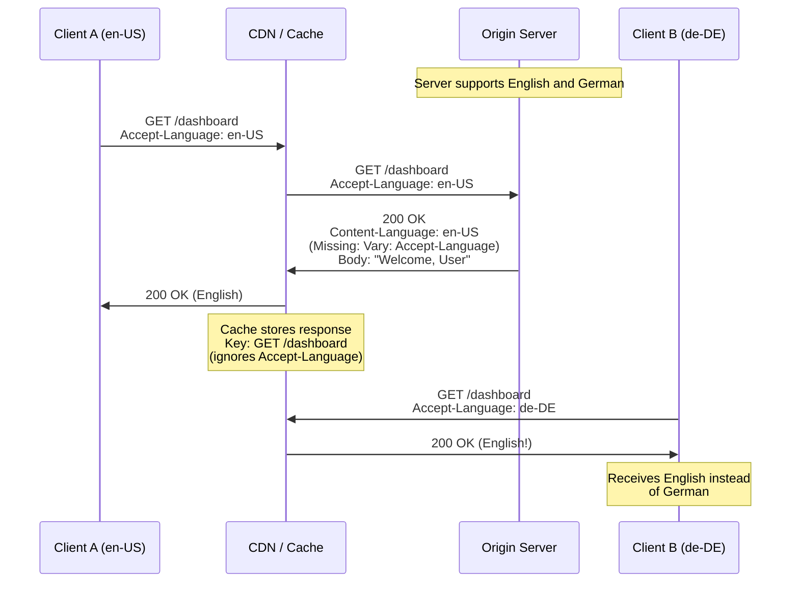
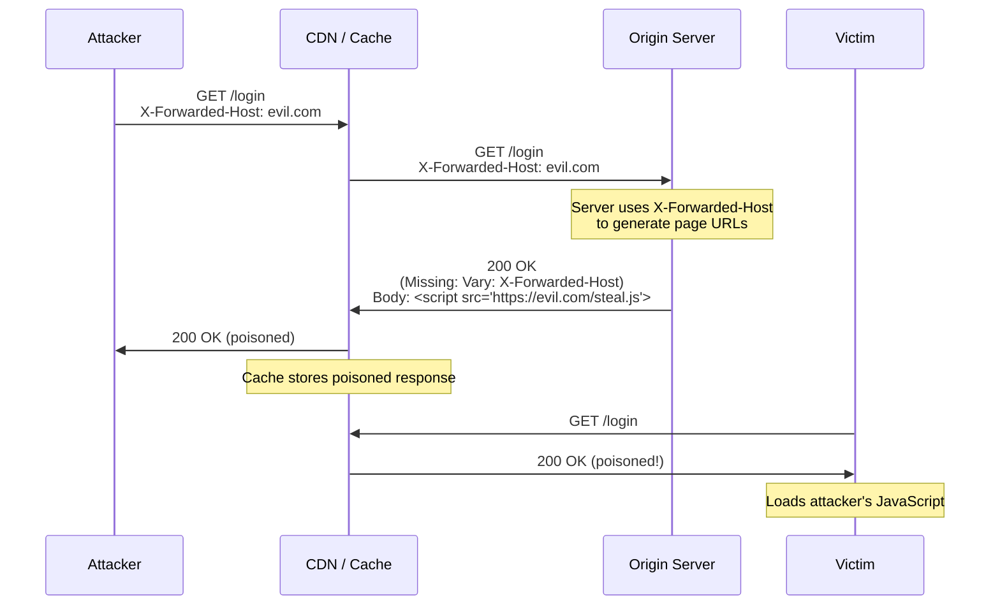

When a server tailors its response based on request headers like `Accept-Encoding`, `Accept-Language`, or `Cookie`, it must tell caches which headers influenced the response. Without this information, a cache stores one version and serves it to everyone — regardless of whether they sent different headers. This is not just a bug. It is an exploitable attack vector known as cache poisoning.

## Why This Matters

A single missing `Vary` header can cause any of the following:

- **Data leakage** — A cache stores a personalized response (containing User A's account data) and serves it to User B. This has caused real data breaches at scale.
- **Cache poisoning** — An attacker deliberately requests a page with malicious headers that alter the response (e.g., injecting JavaScript via `X-Forwarded-Host`). Without `Vary`, the cache stores the poisoned response and serves it to all subsequent visitors.
- **Broken compression** — A server sends a gzip-compressed response to a client that requested it, but the cache serves that same compressed response to a client that cannot decompress it, resulting in binary garbage on screen.
- **Wrong language** — A French user receives a cached English response because the server did not include `Vary: Accept-Language`.

Real-world incidents have affected major platforms including GitHub, Twitter, and numerous CDN customers. James Kettle's 2018 research "Practical Web Cache Poisoning" demonstrated how missing `Vary` headers allow attackers to poison CDN caches at companies like Red Hat, Mozilla, and others.

## How It Works

The `Vary` header tells caches: "This response was generated based on these specific request headers. Only reuse this cached response for future requests that have the same values for those headers."

When a server performs content negotiation — returning different content based on `Accept-Encoding`, `Accept-Language`, `Cookie`, `Authorization`, or any other request header — it must include a `Vary` header listing every request header that influenced the response.



When `Vary: Accept-Language` is present, the cache creates separate entries for each language, and Client B receives the correct German response.

The attack scenario is more dangerous:



## HTTP Examples

**Non-compliant response** — server performs content negotiation but omits Vary:

```http
HTTP/1.1 200 OK
Content-Type: text/html; charset=utf-8
Content-Language: en-US
Content-Encoding: gzip
Cache-Control: public, max-age=3600

<!-- English, gzip-compressed content -->
```

This response varies by at least `Accept-Language` and `Accept-Encoding`, but does not declare it. Any cache will store this single variant and serve it to all users.

**Compliant response** — server declares which request headers influenced the response:

```http
HTTP/1.1 200 OK
Content-Type: text/html; charset=utf-8
Content-Language: en-US
Content-Encoding: gzip
Cache-Control: public, max-age=3600
Vary: Accept-Language, Accept-Encoding

<!-- English, gzip-compressed content -->
```

Now caches know to create separate entries for different `Accept-Language` and `Accept-Encoding` combinations.

**Compliant response for authenticated content** — preventing credential leakage through caches:

```http
HTTP/1.1 200 OK
Content-Type: application/json
Vary: Authorization, Cookie
Cache-Control: private

{"user": "alice", "balance": 1500.00}
```

The `Vary: Authorization, Cookie` combined with `Cache-Control: private` ensures that shared caches never serve one user's authenticated response to another.

## How Thymian Detects This

Thymian validates Vary header compliance using the following rules from the RFC 9110 rule set:

- **`origin-server-should-generate-vary-header`** — Flags responses that appear to be content-negotiated (different Content-Language, Content-Encoding, etc.) but lack a Vary header
- **`cache-must-not-use-response-without-matching-vary-headers`** — Validates that caches only reuse responses when the Vary-listed headers match between the original and current request
- **`proxy-must-not-generate-vary-wildcard`** — Prevents proxies from generating `Vary: *`, which would make the response effectively uncacheable and mask the actual negotiation dimensions
- **`user-agent-may-send-preference-headers-for-proactive-negotiation`** — Validates that clients correctly express their preferences so servers can perform proper content negotiation

## Key Takeaways

- Any server response that changes based on request headers **must** include a `Vary` header listing those headers
- Missing `Vary` headers do not just cause display bugs — they enable cache poisoning attacks that can compromise every visitor to a site
- The most commonly forgotten `Vary` values are `Accept-Encoding`, `Accept-Language`, `Cookie`, and `Authorization`
- Authenticated or personalized responses should additionally use `Cache-Control: private` or `Cache-Control: no-store`
- CDNs and reverse proxies rely entirely on `Vary` to decide whether a cached response can be reused — they cannot guess

## Further Reading

- [RFC 9110, Section 12.5.5 — Vary](https://www.rfc-editor.org/rfc/rfc9110#section-12.5.5) — Specification of the Vary header field
- [RFC 9111 — HTTP Caching](https://www.rfc-editor.org/rfc/rfc9111) — How caches use Vary for response selection
- James Kettle, ["Practical Web Cache Poisoning"](https://portswigger.net/research/practical-web-cache-poisoning) (2018) — Demonstrates real-world cache poisoning via missing Vary headers
- James Kettle, ["Web Cache Entanglement: Novel Pathways to Poisoning"](https://portswigger.net/research/web-cache-entanglement) (Black Hat USA 2020) — Advanced cache poisoning techniques
- Hoai Viet Nguyen et al., ["Web Cache Deception Escalates!"](https://www.usenix.org/conference/usenixsecurity23/presentation/nguyen) (USENIX Security 2023) — Academic study of cache-based attacks
