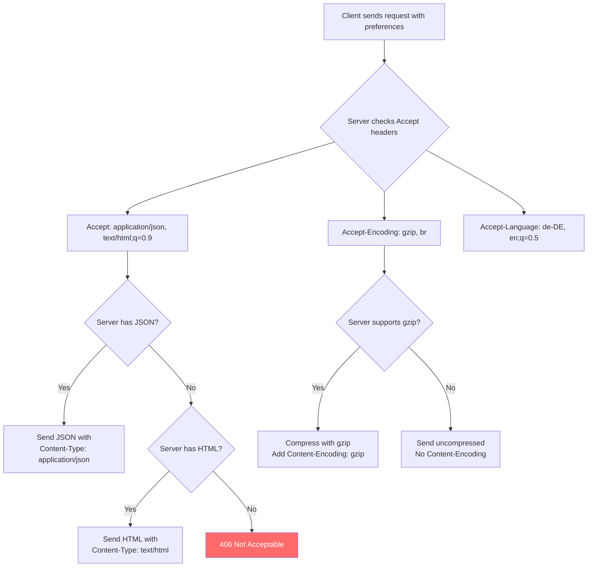
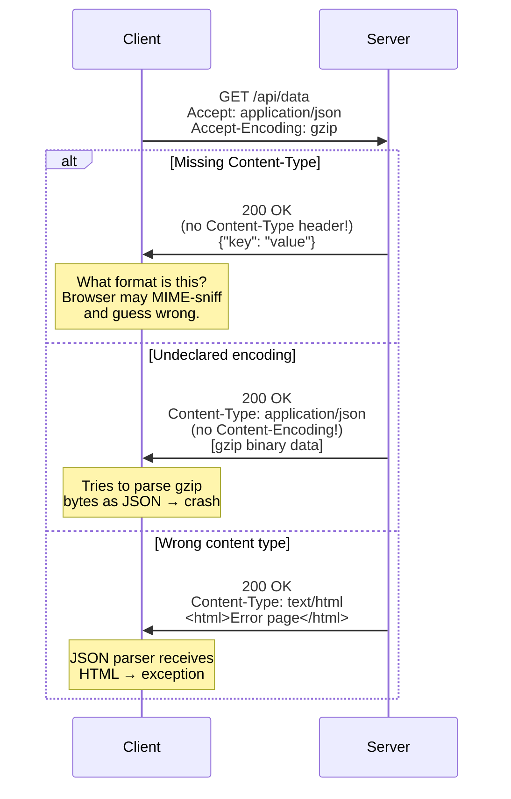

HTTP content negotiation allows a client and server to agree on the best representation of a resource — the right language, encoding, and media type. When this mechanism fails, users see binary garbage instead of web pages, applications crash trying to parse unexpected formats, and security boundaries are violated through content type confusion. These failures are common because many servers ignore client preferences entirely, omit critical metadata, or apply content encodings without declaring them.

## Why This Matters

- **Binary garbage on screen** — A server sends a gzip-compressed response without the `Content-Encoding: gzip` header. The client does not know to decompress it and renders raw binary data.
- **Application crashes** — A client requests JSON (`Accept: application/json`) but the server sends HTML (without checking the `Accept` header or sending the correct `Content-Type`). The client's JSON parser encounters `<!DOCTYPE html>` and throws an exception.
- **Cross-site scripting via content sniffing** — When a server omits `Content-Type`, browsers attempt to guess the content type from the body (MIME sniffing). An attacker can craft a response body that looks like JavaScript to the browser, leading to XSS. This attack class is well-documented by OWASP and led to the creation of the `X-Content-Type-Options: nosniff` header.
- **Wrong language** — A server ignores `Accept-Language` and always serves English. Users in non-English locales receive untranslated content, breaking localized applications.
- **Encoding incompatibility** — A server sends `Content-Encoding: br` (Brotli) to a client that only supports gzip. The client cannot decompress the response.

## How It Works

Content negotiation in HTTP involves the client expressing preferences and the server selecting the best match:



The failure cases occur when this negotiation breaks down:



## HTTP Examples

**Non-compliant — missing Content-Encoding:**

```http
HTTP/1.1 200 OK
Content-Type: application/json
Content-Length: 1024

(gzip-compressed binary data)
```

The server compressed the response with gzip but did not include `Content-Encoding: gzip`. The client interprets the raw bytes as JSON and fails.

**Non-compliant — missing Content-Type:**

```http
HTTP/1.1 200 OK
Content-Length: 256

<script>alert('xss')</script>
<p>This is user-generated content</p>
```

Without `Content-Type`, browsers perform MIME sniffing. The `<script>` tag at the start may cause the browser to interpret this as HTML/JavaScript, executing the script.

**Compliant — proper content negotiation:**

```http
# Request:
GET /api/report HTTP/1.1
Host: api.example.com
Accept: application/json, text/csv;q=0.9
Accept-Encoding: gzip, identity;q=0.5
Accept-Language: de-DE, en;q=0.5

# Response:
HTTP/1.1 200 OK
Content-Type: application/json; charset=utf-8
Content-Encoding: gzip
Content-Language: de-DE
Vary: Accept, Accept-Encoding, Accept-Language

(gzip-compressed JSON in German)
```

Every aspect is declared: content type with charset, content encoding, content language, and a `Vary` header so caches know to store separate variants.

**Compliant — server cannot satisfy client preferences:**

```http
# Client requests Brotli encoding:
GET /data HTTP/1.1
Accept-Encoding: br

# Server only supports gzip — sends uncompressed:
HTTP/1.1 200 OK
Content-Type: application/json

{"data": "uncompressed because server does not support Brotli"}
```

When the server cannot satisfy the requested encoding, it sends the response without content encoding rather than applying an unsupported one.

## How Thymian Detects This

Thymian validates content negotiation compliance using the following rules from the RFC 9110 rule set:

- **`sender-should-generate-content-type-for-message-with-content`** — Flags responses with a body but no `Content-Type` header. Without Content-Type, recipients must guess the format, leading to MIME sniffing vulnerabilities and parsing failures.
- **`sender-must-generate-content-encoding-header-if-encodings-applied`** — Catches the dangerous case where content is compressed (gzip, deflate, Brotli) but the `Content-Encoding` header is missing. This is a MUST-level requirement because the client has no other way to know the body needs decompression.
- **`content-encoding-should-not-include-identity`** — Validates that the "identity" encoding (meaning no encoding) is not listed in Content-Encoding, as it adds no information and can confuse parsers.
- **`recipient-should-treat-x-gzip-as-gzip`** / **`recipient-should-treat-x-compress-as-compress`** — Ensures backward compatibility with legacy encoding names used by older servers.
- **`origin-server-should-send-response-without-content-coding`** — When the client does not accept any content encoding the server supports, the server should send the response uncompressed rather than applying an unsupported encoding.
- **`origin-server-may-respond-415-for-unacceptable-content-coding`** — Validates that servers respond with 415 Unsupported Media Type when they cannot process the request's content coding.
- **`server-must-not-include-accept-encoding-for-non-content-coding-415-errors`** — Ensures the `Accept-Encoding` header is only included in 415 responses specifically about content coding issues.
- **`codings-value-may-be-given-quality-value`** — Validates correct quality value syntax in encoding preferences.
- **`etag-must-differ-for-different-content-encodings`** — Catches a subtle cache corruption bug where the same ETag is used for gzip and uncompressed versions of the same resource, causing clients to receive the wrong encoding from cache.

## Key Takeaways

- Every response with a body **should** include a `Content-Type` header — omitting it enables MIME sniffing attacks
- If a response body is compressed, the `Content-Encoding` header is **required** — without it, clients interpret compressed bytes as raw content
- Servers should check `Accept` headers before choosing a response format, especially for APIs that support multiple formats
- When a server cannot satisfy the client's encoding preferences, it should send the response uncompressed, not apply an unsupported encoding
- Content negotiation failures cause three classes of problems: display corruption (garbled content), application crashes (parser failures), and security vulnerabilities (MIME sniffing XSS)

## Further Reading

- [RFC 9110, Section 8.3 — Content-Type](https://www.rfc-editor.org/rfc/rfc9110#section-8.3) — Requirements for declaring the media type of the message body
- [RFC 9110, Section 8.4 — Content-Encoding](https://www.rfc-editor.org/rfc/rfc9110#section-8.4) — Requirements for declaring content encodings
- [RFC 9110, Section 12.5 — Content Negotiation Fields](https://www.rfc-editor.org/rfc/rfc9110#section-12.5) — Accept, Accept-Encoding, Accept-Language, and Accept-Charset headers
- [OWASP — MIME Sniffing](https://owasp.org/www-project-secure-headers/#x-content-type-options) — How missing Content-Type enables XSS through content type guessing
