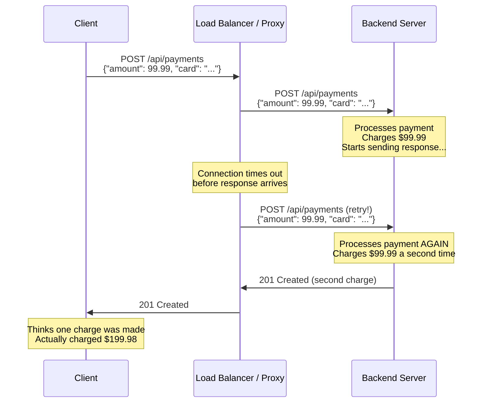
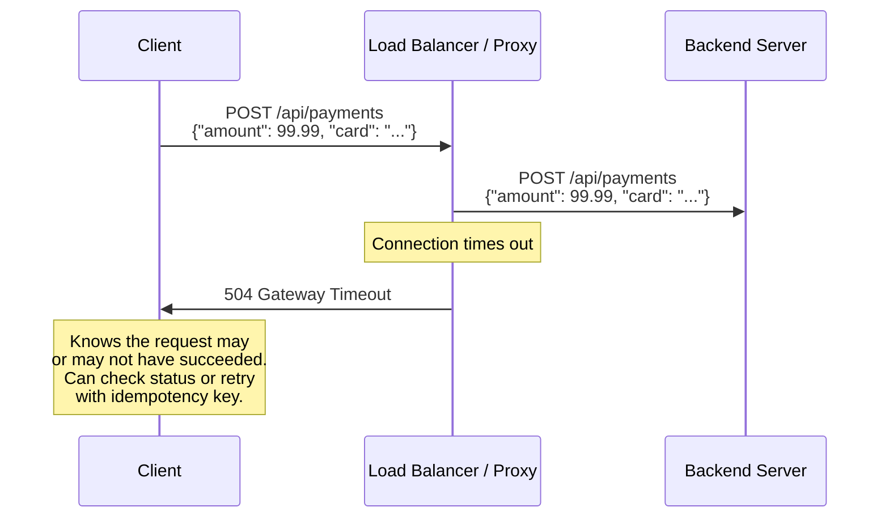

When an HTTP request fails due to a network timeout or connection reset, the natural instinct — both for developers and for infrastructure — is to retry it. For safe, idempotent requests like GET or PUT, this is fine. But when a proxy or client library automatically retries a POST request, the operation may execute twice. This is how customers get charged twice, orders are duplicated, and emails are sent multiple times.

## Why This Matters

Automatic retries of non-idempotent requests cause real financial and data integrity damage:

- **Double payment processing** — A load balancer retries a POST to `/api/payments` after a timeout. The payment gateway processes the charge twice. The customer sees two debits on their statement.
- **Duplicate order creation** — An API gateway retries a POST to `/api/orders` because the backend was slow to respond (but did process the request). Two identical orders are created and shipped.
- **Duplicate database writes** — Any intermediary that retries a non-idempotent request without understanding method semantics risks creating duplicate records, sending duplicate notifications, or triggering duplicate workflows.
- **Cascading duplicates in microservices** — When a retry triggers a chain of downstream service calls, each downstream service may also duplicate its work, multiplying the impact.

This is not a theoretical problem. Payment processors like Stripe and PayPal explicitly document idempotency keys as a mitigation for retry-induced duplicates. AWS ALB, nginx, and HAProxy all have configuration options related to retry behavior that, when misconfigured, cause exactly this problem.

## How It Works

HTTP methods are classified by two properties that determine whether retries are safe:

- **Safe methods** (GET, HEAD, OPTIONS, TRACE) — Do not modify server state. Retrying them is always harmless.
- **Idempotent methods** (GET, HEAD, PUT, DELETE, OPTIONS, TRACE) — Executing them multiple times produces the same result as executing them once. PUT is idempotent because putting the same resource twice results in the same state.
- **Non-idempotent methods** (POST, PATCH) — Each execution may produce a different result. POSTing the same order twice creates two orders.

The problem occurs when an intermediary or client library does not respect this distinction:



The correct behavior is for the proxy to return a 504 Gateway Timeout to the client rather than retrying a POST:



## HTTP Examples

**Dangerous proxy behavior** — retrying a non-idempotent request:

```http
POST /api/orders HTTP/1.1
Host: shop.example.com
Content-Type: application/json
Content-Length: 82

{"product_id": "SKU-1234", "quantity": 1, "shipping": "express"}
```

If a proxy retries this request, two orders are created. The client has no way to know this happened.

**Safe retry** — idempotent PUT with the same resource state:

```http
PUT /api/users/42/preferences HTTP/1.1
Host: api.example.com
Content-Type: application/json
Content-Length: 45
If-Match: "abc123"

{"theme": "dark", "language": "en"}
```

Retrying this PUT is safe because the result is the same whether it executes once or five times — the preferences are set to the specified values. The `If-Match` header adds an additional safety layer by preventing the update if the resource changed between attempts.

**Client-side retry protection** — using idempotency keys:

```http
POST /api/payments HTTP/1.1
Host: payments.example.com
Content-Type: application/json
Idempotency-Key: 550e8400-e29b-41d4-a716-446655440000

{"amount": 99.99, "currency": "USD"}
```

While idempotency keys are an application-level safeguard (not part of RFC 9110), they exist precisely because the underlying problem — non-idempotent retries — is so common and so damaging.

## How Thymian Detects This

Thymian validates retry safety using the following rules from the RFC 9110 rule set:

- **`proxy-must-not-automatically-retry-non-idempontent-requests`** — Flags proxies that retry POST or PATCH requests after a failure. RFC 9110 explicitly prohibits this: intermediaries MUST NOT automatically retry requests with non-idempotent methods.
- **`client-should-not-automatically-retry-request-with-non-idempotent-method`** — Warns when clients automatically retry non-idempotent requests without user confirmation
- **`client-should-not-automatically-retry-a-failed-automatic-retry`** — Prevents retry storms where a failed retry triggers another retry, compounding the duplication problem

## Key Takeaways

- Proxies and load balancers **must not** automatically retry POST or PATCH requests — doing so can cause duplicate charges, orders, and records
- Only safe and idempotent methods (GET, HEAD, PUT, DELETE, OPTIONS) can be safely retried by intermediaries
- When a non-idempotent request times out, the correct proxy behavior is to return 502 or 504 to the client, not to retry
- Application-level idempotency keys are a defense-in-depth measure, not a substitute for correct HTTP semantics
- Always verify your load balancer and API gateway retry configuration — defaults vary across products and versions

## Further Reading

- [RFC 9110, Section 9.2.2 — Idempotent Methods](https://www.rfc-editor.org/rfc/rfc9110#section-9.2.2) — Definition of idempotent methods and retry constraints
- [RFC 9110, Section 9.2.1 — Safe Methods](https://www.rfc-editor.org/rfc/rfc9110#section-9.2.1) — Methods that must not cause side effects
- [IETF Draft — The Idempotency-Key HTTP Header Field](https://datatracker.ietf.org/doc/draft-ietf-httpapi-idempotency-key-header/) — Proposed standard for application-level retry protection
- Stripe, ["Idempotent Requests"](https://stripe.com/docs/api/idempotent_requests) — Industry documentation of the retry duplication problem
