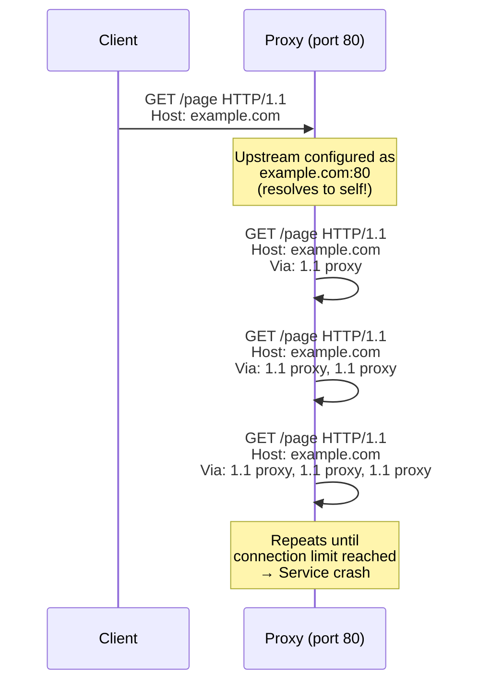
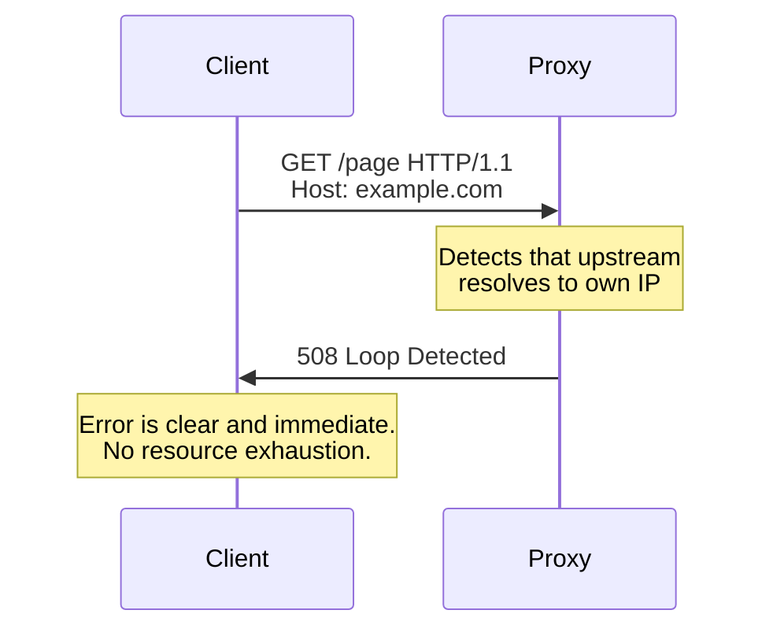

When a reverse proxy or load balancer is misconfigured to forward requests back to itself, it creates an infinite loop. Each iteration consumes a connection, a thread, and memory. Within seconds, the proxy exhausts all available resources and the entire service goes down. This is one of the most common causes of self-inflicted outages in proxy infrastructure, and it typically happens immediately after a DNS change, upstream reconfiguration, or deployment update.

## Why This Matters

- **Complete service outage** — The proxy opens connections to itself until it hits its connection or file descriptor limit. All new requests (including legitimate ones) are rejected. The outage is total and immediate.
- **Cascading failure** — In a multi-tier proxy architecture, a loop in one tier can exhaust upstream connections, causing cascading outages across the entire infrastructure.
- **CPU exhaustion** — Each looping request consumes CPU for parsing, routing, and forwarding. The server's CPU saturates, affecting any other workloads on the same machine.
- **Difficult to diagnose under pressure** — During an outage, logs fill with request entries at maximum speed, making it hard to find the root cause. The loop generates thousands of log entries per second, and each entry looks like a normal request.

Common triggers include:

- A DNS change causes a proxy's upstream backend to resolve to the proxy's own IP address
- A reverse proxy is configured to proxy to `localhost` on the same port it listens on
- Two proxies are configured to forward traffic to each other
- A CDN edge node routes back to an origin that routes through the same CDN

## How It Works



HTTP provides two mechanisms to detect and prevent forwarding loops:

1. **Self-detection** — An intermediary MUST recognize its own identity in the request path (via the `Via` header or IP address) and refuse to forward to itself.
2. **Max-Forwards** — For TRACE and OPTIONS requests, the `Max-Forwards` header acts as a TTL (time-to-live), decremented by each intermediary. When it reaches zero, the request stops.



## HTTP Examples

**Loop in progress — Via header reveals the problem:**

```http
GET /page HTTP/1.1
Host: example.com
Via: 1.1 proxy-a.internal, 1.1 proxy-b.internal, 1.1 proxy-a.internal
```

The appearance of `proxy-a.internal` twice in the `Via` header indicates a loop: the request has passed through proxy-a, then proxy-b, then back to proxy-a.

**Max-Forwards for loop-safe probing:**

```http
OPTIONS * HTTP/1.1
Host: example.com
Max-Forwards: 5
```

Each intermediary decrements `Max-Forwards` by 1. When it reaches 0, the intermediary responds directly instead of forwarding, preventing infinite loops:

```http
# Intermediary receives with Max-Forwards: 0
OPTIONS * HTTP/1.1
Host: example.com
Max-Forwards: 0

# Intermediary responds directly (does not forward):
HTTP/1.1 200 OK
Allow: GET, HEAD, POST, OPTIONS
```

**Compliant loop detection — proxy detects self:**

```http
# Proxy receives request destined for its own address:
GET /page HTTP/1.1
Host: example.com

# Proxy responds with error instead of forwarding:
HTTP/1.1 508 Loop Detected
Content-Type: text/plain

Request loop detected: upstream resolves to this server.
```

## How Thymian Detects This

Thymian validates loop prevention using the following rules from the RFC 9110 rule set:

- **`intermediary-must-not-forward-message-to-itself`** — The primary defense. Catches intermediaries that forward requests to their own address, whether detected via IP address matching, Via header inspection, or host resolution.
- **`intermediary-must-check-and-update-max-forwards`** — Validates that intermediaries decrement the Max-Forwards counter when processing TRACE and OPTIONS requests
- **`intermediary-must-generate-updated-max-forwards-when-forwarding`** — Ensures the decremented Max-Forwards value is included in the forwarded request
- **`intermediary-must-not-forward-when-max-forwards-is-zero`** — Catches intermediaries that continue forwarding after Max-Forwards has reached zero, which defeats the loop protection mechanism
- **`intermediary-must-respond-as-final-recipient-when-max-forward-is-zero`** — Validates that intermediaries respond directly (as if they were the final destination) when Max-Forwards reaches zero
- **`recipient-may-ignore-max-forwards-for-other-methods`** — Documents that Max-Forwards is only required for TRACE and OPTIONS; other methods rely on self-detection

## Key Takeaways

- Forwarding loops cause instant, total service outages — there is no graceful degradation
- The most common trigger is a DNS or configuration change that causes a proxy to resolve its upstream to itself
- Every intermediary **must** detect when it would forward a message to itself and reject the request instead
- The `Via` header is the primary mechanism for loop detection — intermediaries must add their identity and check for duplicates
- `Max-Forwards` provides a TTL-like safety net for TRACE and OPTIONS, but is not used for other methods
- After any DNS change, upstream reconfiguration, or deployment, verify that your proxy is not resolving its backend to its own address

## Further Reading

- [RFC 9110, Section 7.6.1 — Connection](https://www.rfc-editor.org/rfc/rfc9110#section-7.6.1) — Requirements for intermediaries to detect and prevent forwarding loops
- [RFC 9110, Section 7.6.2 — Max-Forwards](https://www.rfc-editor.org/rfc/rfc9110#section-7.6.2) — TTL mechanism for loop-limited forwarding
- [RFC 9110, Section 7.6.3 — Via](https://www.rfc-editor.org/rfc/rfc9110#section-7.6.3) — How intermediaries identify themselves in the request chain for loop detection
