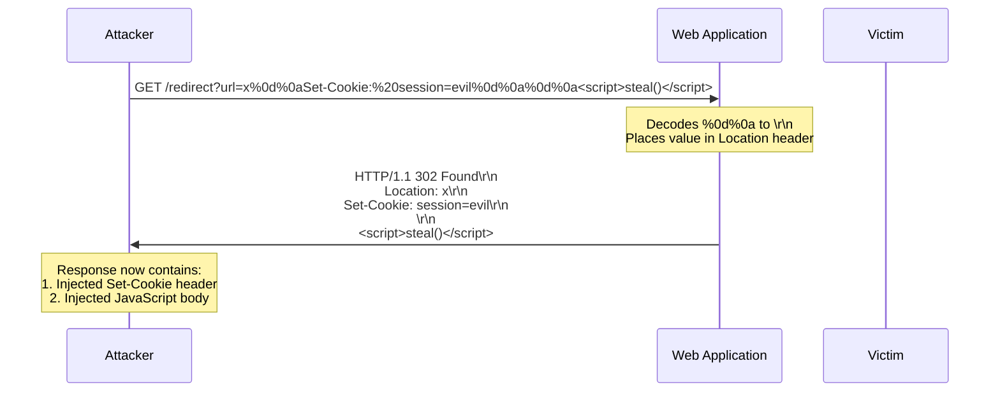
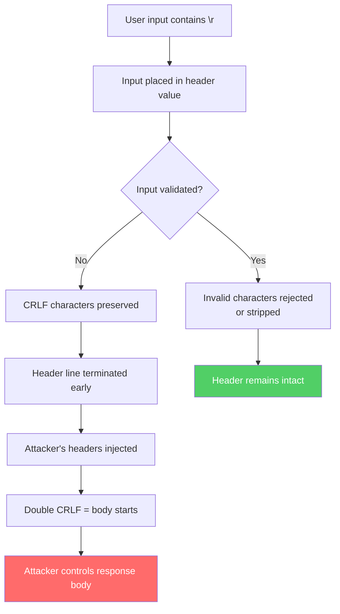

HTTP headers are text-based, separated by carriage return and line feed characters (`\r\n`). If an application places user input into a response header without validating it, an attacker can inject `\r\n` characters to add arbitrary headers, split the HTTP response, or even inject an entirely new response body. This is CRLF injection — one of the oldest and most persistent classes of web vulnerabilities, and it remains exploitable in modern applications because HTTP fundamentally relies on text delimiters that can be spoofed.

## Why This Matters

- **Response splitting** — By injecting `\r\n\r\n` (double CRLF) into a header value, an attacker terminates the headers and begins a new response body. This body can contain JavaScript, HTML, or any content the attacker chooses. The browser or client processes it as legitimate server output.
- **Header injection** — Injecting a single `\r\n` allows adding arbitrary headers. An attacker can inject `Set-Cookie` headers to fixate sessions, `Location` headers to redirect users, or `Access-Control-Allow-Origin` headers to bypass CORS.
- **Cache poisoning** — A split response can be stored by an intermediate cache. The attacker's injected content is then served to all subsequent users requesting the same URL.
- **Log injection** — Injecting newlines into headers that are logged can forge log entries, hiding attacks or framing other users.

This vulnerability class has been documented since 2004 (Amit Klein's "HTTP Response Splitting" paper) and has produced CVEs in virtually every major web framework: Rails, Django, Express, Spring, PHP, Node.js, and HAProxy among others.

## How It Works

The attack exploits the fact that HTTP uses `\r\n` (CRLF) as the delimiter between headers, and `\r\n\r\n` (double CRLF) as the boundary between headers and body:

```
HTTP/1.1 302 Found\r\n
Location: /redirect?url=USER_INPUT\r\n    ← If USER_INPUT contains \r\n...
\r\n
```

When the application reflects user input into a header value:



The recipient sees this as a valid response with an additional `Set-Cookie` header and a JavaScript body:



## HTTP Examples

**Non-compliant — unvalidated user input in Location header:**

```http
# Attacker's request:
GET /redirect?url=https://example.com%0d%0aX-Injected:%20true%0d%0aSet-Cookie:%20admin=1 HTTP/1.1
Host: app.example.com

# Server's response (VULNERABLE):
HTTP/1.1 302 Found
Location: https://example.com
X-Injected: true
Set-Cookie: admin=1

```

The application URL-decoded the input and placed it in the `Location` header. The `\r\n` characters created two additional headers that the attacker controls entirely.

**Non-compliant — null byte in header value:**

```http
HTTP/1.1 200 OK
Content-Type: text/html
X-Custom: value\x00<script>alert(1)</script>

```

Some parsers truncate at the null byte; others process the full value. This discrepancy can cause the trailing content to be interpreted as part of the body by one system while another considers it part of the header.

**Compliant — invalid characters rejected:**

```http
# Server validates the redirect URL:
GET /redirect?url=https://example.com%0d%0aEvil:%20header HTTP/1.1
Host: app.example.com

# Server detects \r\n in input and rejects:
HTTP/1.1 400 Bad Request
Content-Type: text/plain

Invalid characters in redirect URL.
```

## How Thymian Detects This

Thymian validates header value integrity using the following rules from the RFC 9110 rule set:

- **`recipient-must-reject-or-replace-invalid-characters`** — The primary defense. RFC 9110 requires that recipients MUST reject messages containing invalid characters in field values (CR, LF, NUL) or replace those characters before processing. This catches CRLF injection at the protocol level.
- **`new-fields-should-limit-values-to-visible-ascii`** — Flags header fields that contain characters outside the visible US-ASCII range (plus obs-text for backward compatibility). New header definitions SHOULD restrict values to visible ASCII to prevent encoding-related injection attacks.
- **`parser-must-exclude-whitespace-from-field-values`** — Ensures that parsers strip leading and trailing whitespace from header values, preventing whitespace-based injection and evasion techniques.
- **`recipient-should-treat-obs-text-as-opaque-data`** — Validates that recipients handle legacy "obs-text" characters (bytes 0x80-0xFF) as opaque data rather than interpreting them as control characters or delimiters.

## Key Takeaways

- Any user input placed into HTTP header values **must** be validated for CR (`\r`), LF (`\n`), and NUL (`\0`) characters — these are the injection vectors
- CRLF injection enables response splitting, header injection, session fixation, cache poisoning, and XSS — all from a single vulnerability class
- This is not just an application-level concern: HTTP parsers themselves must reject or sanitize invalid characters in received headers
- Frameworks should automatically validate header values before sending them — but many do not, leaving the responsibility to the developer
- CVEs for CRLF injection continue to be filed against major HTTP libraries and frameworks, making protocol-level validation essential

## Further Reading

- [RFC 9110, Section 5.5 — Field Values](https://www.rfc-editor.org/rfc/rfc9110#section-5.5) — Requirements for valid characters in HTTP header values
- Amit Klein, ["HTTP Response Splitting"](http://www.yourmagic.net/amit/HRS.pdf) (Sanctum, 2004) — The original paper defining response splitting attacks
- [OWASP — HTTP Response Splitting](https://owasp.org/www-community/attacks/HTTP_Response_Splitting) — Overview and prevention guide
- [CVE-2019-18277](https://nvd.nist.gov/vuln/detail/CVE-2019-18277) — HAProxy CRLF injection allowing request smuggling
- [CVE-2021-22959](https://nvd.nist.gov/vuln/detail/CVE-2021-22959) — Node.js HTTP request smuggling via CRLF injection in headers
