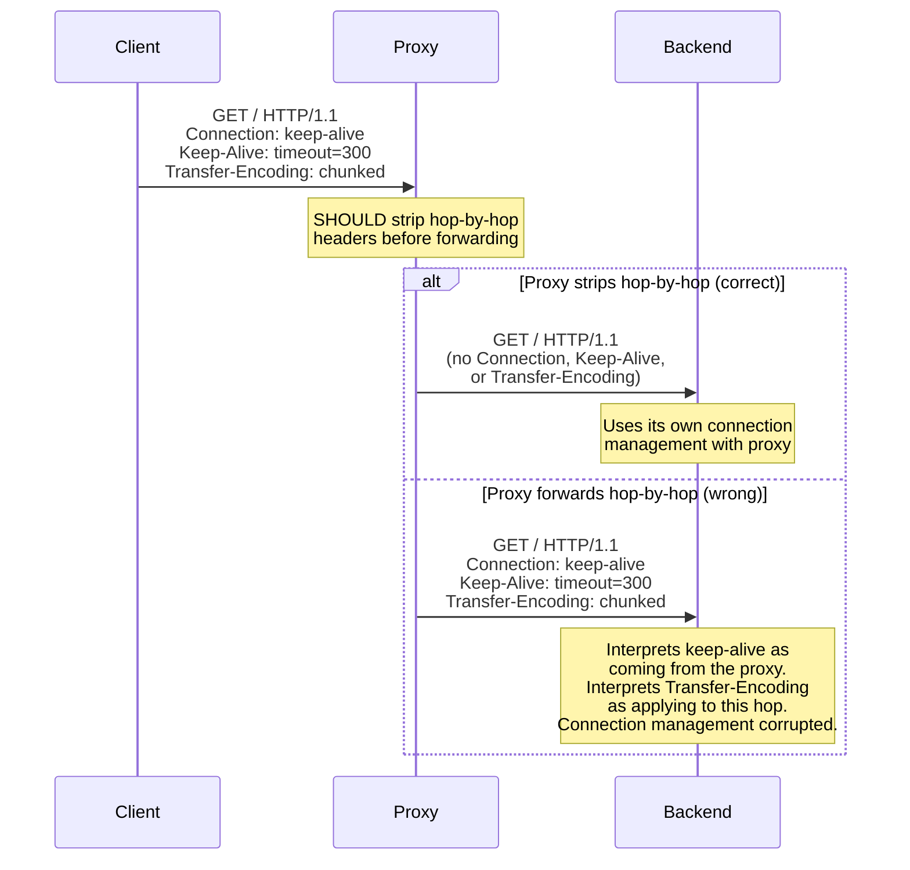
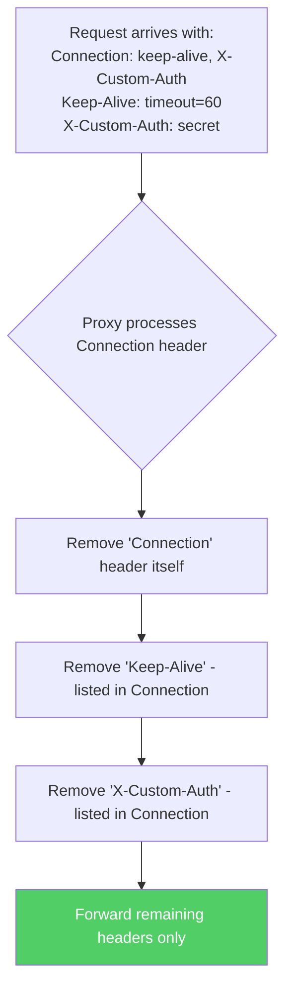

HTTP headers are divided into two categories: end-to-end headers that travel the full request chain from client to server, and hop-by-hop headers that apply only to the immediate connection between two adjacent systems. Headers like `Connection`, `Keep-Alive`, `Transfer-Encoding`, and `Upgrade` are hop-by-hop — they control how two directly connected systems communicate, not how the overall request should be processed. When a proxy fails to strip these headers before forwarding, it creates connection management chaos: backends receive connection directives from a proxy that is not honoring those directives, connections hang or desynchronize, and in the worst case, request smuggling becomes possible.

## Why This Matters

- **Connection desynchronization** — A proxy forwards `Connection: keep-alive` from the client, but the proxy itself uses a different connection strategy with the backend. The backend keeps the connection open expecting more requests on it; the proxy has already moved on. The connection hangs, eventually timing out.
- **Request smuggling via Transfer-Encoding** — The 2019 "HTTP Desync" research by James Kettle specifically exploited cases where proxies forwarded `Transfer-Encoding` as a hop-by-hop header. When the proxy and backend disagree on whether `Transfer-Encoding` applies, message boundaries become ambiguous, enabling request smuggling.
- **WebSocket upgrade failures** — `Upgrade` and `Connection: Upgrade` are hop-by-hop headers. When a proxy that does not support WebSocket forwarding passes these headers to the backend, the backend may attempt a protocol upgrade that the proxy cannot handle, resulting in a broken connection.
- **Keep-alive mismatches** — A proxy forwards `Keep-Alive: timeout=300` from the client. The backend honors this timeout, but the proxy closes the connection after its own (shorter) timeout. The backend writes the response to a closed connection, and the data is lost.

## How It Works



The `Connection` header has a special role: it lists additional headers that should be treated as hop-by-hop for the current connection:



## HTTP Examples

**Non-compliant — proxy forwards hop-by-hop headers:**

```http
# Client sends:
GET /api/data HTTP/1.1
Host: api.example.com
Connection: keep-alive, X-Secret-Token
Keep-Alive: timeout=120
X-Secret-Token: internal-auth-key
Transfer-Encoding: chunked

# Proxy forwards (WRONG - hop-by-hop headers included):
GET /api/data HTTP/1.1
Host: api.example.com
Connection: keep-alive, X-Secret-Token
Keep-Alive: timeout=120
X-Secret-Token: internal-auth-key
Transfer-Encoding: chunked
```

The proxy forwarded everything, including connection-specific headers. The `X-Secret-Token` was listed in the `Connection` header, meaning the client intended it to be hop-by-hop (for the proxy only), but now the backend sees it too.

**Compliant — proxy strips hop-by-hop headers:**

```http
# Client sends:
GET /api/data HTTP/1.1
Host: api.example.com
Connection: keep-alive, X-Secret-Token
Keep-Alive: timeout=120
X-Secret-Token: internal-auth-key
Accept: application/json

# Proxy forwards (correct):
GET /api/data HTTP/1.1
Host: api.example.com
Accept: application/json
Via: 1.1 proxy.internal
```

The proxy removed `Connection`, `Keep-Alive`, `X-Secret-Token` (listed as a connection option), and established its own connection management with the backend.

**Non-compliant — end-to-end header listed as connection option:**

```http
GET /page HTTP/1.1
Host: example.com
Connection: Content-Type
Content-Type: text/html
```

Listing `Content-Type` in `Connection` attempts to make an end-to-end header hop-by-hop. A compliant proxy must not treat end-to-end headers as connection-specific, even if listed in `Connection`.

## How Thymian Detects This

Thymian validates hop-by-hop header handling using the following rules from the RFC 9110 rule set:

- **`intermediary-must-parse-and-remove-connection-fields`** — The primary rule. Intermediaries MUST parse the `Connection` header, identify all fields listed as connection options, remove those fields from the forwarded message, and remove the `Connection` header itself.
- **`intermediary-must-implement-connection-header`** — Validates that intermediaries actively process the `Connection` header rather than ignoring it or passing it through.
- **`intermediary-should-remove-known-hop-by-hop-fields`** — Warns when known hop-by-hop headers (`Keep-Alive`, `Transfer-Encoding`, `Upgrade`, `Proxy-Connection`, etc.) are forwarded, even if not explicitly listed in `Connection`.
- **`sender-must-list-connection-specific-field-in-connection-header`** — Ensures senders declare their hop-by-hop headers in the `Connection` header, making it clear to intermediaries which headers to strip.
- **`sender-must-not-send-end-to-end-fields-as-connection-options`** — Catches attempts to list end-to-end headers (like `Content-Type`, `Authorization`, etc.) as connection options, which would incorrectly cause proxies to strip them.

## Key Takeaways

- Hop-by-hop headers (`Connection`, `Keep-Alive`, `Transfer-Encoding`, `Upgrade`) apply only to the immediate connection — proxies **must** strip them before forwarding
- The `Connection` header lists additional headers that should be treated as hop-by-hop for the current connection — all listed headers must be removed
- Forwarding `Transfer-Encoding` through a proxy is a known request smuggling vector
- End-to-end headers must not be listed as connection options — doing so could cause essential headers (like `Authorization`) to be stripped
- Connection management bugs from hop-by-hop leakage are extremely difficult to debug because they manifest as intermittent timeouts, hung connections, and sporadic failures

## Further Reading

- [RFC 9110, Section 7.6.1 — Connection](https://www.rfc-editor.org/rfc/rfc9110#section-7.6.1) — Connection header semantics and intermediary requirements
- James Kettle, ["HTTP Desync Attacks: Request Smuggling Reborn"](https://portswigger.net/research/http-desync-attacks-request-smuggling-reborn) (DEF CON 27, 2019) — Demonstrates exploitation of hop-by-hop header handling inconsistencies
- [RFC 9112, Section 6.1 — Transfer-Encoding](https://www.rfc-editor.org/rfc/rfc9112#section-6.1) — Transfer-Encoding as a hop-by-hop header in HTTP/1.1
