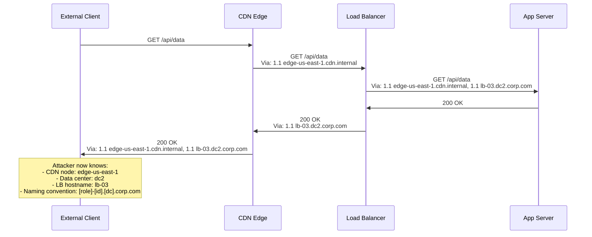
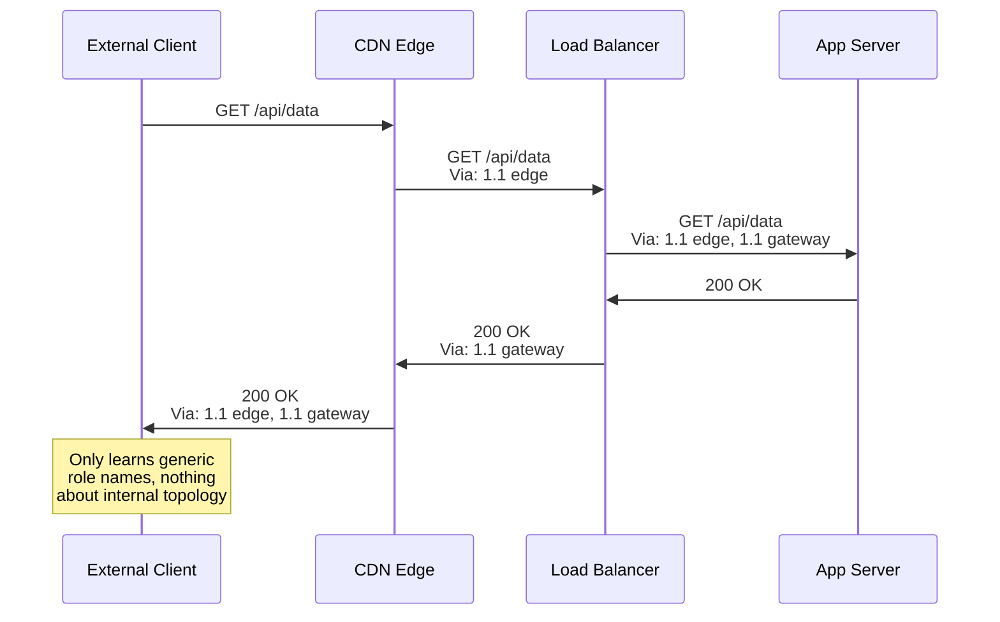

Every proxy and gateway in the HTTP request chain is required to add a `Via` header identifying itself. This header serves a critical purpose — it enables loop detection and protocol debugging. But when proxies include internal hostnames, IP addresses, and software versions in the `Via` header, they inadvertently create a map of the internal network architecture. Attackers can use this information for reconnaissance, lateral movement planning, and targeted exploitation of specific proxy software.

## Why This Matters

- **Internal network mapping** — A `Via` header like `Via: 1.1 proxy-east-1.internal.corp.com, 1.1 10.0.3.42` reveals internal hostnames, naming conventions, and IP addresses. An attacker learns the network topology without any active scanning.
- **Software version exposure** — `Via: 1.1 cache01.internal (Varnish/6.0.7)` reveals the exact proxy software and version. If Varnish 6.0.7 has known vulnerabilities, the attacker can target them directly.
- **Data center and region information** — Hostnames like `proxy-us-east-1a.internal` or `edge-eu-west.cdn.internal` reveal geographic distribution, cloud regions, and infrastructure organization.
- **Lateral movement planning** — In post-compromise scenarios, knowing internal hostnames and the proxy chain topology helps attackers plan which systems to target for lateral movement.
- **Penetration test findings** — Internal hostname disclosure via HTTP headers is a common finding in security audits and penetration tests, often categorized as "information disclosure" with medium severity.

## How It Works

The `Via` header is added by each intermediary to track the request's path:

```
Via: <protocol-version> <pseudonym-or-host> [(<comment>)]
```



The correct approach uses pseudonyms instead of real hostnames:



## HTTP Examples

**Non-compliant — Via header exposes internal details:**

```http
HTTP/1.1 200 OK
Via: 1.1 proxy-a3.us-east-1.internal.example.com (Squid/5.7),
     1.0 10.0.42.15:8080 (nginx/1.22.1),
     1.1 cache-layer-2.dc4.corp.example.com (Varnish/7.1.0)
Content-Type: application/json
```

This response reveals:

- Three internal proxies with full hostnames
- An internal IP address (10.0.42.15)
- Three different proxy software products with exact versions
- AWS region (us-east-1)
- Data center identifier (dc4)
- Naming conventions

**Compliant — Via header uses pseudonyms:**

```http
HTTP/1.1 200 OK
Via: 1.1 edge, 1.0 gateway, 1.1 cache
Content-Type: application/json
```

The Via header fulfills its purpose (loop detection, protocol tracking) without revealing any internal infrastructure details.

**Compliant — firewall intermediary replaces internal hosts:**

```http
# Internal Via before firewall:
Via: 1.1 proxy-a3.internal, 1.1 cache-02.internal

# After passing through firewall:
Via: 1.1 proxy-a, 1.1 proxy-b
```

The firewall replaces internal hostnames with pseudonyms before the response leaves the network boundary.

## How Thymian Detects This

Thymian validates Via header safety using the following rules from the RFC 9110 rule set:

- **`firewall-intermediary-should-not-forward-internal-hosts`** — The primary security rule. Intermediaries acting as a network firewall SHOULD NOT forward internal hostnames in Via headers to external clients.
- **`firewall-intermediary-should-replace-internal-hosts-with-pseudonyms`** — Validates that firewall intermediaries actively replace internal hostnames with pseudonyms rather than simply stripping the Via header (which would break loop detection).
- **`sender-may-replace-host-with-pseudonym`** — Documents that any sender may use a pseudonym instead of a real hostname in the Via header, not just firewalls.
- **`proxy-must-send-via-header`** — Validates that proxies include Via headers (required for loop detection), establishing the baseline that Via must exist but should be sanitized.
- **`gateway-must-send-via-header-in-inbound-requests`** — Ensures gateways add their identity to inbound Via headers.
- **`gateway-may-send-via-header-in-responses`** — Documents that gateways may also add Via to responses.
- **`intermediary-may-combine-via-entries-with-identical-protocols`** — Allows intermediaries to merge consecutive Via entries that use the same protocol version, reducing the amount of information exposed.
- **`sender-must-not-combine-via-entries-with-different-protocols`** — Prevents merging entries with different protocol versions, which would lose protocol transition information needed for debugging.
- **`sender-should-not-combine-via-entries-unless-same-organization`** — Warns against merging Via entries from different organizations, as this loses accountability information.

## Key Takeaways

- Via headers are **required** for loop detection — do not remove them entirely
- Firewall intermediaries **should** replace internal hostnames with pseudonyms before responses leave the network boundary
- Internal hostnames, IP addresses, and software versions in Via headers give attackers a free network topology map
- Pseudonyms should be generic role-based names (e.g., "edge", "gateway", "cache") rather than sequential identifiers that reveal the number of instances
- This is one of the most common information disclosure findings in penetration tests — and one of the easiest to fix

## Further Reading

- [RFC 9110, Section 7.6.3 — Via](https://www.rfc-editor.org/rfc/rfc9110#section-7.6.3) — Via header semantics and pseudonym recommendations
- [OWASP — Information Disclosure](https://owasp.org/www-project-web-security-testing-guide/latest/4-Web_Application_Security_Testing/08-Testing_for_Error_Handling/) — General guidance on preventing information leakage through HTTP headers
