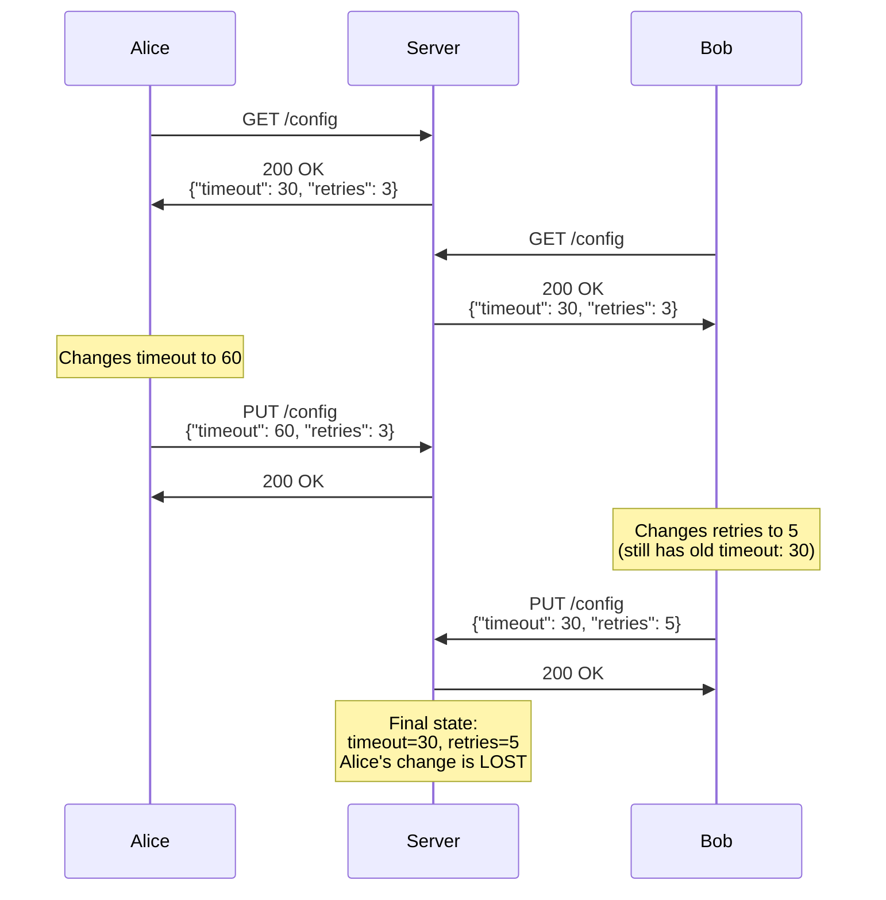
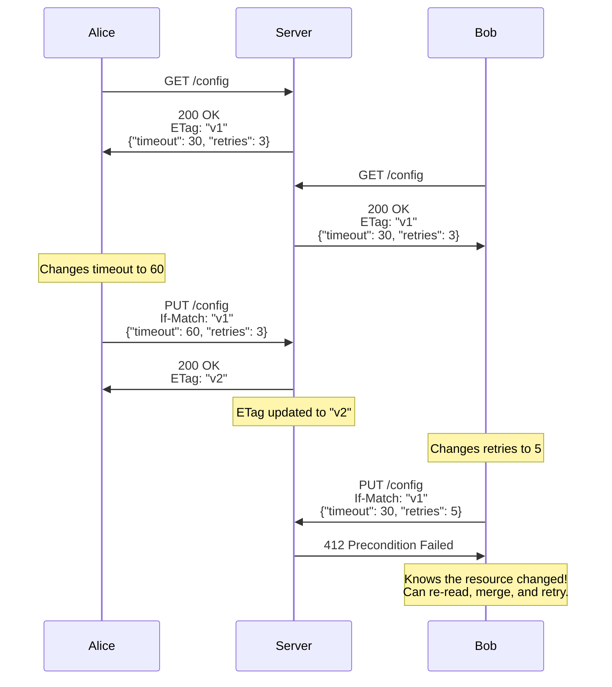

Two developers open the same configuration file through an API. Both make changes. Both save. The second save silently overwrites the first developer's changes — and neither of them knows it happened. This is the "lost update" problem, and it affects any system where multiple clients can read and write the same resource concurrently. HTTP provides a built-in solution through conditional requests using ETags and precondition headers, but many APIs do not implement them, leaving users vulnerable to silent data loss.

## Why This Matters

- **Silent data loss** — Unlike a conflict error that alerts the user, lost updates are invisible. The first user's changes simply disappear. They may not discover the loss until much later, if ever.
- **Configuration drift** — In infrastructure-as-code and API-driven configuration management, lost updates mean one team's configuration changes are silently reverted by another team's concurrent update.
- **Collaborative editing failures** — Wiki systems, CMS platforms, and document management APIs without conflict detection regularly lose user edits. Users learn to distrust the system and develop workarounds (copying to clipboard before saving, etc.).
- **Financial data corruption** — When concurrent updates to financial records overwrite each other, account balances, transaction histories, and audit trails become inconsistent.
- **Regulatory compliance violations** — In regulated industries (healthcare, finance), silent data loss can violate data integrity requirements (HIPAA, SOX, PCI-DSS).

## How It Works

HTTP solves the lost update problem through **optimistic concurrency control** using ETags and conditional request headers:

1. The server assigns each version of a resource a unique identifier called an **ETag** (entity tag)
2. The client reads the resource and receives the current ETag
3. When the client wants to update the resource, it sends the ETag in an `If-Match` header
4. The server checks whether the resource still has that ETag — if it does, the update proceeds; if it does not (someone else changed it), the server rejects the update with `412 Precondition Failed`

**Without conditional requests — the lost update:**



**With conditional requests — conflict detected:**



### Strong vs Weak ETags

ETags come in two flavors:

- **Strong ETags** (e.g., `"abc123"`) — Two representations are byte-for-byte identical. Required for `If-Match` in write operations.
- **Weak ETags** (e.g., `W/"abc123"`) — Two representations are semantically equivalent but may differ at the byte level (e.g., different whitespace in JSON). Useful for cache validation with `If-None-Match` but not safe for write conflict detection.

The server must use **strong comparison** when evaluating `If-Match` preconditions. Using weak comparison would allow updates to proceed even when the resource has changed in ways the client has not seen.

## HTTP Examples

**Server provides ETag with the resource:**

```http
GET /api/documents/42 HTTP/1.1
Host: api.example.com

HTTP/1.1 200 OK
Content-Type: application/json
ETag: "a1b2c3d4"

{"title": "Project Plan", "status": "draft", "author": "alice"}
```

**Client updates with If-Match (success):**

```http
PUT /api/documents/42 HTTP/1.1
Host: api.example.com
Content-Type: application/json
If-Match: "a1b2c3d4"

{"title": "Project Plan", "status": "review", "author": "alice"}

HTTP/1.1 200 OK
ETag: "e5f6g7h8"
```

The ETag matched — no one else modified the document since the client read it.

**Client updates with If-Match (conflict):**

```http
PUT /api/documents/42 HTTP/1.1
Host: api.example.com
Content-Type: application/json
If-Match: "a1b2c3d4"

{"title": "Project Plan", "status": "approved", "author": "bob"}

HTTP/1.1 412 Precondition Failed
Content-Type: application/json

{"error": "Resource has been modified", "current_etag": "e5f6g7h8"}
```

The ETag no longer matches — someone else updated the document. The client must re-read the resource, merge changes if needed, and retry with the new ETag.

**Non-compliant — update without preconditions:**

```http
PUT /api/documents/42 HTTP/1.1
Host: api.example.com
Content-Type: application/json

{"title": "Project Plan", "status": "approved", "author": "bob"}

HTTP/1.1 200 OK
```

No `If-Match` header, no conflict detection. This blindly overwrites whatever is currently stored.

## How Thymian Detects This

Thymian validates conditional request handling using the following rules from the RFC 9110 rule set:

- **`origin-server-should-send-etag`** — Flags responses that lack an ETag, which is the foundation of conflict detection. Servers SHOULD generate ETags for all representations.
- **`origin-server-must-evaluate-if-match-before-method`** — Ensures servers check the `If-Match` precondition before performing the requested operation
- **`origin-server-must-not-perform-method-when-if-match-fails`** — Validates that servers reject the request (412) when the ETag does not match, rather than silently proceeding
- **`origin-server-must-use-strong-comparison-for-if-match`** — Ensures strong (byte-level) comparison is used for `If-Match`, not weak comparison
- **`etag-must-differ-for-different-content-encodings`** — Catches a subtle bug where the same ETag is used for gzipped and uncompressed representations, which would defeat conflict detection
- **`etag-strong-comparison-rules`** / **`etag-weak-comparison-rules`** — Validates that ETag comparison algorithms are correctly implemented
- **`origin-server-must-mark-weak-entity-tag`** — Ensures weak ETags are properly prefixed with `W/` so clients know they cannot use them for `If-Match`
- **`server-must-evaluate-preconditions-in-correct-order`** — RFC 9110 specifies a strict evaluation order for preconditions; evaluating them out of order can cause incorrect behavior
- **`server-must-evaluate-preconditions-after-normal-checks`** — Ensures preconditions are evaluated after basic checks (authentication, method support), not before
- **`origin-server-must-evaluate-if-unmodified-since`** — Validates the date-based precondition as a fallback when ETags are not available
- **`origin-server-must-not-perform-method-when-if-unmodified-since-fails`** — Ensures date-based preconditions also result in 412 on failure
- **`client-should-generate-if-none-match-for-cache-updates`** — Validates that clients use `If-None-Match` for efficient cache revalidation
- **`origin-server-must-evaluate-if-none-match-before-method`** — Ensures `If-None-Match` is evaluated before the method is performed
- **`origin-server-must-respond-304-or-412-when-if-none-match-fails`** — Validates correct response codes for `If-None-Match` failures
- **`recipient-must-use-weak-comparison-for-if-none-match`** — Ensures weak comparison is used for `If-None-Match` (as opposed to strong comparison for `If-Match`)
- **`recipient-must-ignore-if-unmodified-since-when-if-match-present`** — When both `If-Match` and `If-Unmodified-Since` are present, the ETag-based check takes precedence
- **`non-origin-server-must-not-evaluate-conditional-headers`** — Prevents intermediaries from evaluating preconditions, which is the origin server's responsibility

## Key Takeaways

- Without ETags and `If-Match`, concurrent updates to the same resource cause silent data loss — there is no error, no warning, just overwritten changes
- Servers **should** generate ETags for every representation, and clients **should** use `If-Match` when updating resources
- Strong ETags are required for write conflict detection; weak ETags are only suitable for cache validation
- The `412 Precondition Failed` response is the correct signal that a conflict occurred — clients should re-read, merge, and retry
- This is not just a theoretical problem: any multi-user API, CMS, configuration management system, or collaborative tool is affected

## Further Reading

- [RFC 9110, Section 13.1 — Preconditions](https://www.rfc-editor.org/rfc/rfc9110#section-13.1) — Overview of conditional request semantics
- [RFC 9110, Section 13.1.1 — If-Match](https://www.rfc-editor.org/rfc/rfc9110#section-13.1.1) — The primary header for preventing lost updates
- [RFC 9110, Section 8.8.3 — ETag](https://www.rfc-editor.org/rfc/rfc9110#section-8.8.3) — Entity tag generation and comparison semantics
- [RFC 9110, Section 13.2 — Evaluation of Preconditions](https://www.rfc-editor.org/rfc/rfc9110#section-13.2) — Required evaluation order for precondition headers
