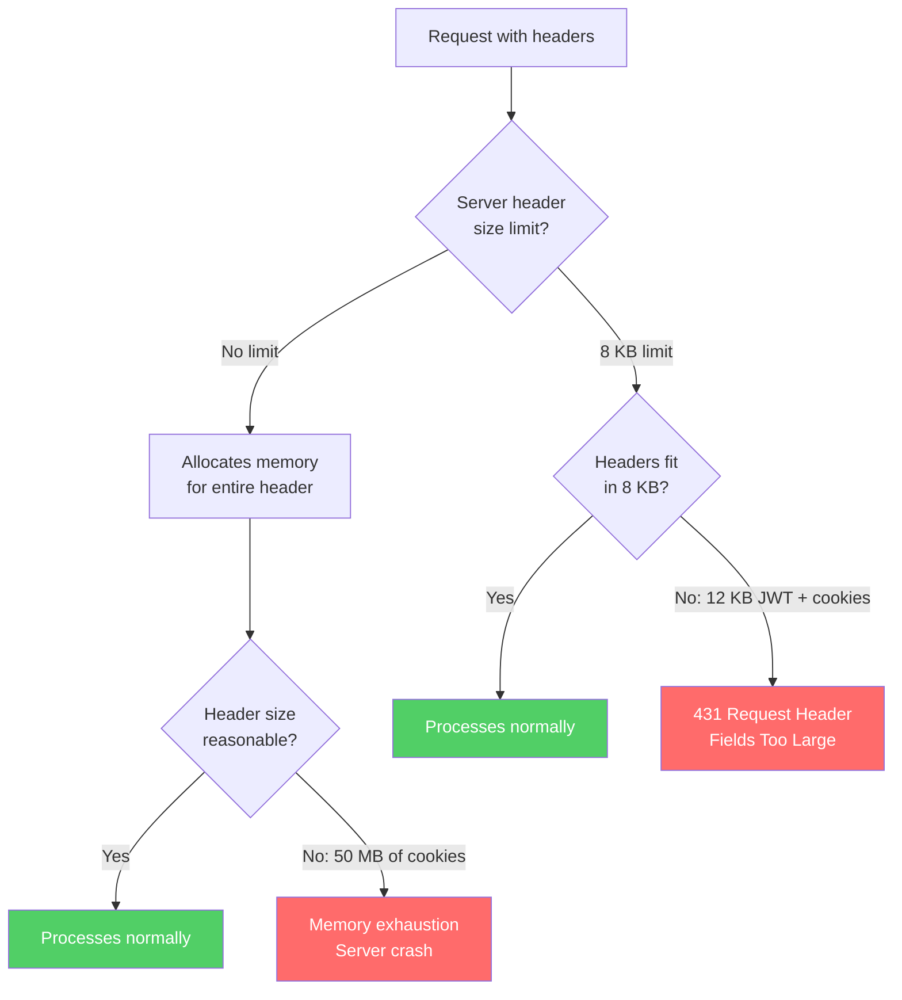
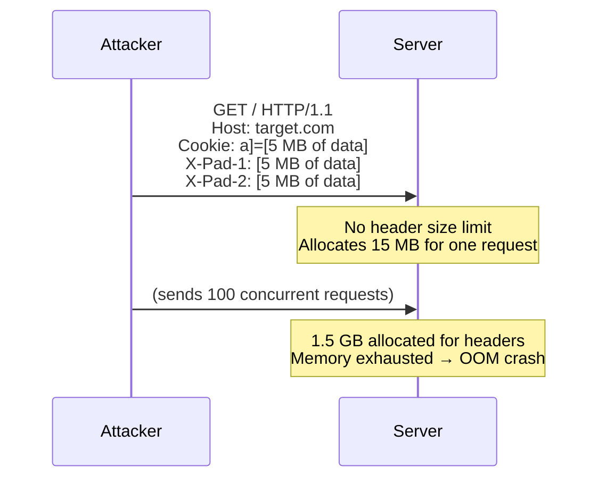
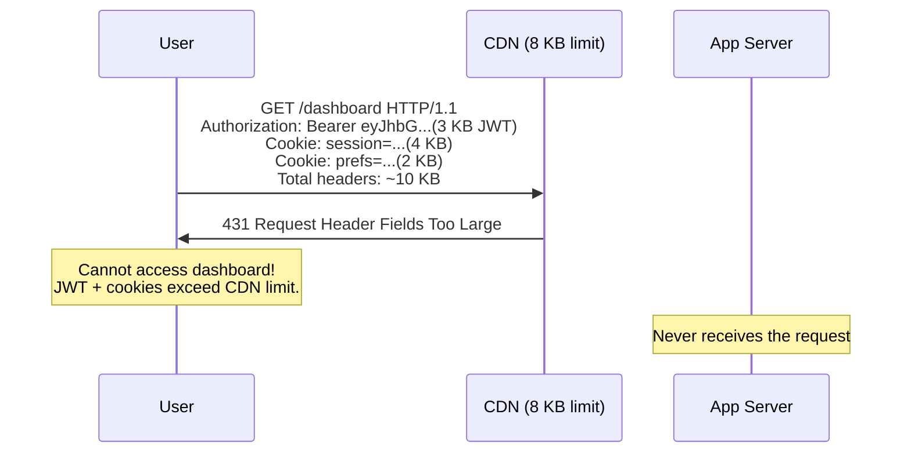

HTTP does not define a maximum size for headers. Each server, proxy, and load balancer sets its own limits — and these limits vary wildly. Apache defaults to 8 KB, nginx to 8 KB, IIS to 16 KB, and some CDNs allow up to 32 KB. This creates two opposing problems: servers without limits are vulnerable to memory exhaustion from maliciously oversized headers, while servers with strict limits reject legitimate requests that carry large JWT tokens, cookies, or custom headers. Both scenarios cause real outages.

## Why This Matters

- **Denial of service** — An attacker sends requests with enormous headers (megabytes of cookie data, thousands of custom headers). Servers without size limits allocate memory for each header, eventually exhausting available memory and crashing. This is a low-bandwidth, high-impact attack because headers are processed before any authentication or rate limiting.
- **Authentication failures** — Modern authentication systems use JWT tokens that can be 2-4 KB or larger. Combined with session cookies, CORS preflight headers, and application-specific headers, legitimate requests can exceed 8 KB. When a proxy or CDN rejects these with `431 Request Header Fields Too Large`, users cannot log in or access protected resources.
- **Silent request rejection** — Some servers close the connection without a response when headers are too large, making the failure invisible to monitoring. The client sees a connection reset with no status code, and debugging requires packet captures.
- **Cascading header growth** — As requests pass through proxy chains, each proxy may add headers (`X-Forwarded-For`, `X-Request-ID`, `Via`, etc.). By the time the request reaches the backend, the accumulated headers may exceed the backend's limit even though each individual component added a reasonable amount.

## How It Works



The DoS scenario:



The legitimate failure scenario:



## HTTP Examples

**Attack — oversized headers for DoS:**

```http
GET / HTTP/1.1
Host: target.example.com
Cookie: padding=AAAAAAAAAA...AAAA  (repeat to 1 MB)
X-Custom-1: BBBBBBBBBB...BBBB     (repeat to 1 MB)
X-Custom-2: CCCCCCCCCC...CCCC     (repeat to 1 MB)
```

Each request consumes 3 MB of server memory just for header parsing, before any application logic runs.

**Compliant — server rejects with 431:**

```http
HTTP/1.1 431 Request Header Fields Too Large
Content-Type: text/plain
Content-Length: 54

Request header fields exceed the maximum allowed size.
```

The server rejects the oversized request with the appropriate 431 status code, providing a clear signal to the client.

**Compliant — server rejects oversized URI with 414:**

```http
GET /search?q=AAAAAAAAAA...AAAA  (20 KB query string) HTTP/1.1
Host: api.example.com

HTTP/1.1 414 URI Too Long
Content-Type: text/plain

The request URI exceeds the maximum allowed length.
```

**Interoperability — URI length support:**

```http
# RFC 9110 recommends supporting URIs of at least 8000 octets.
# This request should be accepted:
GET /api/search?filters=category%3Delectronics%26brand%3D...  (7500 bytes) HTTP/1.1
Host: api.example.com

HTTP/1.1 200 OK
Content-Type: application/json
```

## How Thymian Detects This

Thymian validates header size handling using the following rules from the RFC 9110 rule set:

- **`server-must-respond-4xx-for-oversized-fields`** — Validates that servers respond with an appropriate 4xx status code (431 or 400) when request headers exceed the server's size limit, rather than silently dropping the connection or crashing.
- **`client-may-discard-oversized-field-lines`** — Documents that clients are permitted to discard individual response headers that exceed their processing limits, rather than failing entirely.
- **`sender-recipient-should-support-8000-octet-uris`** — Validates that both senders and recipients support URIs of at least 8000 octets. This ensures interoperability for APIs with complex query strings while establishing a reasonable baseline.

## Key Takeaways

- Every HTTP server **must** enforce header size limits — without them, a single request can exhaust all available memory
- When headers exceed the limit, the server **must** respond with `431 Request Header Fields Too Large` or an appropriate 4xx code, not silently close the connection
- Modern authentication (JWTs, OAuth tokens) and cookie-heavy applications can legitimately produce 10+ KB of headers — ensure your limits accommodate them
- Senders and recipients **should** support URIs of at least 8000 octets for interoperability
- Proxy chains accumulate headers — verify that the total header size at each hop remains within the next hop's limits
- Test your authentication flow against your CDN and proxy header size limits — this is a common source of production outages after adding new authentication features

## Further Reading

- [RFC 9110, Section 5.3 — Field Order and Limits](https://www.rfc-editor.org/rfc/rfc9110#section-5.3) — Requirements for handling oversized fields
- [RFC 9110, Section 4.1 — URI References](https://www.rfc-editor.org/rfc/rfc9110#section-4.1) — URI length recommendations
- [RFC 9110, Section 15.5.18 — 431 Request Header Fields Too Large](https://www.rfc-editor.org/rfc/rfc9110#section-15.5.18) — The status code for oversized headers
- [OWASP — Denial of Service Cheat Sheet](https://cheatsheetseries.owasp.org/cheatsheets/Denial_of_Service_Cheat_Sheet.html) — General DoS prevention strategies
