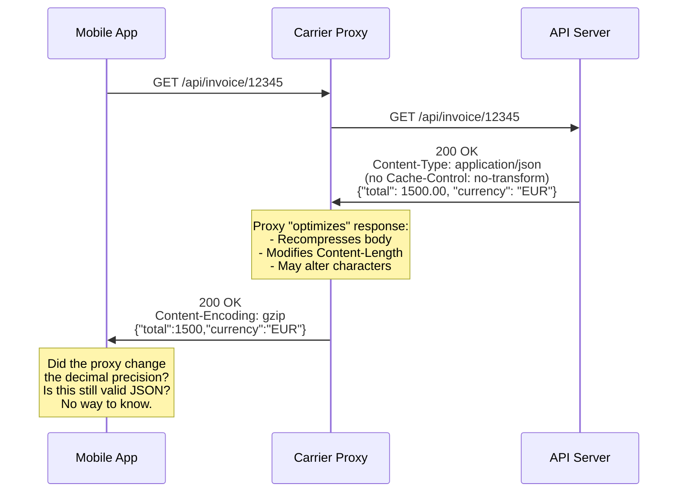
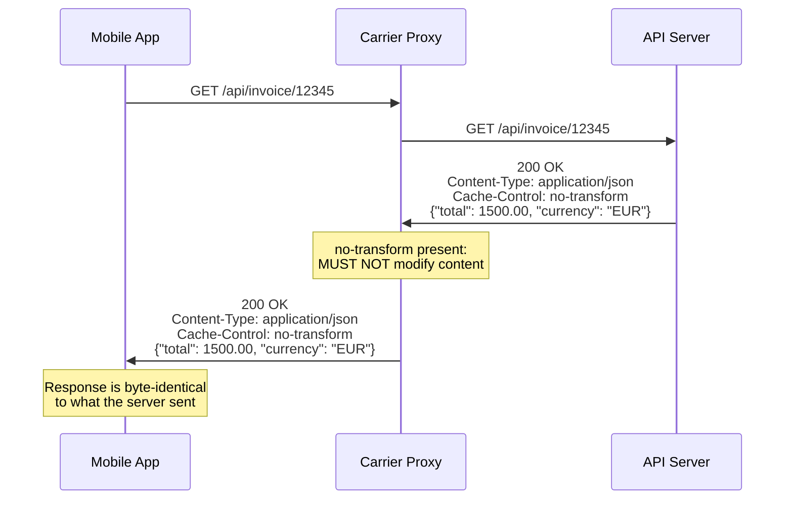
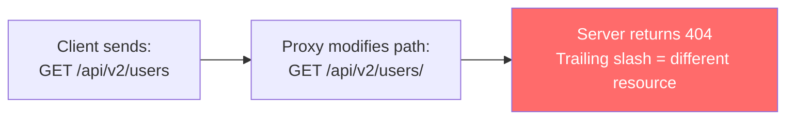

HTTP allows intermediaries — proxies, CDNs, corporate gateways — to transform response content. They might recompress images, minify HTML, or transcode video to save bandwidth. But when these transformations are applied indiscriminately, they corrupt data that was never meant to be modified: JSON API responses, binary file downloads, digitally signed payloads, and single-page application bundles. Mobile carriers are notorious offenders, but corporate proxies and misconfigured CDN edges do this too.

## Why This Matters

- **API response corruption** — A mobile carrier proxy attempts to "optimize" a JSON response by stripping whitespace or re-encoding characters. The modified JSON becomes unparseable or changes the meaning of the data. Financial APIs, healthcare APIs, and any API that transmits structured data can be silently corrupted.
- **Broken digital signatures** — When a response body is signed (e.g., webhook payloads from payment processors, software update manifests), any byte-level modification invalidates the signature. The recipient rejects the payload as tampered, causing integration failures.
- **File integrity violations** — Binary downloads (installers, firmware updates, database backups) modified by a proxy become corrupted. The user downloads what appears to be a valid file, but checksums fail or the software is broken.
- **Injected JavaScript** — Some proxies inject analytics scripts, advertising, or tracking pixels into HTML responses. This breaks Content Security Policy, causes React/Angular/Vue apps to fail hydration, and can introduce XSS vulnerabilities.
- **Image quality degradation** — Proxies that recompress images to save bandwidth destroy quality in medical imaging, photography, and design applications where pixel-level accuracy matters.

## How It Works

HTTP provides a mechanism to prevent unwanted transformations: the `Cache-Control: no-transform` directive. When present, intermediaries are prohibited from modifying the response content in any way.



With `no-transform`, the proxy must pass the response through unmodified:



Proxies can also corrupt requests by modifying the URI path or hostname:



## HTTP Examples

**Non-compliant — proxy transforms content despite no-transform:**

```http
# Server sends:
HTTP/1.1 200 OK
Content-Type: application/json
Cache-Control: no-transform
Content-Length: 45

{"amount": 1234.56, "signed": "a8f3b2..."}

# Proxy forwards (modified):
HTTP/1.1 200 OK
Content-Type: application/json
Content-Encoding: gzip
Content-Length: 38
Transfer-Encoding: chunked

(gzip-compressed, possibly altered content)
```

The proxy ignored `no-transform` and recompressed the content. The digital signature in the `signed` field may now be invalid because the body bytes have changed.

**Non-compliant — proxy modifies request URI:**

```http
# Client sends:
GET /api/search?q=hello+world&page=1 HTTP/1.1
Host: api.example.com

# Proxy forwards (modified path):
GET /api/search?q=hello%20world&page=1 HTTP/1.1
Host: api.example.com
```

The proxy re-encoded the query string (`+` to `%20`). While semantically equivalent in some contexts, some servers treat these differently, and HMAC-signed requests will fail because the signature was computed over the original byte sequence.

**Compliant — proxy forwards unmodified:**

```http
# Server sends:
HTTP/1.1 200 OK
Content-Type: application/json
Cache-Control: no-transform, no-store
Content-Length: 45

{"amount": 1234.56, "signed": "a8f3b2..."}

# Proxy forwards (identical):
HTTP/1.1 200 OK
Content-Type: application/json
Cache-Control: no-transform, no-store
Content-Length: 45
Via: 1.1 proxy.carrier.net

{"amount": 1234.56, "signed": "a8f3b2..."}
```

The proxy adds its `Via` header (required) but does not modify any content or existing headers.

## How Thymian Detects This

Thymian validates content integrity through proxies using the following rules from the RFC 9110 rule set:

- **`intermediary-must-not-transform-200-response-with-no-transform`** — Flags proxies that modify response content when `Cache-Control: no-transform` is present. This is a MUST-level requirement.
- **`intermediary-may-transform-content-unless-no-transform`** — Documents that transformation is permitted when `no-transform` is absent, but establishes the boundary
- **`proxy-must-not-modify-absolute-uri-when-forwarding`** — Catches proxies that alter the request URI path or query string when forwarding. Even cosmetic changes (re-encoding, adding trailing slashes) can break routing and signatures.
- **`proxy-must-not-modify-endpoint-of-absolute-uri-when-forwarding`** — Specifically protects the scheme, host, and port components of the URI from modification
- **`proxy-must-send-fqdn-in-request-target`** — Ensures proxies use fully qualified domain names in forwarded requests, preventing hostname truncation

## Key Takeaways

- APIs and services that require byte-level integrity **must** include `Cache-Control: no-transform` in responses
- Mobile carrier proxies are the most common offenders, but corporate proxies and CDN edges also transform content
- URI modifications by proxies (path re-encoding, trailing slashes, hostname changes) can break routing, signatures, and API contracts
- Digital signatures, checksums, and HMAC-based authentication are all invalidated by any byte-level content modification
- When debugging mysterious API failures that only occur on certain networks, consider that an intermediary may be modifying traffic

## Further Reading

- [RFC 9110, Section 7.7 — Message Transformations](https://www.rfc-editor.org/rfc/rfc9110#section-7.7) — Rules governing when intermediaries may and must not transform content
- [RFC 9111, Section 5.2.2.6 — no-transform](https://www.rfc-editor.org/rfc/rfc9111#section-5.2.2.6) — Cache-Control directive prohibiting transformations
- [RFC 9110, Section 7.6 — Message Forwarding](https://www.rfc-editor.org/rfc/rfc9110#section-7.6) — Requirements for URI and header preservation during forwarding
