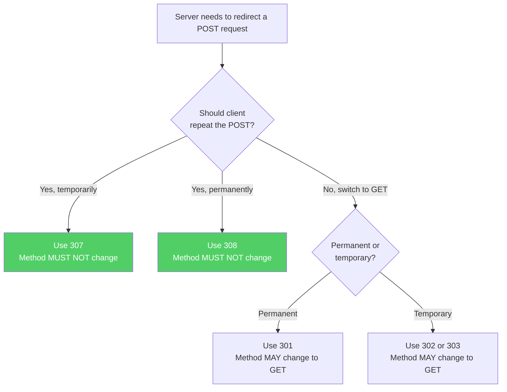
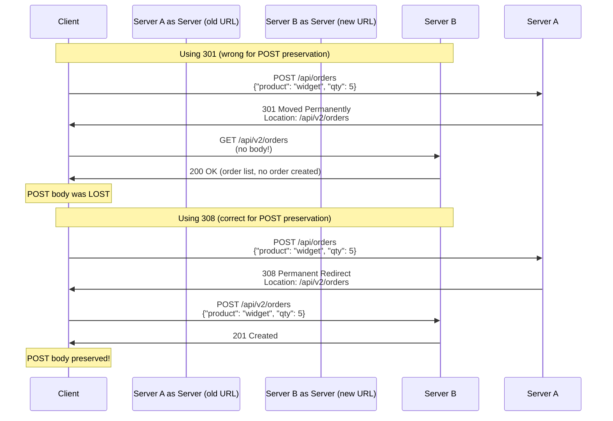

When a server redirects a POST request, the redirect status code determines whether the client should repeat the POST (with its body) or switch to GET (losing the body). This distinction — which seems like a minor protocol detail — has caused decades of confusion, broken form submissions, lost payment data, and failed API integrations. The problem stems from historical ambiguity in the 301 and 302 status codes, which was eventually resolved by adding 307 and 308, but many servers still use the wrong codes.

## Why This Matters

- **Lost form data** — A user submits a registration form via POST. The server responds with `301 Moved Permanently`. The browser changes the method to GET for the redirected request, dropping the form body. The user arrives at the new URL with no data submitted.
- **Failed payment processing** — A payment API responds with `302 Found` to a POST containing payment details. The client switches to GET, the payment body is lost, and the transaction silently fails. The user sees a confirmation page but was never charged (or is charged but the order is not created).
- **API integration breakage** — A webhook endpoint is moved to a new URL. The server responds with `301`. The webhook sender switches from POST to GET, losing the webhook payload. Events are silently dropped.
- **Redirect loops from method change** — A server expects POST at URL A, redirects to URL B with 301, the client sends GET to B, B requires POST and redirects back to A. An infinite redirect loop ensues.

## How It Works

HTTP defines four redirect status codes with different method-preservation behaviors:

| Status Code | Name               | Method Changes?            | Use Case                          |
| ----------- | ------------------ | -------------------------- | --------------------------------- |
| 301         | Moved Permanently  | POST **may** change to GET | Resource has a new permanent URL  |
| 302         | Found              | POST **may** change to GET | Temporary redirect (e.g., login)  |
| 307         | Temporary Redirect | Method **must not** change | Temporary redirect, preserve POST |
| 308         | Permanent Redirect | Method **must not** change | Permanent redirect, preserve POST |

The historical problem: The HTTP/1.0 spec said 301 and 302 should not change the method. But browsers did it anyway (changing POST to GET), and the behavior became entrenched. RFC 9110 acknowledges this reality — 301 and 302 MAY change the method — and provides 307 and 308 as the correct alternatives when the method must be preserved.





## HTTP Examples

**Wrong — 301 for a POST endpoint (body may be lost):**

```http
POST /api/payments HTTP/1.1
Host: api.example.com
Content-Type: application/json

{"amount": 99.99, "card": "tok_visa_1234"}

HTTP/1.1 301 Moved Permanently
Location: /api/v2/payments
```

Most clients will change the method to GET and drop the payment body. The redirect succeeds but the payment is never processed.

**Correct — 308 preserves method and body permanently:**

```http
POST /api/payments HTTP/1.1
Host: api.example.com
Content-Type: application/json

{"amount": 99.99, "card": "tok_visa_1234"}

HTTP/1.1 308 Permanent Redirect
Location: /api/v2/payments
```

The client MUST repeat the POST with the same body to the new URL. The payment is processed correctly.

**Correct — 307 preserves method and body temporarily:**

```http
POST /api/upload HTTP/1.1
Host: api.example.com
Content-Type: multipart/form-data; boundary=---
Content-Length: 10485760

(file data)

HTTP/1.1 307 Temporary Redirect
Location: https://upload-node-3.example.com/api/upload
```

The server temporarily redirects the upload to a different node. The client MUST repeat the POST with the same body.

**Correct — 303 explicitly requests GET after POST:**

```http
POST /api/orders HTTP/1.1
Host: shop.example.com
Content-Type: application/json

{"product": "widget", "qty": 5}

HTTP/1.1 303 See Other
Location: /api/orders/12345
```

303 is the correct way to say "your POST was processed, now GET the result." This is the Post/Redirect/Get pattern that prevents duplicate form submissions.

## How Thymian Detects This

Thymian validates redirect behavior using the following rules from the RFC 9110 rule set:

- **`user-agent-must-not-change-request-method-for-automatic-redirection-for-307-response`** — The critical rule. Clients MUST NOT change the request method when following a 307 redirect. If a POST was redirected with 307, the redirect must be a POST.
- **`user-agent-may-change-request-method-from-post-to-get-for-301-response`** — Documents that method change is permitted (not required) for 301, alerting developers that POST bodies may be lost.
- **`user-agent-may-change-request-method-from-post-to-get-for-302-response`** — Same as above for 302 redirects.
- **`clients-should-detect-and-intervene-cyclical-redirections`** — Catches infinite redirect loops that can result from method-change confusion (POST -> GET -> redirect back to POST endpoint).
- **`server-should-generate-location-header-field-for-301-response`** / **`server-should-generate-location-header-for-302-response`** / **`server-should-generate-location-header-for-307-response`** / **`server-should-generate-location-header-for-308-response`** — Validates that redirect responses include a Location header pointing to the new URL.
- **`user-agent-may-use-location-header-for-automatic-redirection-for-301-response`** / **`user-agent-may-use-location-header-for-automatic-redirection-for-302-response`** / **`user-agent-may-use-location-header-for-automatic-redirection-for-308-response`** — Validates client behavior when automatically following redirects.
- **`user-agent-must-inherit-fragment-for-3xx-without-fragment`** — Ensures fragment identifiers are preserved across redirects when the Location header does not include one.
- **`user-agent-shoud-resend-original-request-with-modifications-for-redirected-requests`** — Validates that redirected requests include appropriate modifications (updated Host header, etc.).

## Key Takeaways

- Use **307** for temporary redirects and **308** for permanent redirects when the request method and body must be preserved
- **301** and **302** may cause POST to change to GET — use them only when this behavior is acceptable or desired
- Use **303** (See Other) for the Post/Redirect/Get pattern, where you explicitly want the client to GET a different resource after a successful POST
- Many real-world data loss incidents stem from using 301/302 when 307/308 was needed
- API versioning redirects (e.g., `/api/v1/` -> `/api/v2/`) must use 307 or 308 to preserve POST/PUT/PATCH/DELETE methods

## Further Reading

- [RFC 9110, Section 15.4 — Redirection 3xx](https://www.rfc-editor.org/rfc/rfc9110#section-15.4) — Overview of all redirect status codes
- [RFC 9110, Section 15.4.2 — 301 Moved Permanently](https://www.rfc-editor.org/rfc/rfc9110#section-15.4.2) — Historical method change behavior
- [RFC 9110, Section 15.4.8 — 307 Temporary Redirect](https://www.rfc-editor.org/rfc/rfc9110#section-15.4.8) — Method-preserving temporary redirect
- [RFC 9110, Section 15.4.9 — 308 Permanent Redirect](https://www.rfc-editor.org/rfc/rfc9110#section-15.4.9) — Method-preserving permanent redirect
- [MDN — Redirections in HTTP](https://developer.mozilla.org/en-US/docs/Web/HTTP/Redirections) — Practical guide to HTTP redirects
