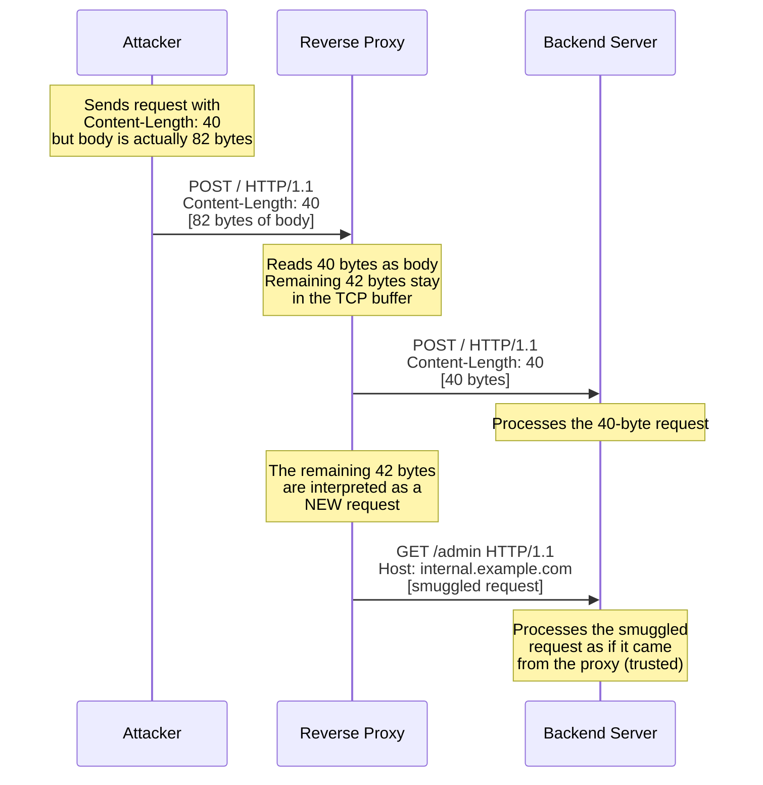
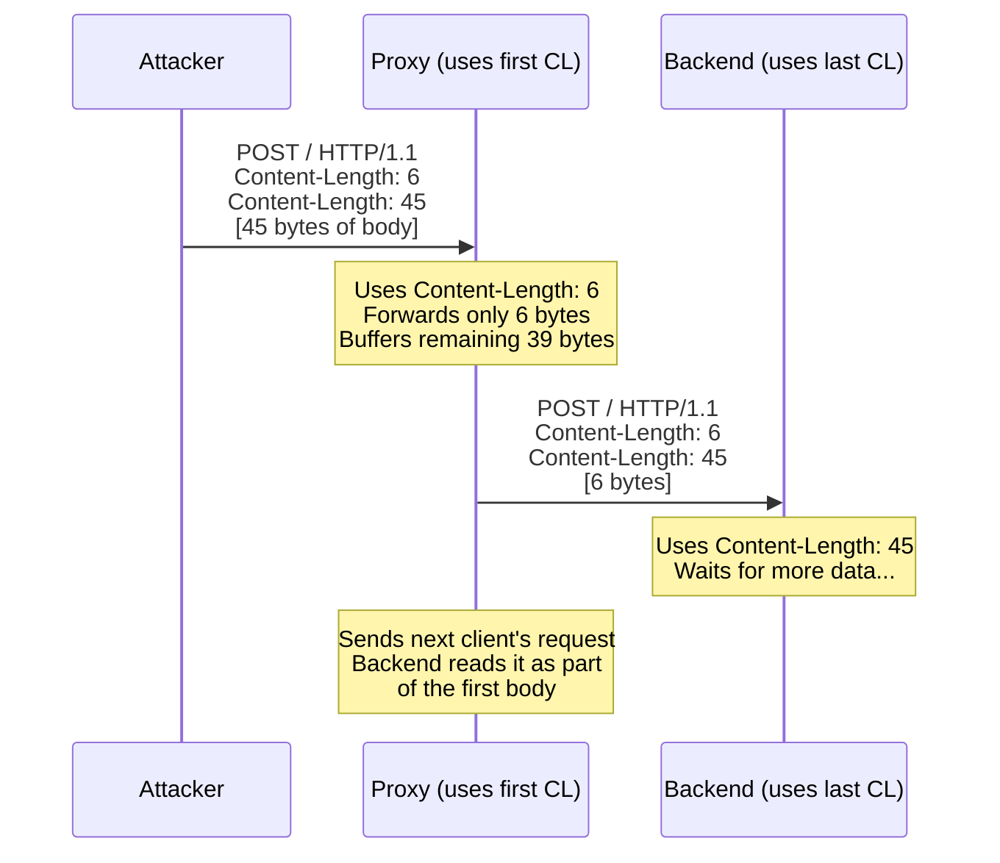

When an HTTP message travels through a proxy to a backend server, both systems need to agree on exactly where the message body ends and the next message begins. The `Content-Length` header is supposed to be the definitive answer. But when Content-Length is wrong — whether through misconfiguration, a bug, or deliberate manipulation — the proxy and server may parse the byte stream differently. The proxy thinks the body is 100 bytes; the server thinks it is 150 bytes. Those extra 50 bytes become a ghost request, processed under a different user's identity. This is HTTP request smuggling, and it is consistently rated among the most critical classes of web vulnerabilities.

## Why This Matters

Request smuggling exploits the gap between how different HTTP implementations parse message boundaries. The consequences are severe:

- **Credential theft** — An attacker's smuggled request is prepended to a victim's request. The server processes it as if the victim sent it, allowing the attacker to capture the victim's cookies, authorization tokens, or session data.
- **Cache poisoning** — The smuggled request causes a malicious response to be cached under a legitimate URL, serving attacker-controlled content to all subsequent visitors.
- **Web Application Firewall bypass** — The WAF inspects the "outer" request and approves it. The smuggled "inner" request bypasses all security checks.
- **Request hijacking** — An attacker can route a victim's request to an attacker-controlled endpoint, intercepting sensitive data.

This is not theoretical. James Kettle's 2019 research "HTTP Desync Attacks" demonstrated real-world exploitation against major infrastructure including CDNs and load balancers, resulting in critical CVEs across HAProxy, Apache Traffic Server, Akamai, and Pulse Secure VPN. The original attack class was documented by Watchfire in 2005 and has remained exploitable for two decades because HTTP implementations continue to handle Content-Length inconsistently.

## How It Works

The core problem is simple: when Content-Length does not match the actual body size, or when multiple conflicting Content-Length values are present, different systems in the request chain may disagree about message boundaries.

### Incorrect Content-Length



### Multiple Conflicting Content-Length Values

When a message contains two `Content-Length` headers with different values, some implementations use the first value while others use the last:



## HTTP Examples

**Non-compliant — incorrect Content-Length:**

```http
POST /search HTTP/1.1
Host: example.com
Content-Type: application/x-www-form-urlencoded
Content-Length: 13

q=test&lang=enGET /admin HTTP/1.1
Host: example.com

```

The declared Content-Length is 13 (`q=test&lang=en`), but the actual body contains additional data. A proxy reading exactly 13 bytes passes the legitimate search request. The remaining `GET /admin HTTP/1.1...` is left in the TCP stream and parsed as a separate request.

**Non-compliant — multiple Content-Length values:**

```http
POST /api/transfer HTTP/1.1
Host: bank.example.com
Content-Type: application/json
Content-Length: 30
Content-Length: 120

{"from": "alice", "to": "bob", "amount": 100}
SMUGGLED_REQUEST_HERE...
```

Different implementations pick different Content-Length values, creating a parsing discrepancy.

**Compliant — single, accurate Content-Length:**

```http
POST /search HTTP/1.1
Host: example.com
Content-Type: application/x-www-form-urlencoded
Content-Length: 14

q=test&lang=en
```

The Content-Length exactly matches the body. There is no ambiguity about where this message ends.

## How Thymian Detects This

Thymian validates Content-Length correctness using the following rules from the RFC 9110 rule set:

- **`sender-must-not-forward-incorrect-content-length`** — Catches messages where the Content-Length value does not match the actual body size. Senders are required to validate Content-Length before forwarding.
- **`sender-must-not-forward-message-with-incorrect-content-length-header`** — Specifically targets intermediaries that forward messages with Content-Length values known to be wrong. This is the primary defense against smuggling via Content-Length mismatch.
- **`sender-must-not-forward-message-with-invalid-content-length`** — Catches malformed Content-Length values: non-numeric values, multiple conflicting values, negative numbers, or values with leading zeros. Any of these can cause parsing disagreements between systems.

## Key Takeaways

- Content-Length **must** exactly match the actual body size — even a one-byte discrepancy can be exploited for request smuggling
- Messages with multiple conflicting Content-Length values **must** be rejected, never forwarded — different implementations pick different values, creating the exact parsing ambiguity attackers exploit
- Request smuggling is not a single vulnerability but a class of attacks: credential theft, cache poisoning, WAF bypass, and request hijacking all stem from the same root cause
- Intermediaries bear the greatest responsibility — a proxy that forwards an incorrect Content-Length enables every downstream attack
- This vulnerability class has persisted for over 20 years because HTTP parsing is implemented independently by hundreds of different systems, and any two that disagree become exploitable

## Further Reading

- [RFC 9110, Section 8.6 — Content-Length](https://www.rfc-editor.org/rfc/rfc9110#section-8.6) — Specification of Content-Length semantics and forwarding requirements
- Linhart, Heydt-Benjamin, Neville, Novik, ["HTTP Request Smuggling"](https://www.cgisecurity.com/lib/HTTP-Request-Smuggling.pdf) (Watchfire, 2005) — The original paper defining CL/TE desync attacks
- James Kettle, ["HTTP Desync Attacks: Request Smuggling Reborn"](https://portswigger.net/research/http-desync-attacks-request-smuggling-reborn) (DEF CON 27, 2019) — Modernized smuggling research with real-world CDN exploitation
- [RFC 9112, Section 6.3 — Message Body Length](https://www.rfc-editor.org/rfc/rfc9112#section-6.3) — HTTP/1.1 framing rules for determining message body length
