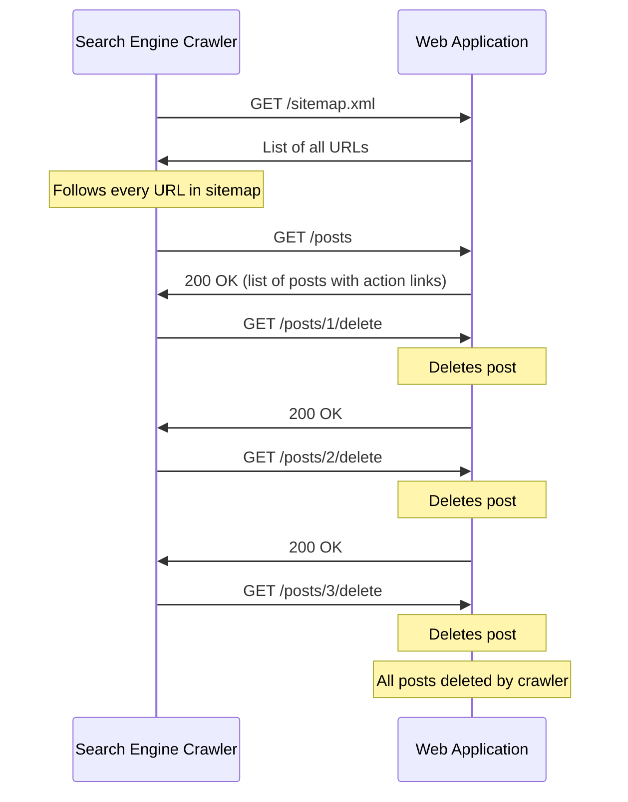
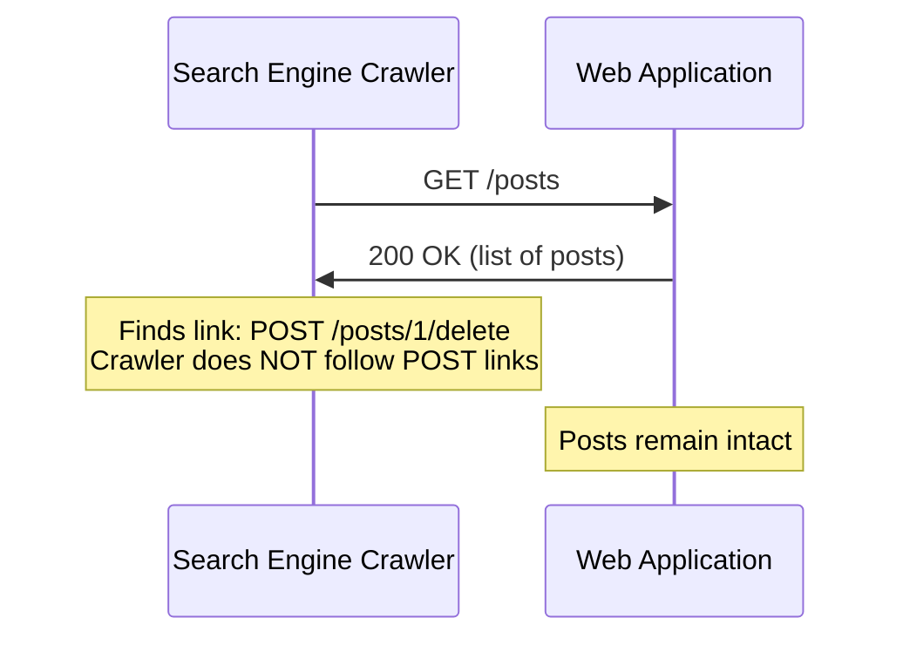

In HTTP, "safe" methods like GET and HEAD are defined as read-only — they must not cause any change to the server's state. When developers violate this contract by implementing GET endpoints that delete records, send emails, or modify data, the results are predictable and disastrous. Web crawlers follow every link, browser prefetchers load pages before users click them, and caches serve stored responses instead of forwarding requests. All of these behaviors assume GET is safe. When it is not, data is destroyed, actions are triggered unexpectedly, and debugging is nearly impossible.

## Why This Matters

The most famous incident occurred in 2005 when Google launched its Web Accelerator, a browser extension that prefetched links on the current page to speed up navigation. Ruby on Rails applications at the time commonly used GET requests for destructive actions (delete links like `GET /posts/42/delete`). The Web Accelerator silently prefetched these links, deleting data without the user ever clicking anything. Entire databases were emptied by a browser optimization feature.

Other real-world consequences include:

- **Search engine crawlers deleting data** — Googlebot, Bingbot, and other crawlers follow every link they find. If `GET /user/42/remove` deletes a user, the crawler will delete every user it discovers.
- **Browser prefetching triggering actions** — Modern browsers prefetch links they predict the user will click. If those links trigger side effects, the actions execute before the user makes a conscious choice.
- **Proxy caching preventing execution** — If a GET endpoint sends an email, a cache may serve a stored response for subsequent requests. The email is sent once but never again, even though users expect it to send each time.
- **Browser extensions and security tools** — Anti-malware tools, accessibility tools, and privacy extensions may follow links to inspect them. Each follow triggers the side effect.

## How It Works



The correct design uses POST (or DELETE) for destructive operations:



## HTTP Examples

**Non-compliant — GET with destructive side effect:**

```http
GET /api/users/42/delete HTTP/1.1
Host: app.example.com
```

This endpoint deletes user 42 when accessed via GET. Any crawler, prefetcher, or cached request will trigger the deletion.

**Non-compliant — GET that sends email:**

```http
GET /api/notifications/send?to=team@example.com&msg=Deploy+complete HTTP/1.1
Host: app.example.com
```

If this response is cached, subsequent requests receive the cached response without sending the email. If not cached, every prefetch or crawl sends a duplicate email.

**Compliant — destructive operations use appropriate methods:**

```http
DELETE /api/users/42 HTTP/1.1
Host: app.example.com
Authorization: Bearer eyJhbG...

HTTP/1.1 204 No Content
```

```http
POST /api/notifications HTTP/1.1
Host: app.example.com
Content-Type: application/json
Authorization: Bearer eyJhbG...

{"to": "team@example.com", "message": "Deploy complete"}

HTTP/1.1 201 Created
```

Crawlers, prefetchers, and caches never automatically trigger DELETE or POST requests. The operations only execute when explicitly initiated by the user or application.

## How Thymian Detects This

Thymian validates safe method semantics using the following rules from the RFC 9110 rule set:

- **`origin-server-must-disable-safe-methods-for-unsafe-resources`** — Flags endpoints where safe methods (GET, HEAD) produce state-changing side effects. RFC 9110 states that the origin server MUST NOT allow a safe request to have unsafe side effects.
- **`user-agent-distinguish-between-safe-and-unsafe-methods`** — Validates that user agents correctly differentiate between safe and unsafe methods, presenting appropriate UI cues (e.g., confirmation dialogs for unsafe actions) and not automatically triggering unsafe requests.

## Key Takeaways

- GET and HEAD are a contract: they promise the server state will not change. Violating this contract causes real data loss.
- Crawlers, prefetchers, browser extensions, and caches all assume GET is safe — there is no way to prevent them from following GET links
- Use POST for actions that change state, DELETE for deletions, PUT for updates — these methods are never automatically triggered by infrastructure
- The "delete link" anti-pattern (`GET /resource/delete`) is the canonical example, but any side effect via GET is equally dangerous: sending emails, creating records, transferring money
- This is not just about security — it is about correctness. HTTP method semantics are the foundation that the entire web infrastructure relies on.

## Further Reading

- [RFC 9110, Section 9.2.1 — Safe Methods](https://www.rfc-editor.org/rfc/rfc9110#section-9.2.1) — Definition of safe methods and the prohibition of side effects
- [RFC 9110, Section 9.3.1 — GET](https://www.rfc-editor.org/rfc/rfc9110#section-9.3.1) — GET method semantics
- ["The Spider of Doom"](https://blog.codinghorror.com/the-spider-of-doom/) — Jeff Atwood's account of the Google Web Accelerator incident and the dangers of GET with side effects
