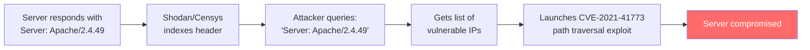

Every HTTP response can include a `Server` header, and every request can include a `User-Agent` header. These headers are meant to identify the software handling the message. The problem is that many implementations include far too much detail — exact version numbers, operating system information, installed modules, and framework versions. This turns every HTTP exchange into a reconnaissance opportunity for attackers, who can scan for specific vulnerable versions and launch targeted exploits without any trial and error.

## Why This Matters

- **Targeted exploitation** — When a server responds with `Server: Apache/2.4.49 (Ubuntu) OpenSSL/1.1.1f PHP/7.4.3`, an attacker knows exactly which CVEs to try. Apache 2.4.49 has CVE-2021-41773 (path traversal), PHP 7.4.3 has multiple known vulnerabilities. No guesswork needed.
- **Internet-wide scanning** — Services like Shodan and Censys index `Server` headers across the entire internet. Attackers query these databases for specific vulnerable versions, then mass-exploit them. When a new CVE is published, the attack window is measured in hours.
- **Client fingerprinting** — Overly detailed `User-Agent` headers (e.g., `Mozilla/5.0 (Windows NT 10.0; Win64; x64) AppleWebKit/537.36 (KHTML, like Gecko) Chrome/91.0.4472.124 Safari/537.36`) are a primary vector for browser fingerprinting, enabling user tracking without cookies.
- **Supply chain exposure** — Headers like `X-Powered-By: Express` or `Server: nginx/1.18.0 (Ubuntu)` reveal the entire technology stack, helping attackers identify the weakest link.

The Apache 2.4.49 path traversal vulnerability (CVE-2021-41773) is a textbook example: attackers scanned Shodan for servers advertising this exact version and mass-exploited them within days of the CVE publication.

## How It Works



The same principle applies to client fingerprinting:

```mermaid
sequenceDiagram
    participant User
    participant Site A as Site A (Tracker)
    participant Site B as Site B (Tracker)

    User->>Site A: GET /page<br/>User-Agent: Mozilla/5.0 (Macintosh; Intel Mac OS X 10_15_7)...<br/>Accept-Language: en-US,de-DE;q=0.9
    Note over Site A: Fingerprint hash: a7b3c9d2<br/>Links to user profile

    User->>Site B: GET /page<br/>User-Agent: Mozilla/5.0 (Macintosh; Intel Mac OS X 10_15_7)...<br/>Accept-Language: en-US,de-DE;q=0.9
    Note over Site B: Same fingerprint: a7b3c9d2<br/>Same user, no cookies needed
```

The EFF's Panopticlick (now Cover Your Tracks) project demonstrated that the combination of User-Agent, Accept-Language, and other headers creates a unique fingerprint for the vast majority of browsers.

## HTTP Examples

**Non-compliant — overly detailed Server header:**

```http
HTTP/1.1 200 OK
Server: Apache/2.4.49 (Ubuntu) OpenSSL/1.1.1f PHP/7.4.3 mod_perl/2.0.11
X-Powered-By: PHP/7.4.3
Content-Type: text/html
```

This response reveals the exact web server, OS, TLS library, PHP runtime, and Perl module versions. Each is a searchable attack surface.

**Non-compliant — overly detailed User-Agent:**

```http
GET /api/data HTTP/1.1
Host: api.example.com
User-Agent: MyApp/2.1.3 (Linux; x86_64) libcurl/7.68.0 OpenSSL/1.1.1f zlib/1.2.11
```

This client reveals its application version, OS, architecture, HTTP library version, TLS library version, and compression library version.

**Compliant — minimal Server header:**

```http
HTTP/1.1 200 OK
Server: Apache
Content-Type: text/html
```

Only the product name, no version. An attacker learns the server software but cannot target a specific version.

**Compliant — minimal User-Agent:**

```http
GET /api/data HTTP/1.1
Host: api.example.com
User-Agent: MyApp/2.1
```

Only the product name and major version. Sufficient for compatibility purposes without exposing the full technology stack.

## How Thymian Detects This

Thymian validates information disclosure through product headers using the following rules from the RFC 9110 rule set:

- **`origin-server-should-not-generate-detailed-server-header`** — Flags Server headers that contain needlessly fine-grained detail (version numbers, OS information, module versions)
- **`origin-server-should-limit-addition-of-subproducts-by-third-parties`** — Warns when third-party modules append their own product tokens to the Server header, expanding the attack surface
- **`origin-server-may-generate-server-header-field`** — Documents that the Server header is optional — omitting it entirely is a valid choice
- **`user-agent-should-not-generate-overly-detailed-user-agent`** — Flags User-Agent strings that reveal more than necessary about the client software and environment
- **`user-agent-should-limit-addition-of-subproducts-by-third-parties`** — Warns when plugins or libraries append their own product tokens to the User-Agent
- **`sender-should-limit-generated-product-identifiers-to-necessity`** — Applies to both clients and servers: only include product tokens that serve an interoperability purpose
- **`sender-should-not-generate-non-version-info-in-product-version`** — Flags product tokens that include non-version information (OS details, architecture, etc.) in the version field
- **`sender-must-not-generate-advertising-in-product-identifier`** — Catches product tokens that include advertising or marketing text, which adds noise and further expands the header's attack surface

## Key Takeaways

- Detailed `Server` headers turn every response into a reconnaissance report — omit version numbers, module lists, and OS information
- Shodan and Censys index Server headers internet-wide, allowing attackers to find vulnerable servers before patches are applied
- Detailed `User-Agent` headers enable cross-site user tracking without cookies
- The safest approach is to either omit the `Server` header entirely or include only the product name without a version
- Audit every component in your stack (web server, reverse proxy, application framework) for headers that leak technology information — check for `X-Powered-By`, `X-AspNet-Version`, and similar headers too

## Further Reading

- [RFC 9110, Section 10.2.4 — Server](https://www.rfc-editor.org/rfc/rfc9110#section-10.2.4) — Requirements for the Server header field
- [RFC 9110, Section 10.1.5 — User-Agent](https://www.rfc-editor.org/rfc/rfc9110#section-10.1.5) — Requirements for the User-Agent header field
- [CVE-2021-41773](https://nvd.nist.gov/vuln/detail/CVE-2021-41773) — Apache 2.4.49 path traversal, mass-exploited via Server header scanning
- EFF, ["Cover Your Tracks"](https://coveryourtracks.eff.org/) — Browser fingerprinting research demonstrating User-Agent as a tracking vector
- [OWASP — HTTP Headers Security](https://owasp.org/www-project-secure-headers/) — Recommendations for security-relevant HTTP headers
