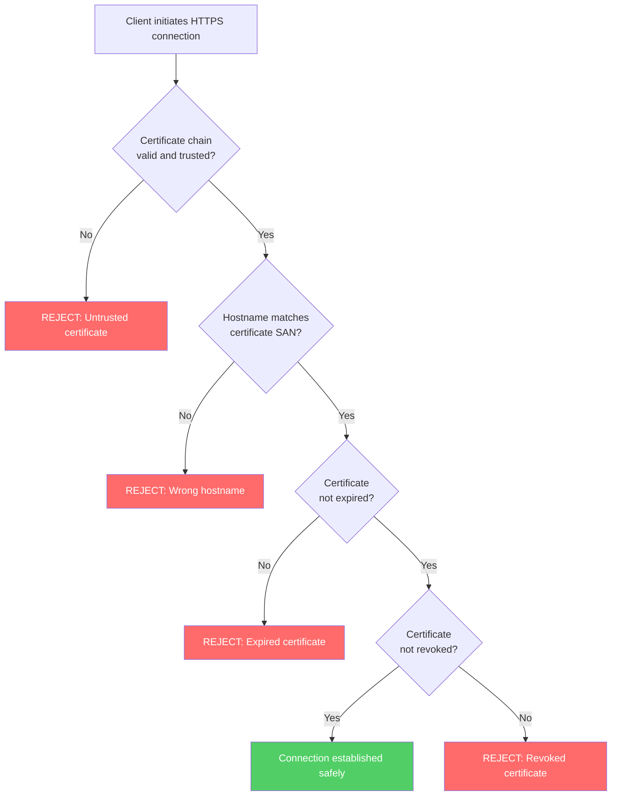
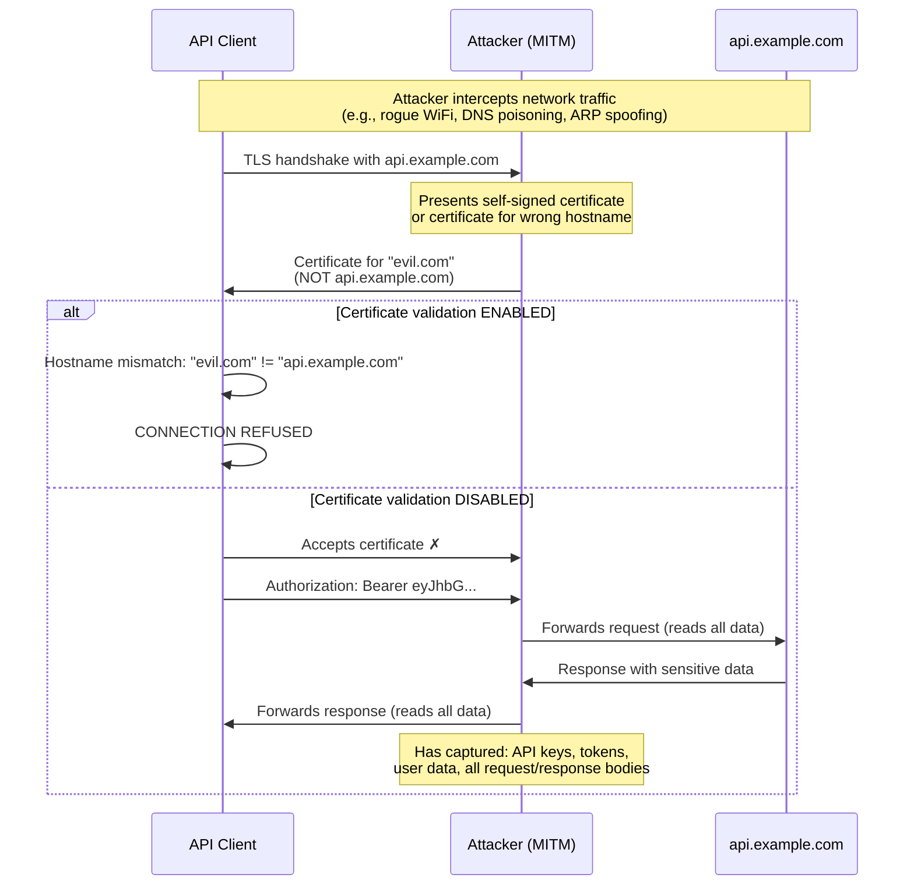

When an HTTP client connects to a server over HTTPS, it must verify that the server's TLS certificate is valid and belongs to the intended host. If this verification is skipped, weakened, or implemented incorrectly, an attacker positioned between the client and server can intercept, read, and modify all traffic — including credentials, API keys, and sensitive data. This is a man-in-the-middle (MITM) attack, and it is devastatingly common in non-browser HTTP clients.

## Why This Matters

In 2012, researchers Georgiev et al. published a landmark study titled "The Most Dangerous Code in the World," systematically analyzing TLS certificate validation in non-browser software. Their findings were alarming:

- **Amazon EC2 Java library** — Did not validate hostnames in certificates, allowing any valid certificate to authenticate any server
- **PayPal Payments SDK** — Disabled certificate validation entirely
- **Chase mobile banking app** — Accepted self-signed certificates
- **Amazon and PayPal merchant SDKs** — Vulnerable to MITM attacks due to incorrect certificate chain validation
- **Numerous Python, Java, and PHP libraries** — Used broken or absent hostname verification

The pattern is consistent: browser vendors invest heavily in correct TLS implementation, but non-browser HTTP clients — the ones that handle API calls, payment processing, and microservice communication — frequently get it wrong. Common causes include:

- Setting `NODE_TLS_REJECT_UNAUTHORIZED=0` in Node.js for convenience during development, then shipping it to production
- Using `verify=False` in Python's `requests` library
- Disabling `SSLPeerVerification` in PHP's cURL wrapper
- Using deprecated CN (Common Name) matching instead of SAN (Subject Alternative Name) verification

## How It Works

TLS certificate validation involves multiple steps. Skipping any one of them opens a different attack vector:



When validation is disabled or broken, the attack is straightforward:



### The CN vs SAN Problem

Older implementations check the certificate's Common Name (CN) field for hostname matching. This is deprecated and insecure because:

- CN was designed for human-readable display names, not hostname verification
- A certificate with `CN=*.example.com` matched differently across implementations
- Attackers could obtain certificates with misleading CN values
- Modern certificates use Subject Alternative Name (SAN) extensions, which support multiple hostnames and wildcards with well-defined matching rules

RFC 9110 explicitly requires RFC 6125 verification and prohibits CN-based matching for this reason.

## HTTP Examples

**Non-compliant — disabled certificate validation (Node.js):**

```javascript
// DANGEROUS: Disables ALL certificate validation
process.env.NODE_TLS_REJECT_UNAUTHORIZED = '0';

const response = await fetch('https://api.example.com/users', {
  headers: { Authorization: 'Bearer secret-token' },
});
```

Any MITM attacker can intercept this request, capture the bearer token, and impersonate the client.

**Non-compliant — CN-based hostname matching:**

```
Certificate:
  Subject: CN=api.example.com     ← Deprecated matching field
  Subject Alternative Name: (none)
```

A client that only checks CN may accept a certificate where the CN matches but the SAN (which should be the authoritative source) does not contain the hostname.

**Compliant — proper SAN-based verification:**

```
Certificate:
  Subject: CN=Example API           ← Informational only
  Subject Alternative Name:
    DNS:api.example.com              ← Client MUST match against this
    DNS:api.staging.example.com
```

The client verifies that `api.example.com` appears in the SAN extension, the certificate chain is trusted, and the certificate is not expired or revoked.

## How Thymian Detects This

Thymian validates TLS certificate handling using the following rules from the RFC 9110 rule set:

- **`client-must-verify-service-identity`** — Ensures clients verify the server's identity before sending any data. This is the foundational check.
- **`client-must-use-rfc6125-verification`** — Requires clients to use the RFC 6125 verification procedure, which defines the correct algorithm for matching hostnames against certificates
- **`client-must-not-use-cn-id-reference-identity`** — Explicitly flags clients that fall back to deprecated CN-based matching instead of using SAN
- **`client-must-construct-reference-identity`** — Validates that the client properly constructs the reference identity (the hostname it expects) from the URI before comparing it to the certificate
- **`client-must-secure-https-requests-and-responses`** — Ensures the entire HTTPS transaction (both request and response) is protected by TLS
- **`automated-clients-must-provide-setting-to-enable-certificate-check`** — Requires automated HTTP clients to have a configuration option to enable certificate validation (rejecting clients that hardcode validation off)
- **`automated-clients-may-provide-setting-to-disable-certificate-check`** — Acknowledges that test/development environments may need to disable validation, but the setting must be explicit
- **`automated-client-should-terminate-connection-for-bad-certificate`** — Warns when automated clients continue communicating after encountering a bad certificate instead of terminating
- **`automated-client-must-log-error-to-audit-log-for-bad-certificate`** — Requires that certificate validation failures are logged to an audit log, creating a forensic trail for security investigations
- **`user-agent-must-handle-bad-certificate`** — Ensures user agents have a defined behavior (reject or prompt the user) when encountering an invalid certificate

## Key Takeaways

- Disabling TLS certificate validation is the most common security mistake in non-browser HTTP clients — and it completely negates the protection HTTPS provides
- Certificate hostname matching **must** use the Subject Alternative Name (SAN) extension, not the deprecated Common Name (CN) field
- Automated clients (microservices, CI/CD pipelines, cron jobs) are the most frequent offenders because there is no human to notice a certificate warning
- `NODE_TLS_REJECT_UNAUTHORIZED=0`, `verify=False`, and equivalent settings must **never** reach production
- Certificate validation failures should always be logged — they may indicate an active attack

## Further Reading

- [RFC 9110, Section 4.3.4 — https URI Scheme, Authoritative Access](https://www.rfc-editor.org/rfc/rfc9110#section-4.3.4) — Requirements for client certificate verification
- [RFC 6125 — Representation and Verification of Domain-Based Application Service Identity](https://www.rfc-editor.org/rfc/rfc6125) — The correct algorithm for matching hostnames against certificates
- Martin Georgiev et al., ["The Most Dangerous Code in the World: Validating SSL Certificates in Non-Browser Software"](https://www.cs.utexas.edu/~shmat/shmat_ccs12.pdf) (ACM CCS 2012) — Systematic analysis of broken certificate validation across major libraries and SDKs
- [OWASP — Certificate and Public Key Pinning](https://owasp.org/www-community/controls/Certificate_and_Public_Key_Pinning) — Additional defense-in-depth measures beyond standard certificate validation
