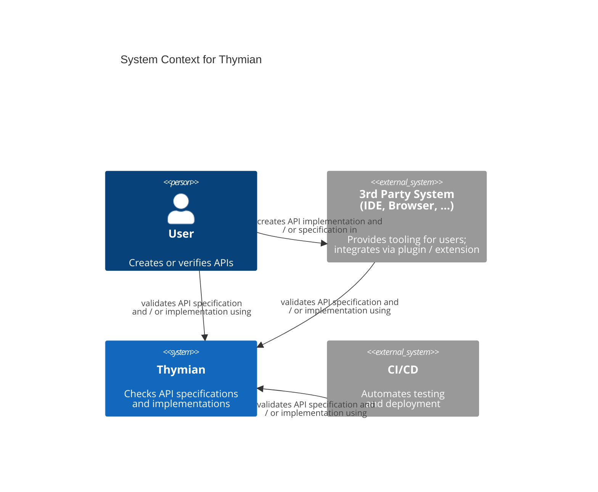

# 3. Context & Scope

## 3.1 Business Context

```mermaid
C4Context
  title System Context for Thymian
  Person(user, "User", "Creates or verifies APIs")
  System_Ext(3rdParty, "3rd Party System<br>(IDE, Browser, ...)", "Provides tooling for users;<br>integrates via plugin / extension")
  System(thymian, "Thymian", "Checks API specifications<br>and implementations")
  System_Ext(ci, "CI/CD", "Automates testing<br>and deployment")

  Rel(user, thymian, "validates API specification<br>and / or implementation using")
  UpdateRelStyle(user, thymian, $offsetX="-100")
  Rel(ci, thymian, "validates API specification and<br>/ or implementation using")
  UpdateRelStyle(ci, thymian, $offsetX="-50", $offsetY="20")
  Rel(user, 3rdParty, "creates API implementation and<br>/ or specification in")
  UpdateRelStyle(user, 3rdParty, $offsetX="-50", $offsetY="-20")
  Rel(3rdParty, thymian, "validates API specification and<br>/ or implementation using")
  UpdateRelStyle(3rdParty, thymian, $offsetX="-50")

  UpdateLayoutConfig($c4ShapeInRow="2", $c4BoundaryInRow="1")
```

## Technical Context

TODO
