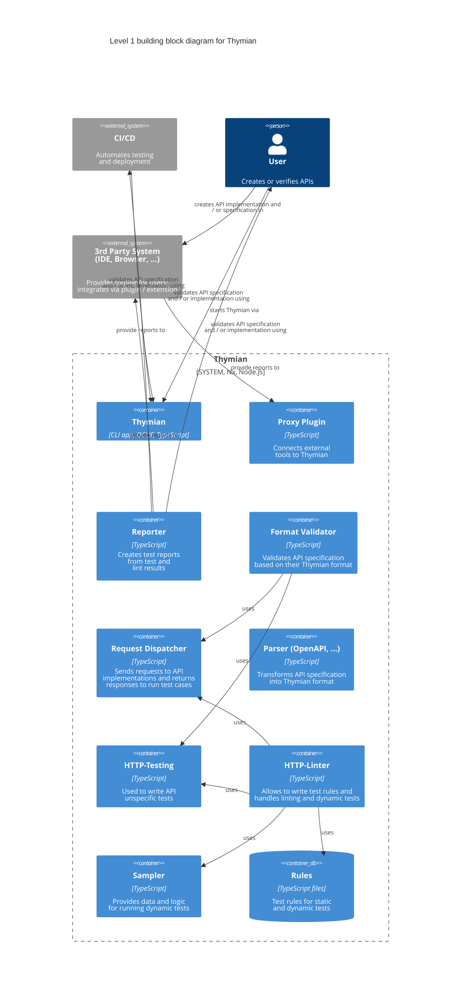

# 5. Building Block View

## 5.1 Whitebox Thymian

```mermaid
C4Container
  title Level 1 building block diagram for Thymian
  System_Ext(ci, "CI/CD", "Automates testing<br>and deployment")
  Person(user, "User", "Creates or verifies APIs")
  System_Ext(3rdParty, "3rd Party System<br>(IDE, Browser, ...)", "Provides tooling for users;<br>integrates via plugin / extension")

  Boundary(thymian, "Thymian", "SYSTEM, Nx, Node.js") {
    Container(thymianCli, "Thymian", "CLI app, OCLIF, TypeScript")
    Container(proxy, "Proxy Plugin", "TypeScript", "Connects external<br>tools to Thymian")
    Container(reporter, "Reporter", "TypeScript", "Creates test reports<br>from test and<br>lint results")
    Container(formatValidator, "Format Validator", "TypeScript", "Validates API specification<br>based on their Thymian format")
    Container(requestDispatcher, "Request Dispatcher", "TypeScript", "Sends requests to API<br>implementations and returns<br>responses to run test cases")
    Container(parser, "Parser (OpenAPI, ...)", "TypeScript", "Transforms API specification<br>into Thymian format")
    Container(testing, "HTTP-Testing", "TypeScript", "Used to write API<br>unspecific tests")
    Container(linter, "HTTP-Linter", "TypeScript", "Allows to write test rules and<br>handles linting and dynamic tests")
    Container(sampler, "Sampler", "TypeScript", "Provides data and logic<br>for running dynamic tests")
    ContainerDb(rules, "Rules", "TypeScript files", "Test rules for static<br>and dynamic tests")
  }

  Rel(user, thymianCli, "validates API specification<br>and / or implementation using")
  UpdateRelStyle(user, thymianCli, $offsetX="-100")
  Rel(user, 3rdParty, "creates API implementation and<br>/ or specification in")
  UpdateRelStyle(user, 3rdParty, $offsetX="-50", $offsetY="-20")
  Rel(ci, thymianCli, "validates API specification<br>and / or implementation using")
  UpdateRelStyle(ci, thymianCli, $offsetX="-80", $offsetY="-10")
  Rel(3rdParty, thymianCli, "starts Thymian via")
  UpdateRelStyle(3rdParty, thymianCli, $offsetX="130", $offsetY="-85")
  Rel(3rdParty, proxy, "validates API specification<br>and / or implementation using")
  UpdateRelStyle(3rdParty, proxy, $offsetX="-30", $offsetY="-50")

  Rel(reporter, ci, "provide reports to")
  UpdateRelStyle(reporter, ci, $offsetX="-50", $offsetY="-25")
  Rel(reporter, user, "provide reports to")
  UpdateRelStyle(reporter, user, $offsetX="25", $offsetY="35")
  Rel(reporter, 3rdParty, "provide reports to")
  UpdateRelStyle(reporter, 3rdParty, $offsetX="-30", $offsetY="60")

  Rel(linter, testing, "uses")
  Rel(formatValidator, testing, "uses")
  Rel(linter, requestDispatcher, "uses")
  Rel(formatValidator, requestDispatcher, "uses")
  Rel(linter, rules, "uses")
  Rel(linter, sampler, "uses")

  UpdateLayoutConfig($c4ShapeInRow="3", $c4BoundaryInRow="1")
```

## 5.2 Building Blocks - Level 2

### 5.2.1 HTTP-Linter

### 5.2.2 Sampler
