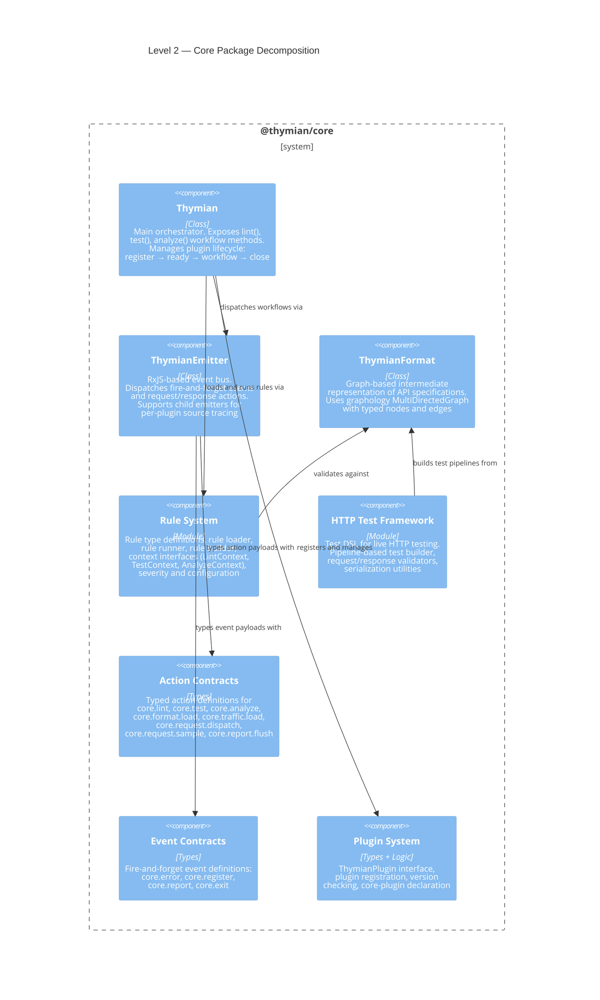

# 5. Building Block View

## 5.1 Whitebox Thymian

```mermaid
C4Container
  title Level 1 building block diagram for Thymian
  System_Ext(ci, "CI/CD", "Automates testing<br>and deployment")
  Person(user, "User", "Creates or verifies APIs")
  System_Ext(3rdParty, "3rd Party System<br>(IDE, Browser, ...)", "Provides tooling for users;<br>integrates via plugin / extension")

  Boundary(thymian, "Thymian", "SYSTEM, Nx, Node.js") {
    Boundary(thymianCore, "Thymian Core") {
      Container(core, "Core", "TypeScript", "Workflow orchestration,<br>ThymianFormat, rule system,<br>event/action contracts,<br>HTTP test framework")

      %% Inbound Ports
      Container(forUserInteraction, "For User Interaction", "Port", "Defines methods and types<br>for using Thymian via CLI or<br>other user interfaces")

      %% Outbound Ports
      Container(forPlugins, "For Plugins", "Port", "Defines events, actions<br>and plugin options")
      Container(forReporting, "For Reporting", "Port", "Defines methods and types<br>for reporting results for<br>linting, testing and analyzing")
      Container(forHttpTrafficLoading, "For HTTP<br>Traffic Loading", "Port", "Defines methods and types for<br>loading HTTP traffic data")
      Container(forThymianFormatLoading, "For Thymian<br>Format Loading", "Port", "Defines methods and types<br>for loading Thymian format<br>from API descriptions")
      Container(forLinting, "For Linting", "Port", "Defines methods and types<br>for linting Thymian format data")
      Container(forTesting, "For Testing", "Port", "Defines methods and types<br>for testing HTTP interactions<br>against Thymian format data using<br>HTTP requests and responses")
      Container(forAnalyzing, "For Analyzing", "Port", "Defines methods and types<br>for analyzing HTTP interactions<br>against Thymian format data<br>from HTTP traffic data")
      Container(forSampling, "For Sampling", "Port", "Defines methods and types for<br>creating sample data for testing")
      Container(forHttpRules, "For HTTP Rules", "Port", "Defines methods and types<br>for defining HTTP rules for<br>linting, testing and analyzing")
      Container(forRequestDispatching, "For Request Dispatching", "Port", "Defines methods and types<br>for sending HTTP requests<br>and returning responses")
    }

    Boundary(plugins, "Plugins", "Extensible components that<br>implement specific functionality<br>and integrate with Thymian Core<br>via the defined plugin port") {
      Container(textReporter, "Text Reporter", "TypeScript", "Reports results in textual format")
      Container(csvReporter, "CSV Reporter", "TypeScript", "Reports results in CSV format")
      Container(markdownReporter, "Markdown Reporter", "TypeScript", "Reports results in Markdown format")
      Container(harLoader, "HAR Loader", "TypeScript", "Loads HAR files for<br>HTTP traffic analysis")
      Container(openapiLoader, "OpenAPI Loader", "TypeScript", "Loads OpenAPI files<br>into Thymian format data for<br>linting, testing and analyzing")
      Container(httpLinter, "HTTP Linter", "TypeScript", "Lints API specifications<br>based on their<br>Thymian format data")
      Container(httpTester, "HTTP Tester", "TypeScript", "Tests HTTP interactions with<br>API implementations against<br>Thymian format data using<br>HTTP requests and responses")
      Container(httpAnalyzer, "HTTP Analyzer", "TypeScript", "Analyzes HTTP interactions<br>based on HTTP traffic data<br>and Thymian format data")
      Container(sampler, "Sampler", "TypeScript", "Creates sample data for testing")
      Container(requestDispatcher, "Request Dispatcher", "TypeScript", "Serializes and sends HTTP<br>requests and returns responses")
      Container(websocketProxy, "WebSocket Proxy", "TypeScript", "Proxies WebSocket connections<br>to Thymian Core.<br>Used to integrate 3rd-party software")
    }

    Container(cli, "CLI", "OCLIF, TypeScript", "Command-line interface for<br>interacting with Thymian")
    Container(rfc9110Rules, "RFC 9110 Rules", "TypeScript", "HTTP ruleset that<br>covers RFC 9110 for<br>linting, testing and analyzing")
    Container(apiDescriptionValidationRules, "API Description<br>Validation Rules", "TypeScript", "API description validation ruleset.<br>For testing and analyzing")
  }

  Rel(user, cli, "validates API specification<br>and/or implementation using")
  UpdateRelStyle(user, cli, $offsetX="-100")
  Rel(user, 3rdParty, "creates API implementation and<br>/ or specification in")
  UpdateRelStyle(user, 3rdParty, $offsetX="-50", $offsetY="-20")
  Rel(ci, cli, "validates API specification<br>and/or implementation using")
  UpdateRelStyle(ci, cli, $offsetX="-80", $offsetY="-10")
  Rel(3rdParty, cli, "starts Thymian via")
  UpdateRelStyle(3rdParty, cli, $offsetX="130", $offsetY="-85")
  Rel(3rdParty, websocketProxy, "validates API specification<br>and/or implementation using")
  UpdateRelStyle(3rdParty, websocketProxy, $offsetX="-30", $offsetY="-50")

  Rel(textReporter, ci, "provides reports to")
  UpdateRelStyle(textReporter, ci, $offsetX="-50", $offsetY="-25")
  Rel(textReporter, user, "provides reports to")
  UpdateRelStyle(textReporter, user, $offsetX="25", $offsetY="35")
  Rel(textReporter, 3rdParty, "provides reports to")
  UpdateRelStyle(textReporter, 3rdParty, $offsetX="-30", $offsetY="60")

  %% Core implements and uses ports
  Rel(core, forUserInteraction, "implements")
  Rel(core, forReporting, "uses")
  Rel(core, forHttpTrafficLoading, "uses")
  Rel(core, forThymianFormatLoading, "uses")
  Rel(core, forLinting, "uses")
  Rel(core, forTesting, "uses")
  Rel(core, forAnalyzing, "uses")
  Rel(core, forSampling, "uses")
  Rel(core, forRequestDispatching, "uses")

  %% CLI uses inbound port
  Rel(cli, forUserInteraction, "uses")

  %% Rule sets implement rules port
  Rel(rfc9110Rules, forHttpRules, "implements")
  Rel(apiDescriptionValidationRules, forHttpRules, "implements")

  %% Plugins implement their respective ports
  Rel(textReporter, forReporting, "implements")
  Rel(csvReporter, forReporting, "implements")
  Rel(markdownReporter, forReporting, "implements")
  Rel(harLoader, forHttpTrafficLoading, "implements")
  Rel(openapiLoader, forThymianFormatLoading, "implements")
  Rel(httpLinter, forLinting, "implements")
  Rel(httpTester, forTesting, "implements")
  Rel(httpAnalyzer, forAnalyzing, "implements")
  Rel(sampler, forSampling, "implements")
  Rel(requestDispatcher, forRequestDispatching, "implements")

  %% All plugins implement the plugin port
  Rel(websocketProxy, forPlugins, "implements")
  Rel(textReporter, forPlugins, "implements")
  Rel(csvReporter, forPlugins, "implements")
  Rel(markdownReporter, forPlugins, "implements")
  Rel(harLoader, forPlugins, "implements")
  Rel(openapiLoader, forPlugins, "implements")
  Rel(httpLinter, forPlugins, "implements")
  Rel(httpTester, forPlugins, "implements")
  Rel(httpAnalyzer, forPlugins, "implements")
  Rel(sampler, forPlugins, "implements")
  Rel(requestDispatcher, forPlugins, "implements")

  %% Validation plugins use rules
  Rel(httpLinter, forHttpRules, "uses")
  Rel(httpTester, forHttpRules, "uses")
  Rel(httpAnalyzer, forHttpRules, "uses")

  %% External integrations
  Rel(3rdParty, websocketProxy, "integrates via")

  UpdateLayoutConfig($c4ShapeInRow="3", $c4BoundaryInRow="1")
```

### Container-to-Package Mapping

| Container                        | Package                                     | npm Name                                    |
| -------------------------------- | ------------------------------------------- | ------------------------------------------- |
| Core                             | `packages/core`                             | `@thymian/core`                             |
| CLI                              | `packages/thymian`                          | `thymian`                                   |
| HTTP Linter                      | `packages/plugin-http-linter`               | `@thymian/plugin-http-linter`               |
| HTTP Tester                      | `packages/plugin-http-tester`               | `@thymian/plugin-http-tester`               |
| HTTP Analyzer                    | `packages/plugin-http-analyzer`             | `@thymian/plugin-http-analyzer`             |
| OpenAPI Loader                   | `packages/plugin-openapi`                   | `@thymian/plugin-openapi`                   |
| Text / CSV / Markdown Reporter   | `packages/plugin-reporter`                  | `@thymian/plugin-reporter`                  |
| HAR Loader                       | `packages/plugin-http-analyzer`             | (built into the analyzer plugin)            |
| Request Dispatcher               | `packages/plugin-request-dispatcher`        | `@thymian/plugin-request-dispatcher`        |
| Sampler                          | `packages/plugin-sampler`                   | `@thymian/plugin-sampler`                   |
| WebSocket Proxy                  | `packages/plugin-websocket-proxy`           | `@thymian/plugin-websocket-proxy`           |
| RFC 9110 Rules                   | `packages/rules-rfc-9110`                   | `@thymian/rules-rfc-9110`                   |
| API Description Validation Rules | `packages/rules-api-description-validation` | `@thymian/rules-api-description-validation` |

Additional non-diagram packages:

| Package                 | Purpose                             |
| ----------------------- | ----------------------------------- |
| `packages/common-cli`   | Shared CLI base classes and helpers |
| `packages/core-testing` | Test utilities for the core package |

### Key Architectural Changes from Epic 1

- **Core as orchestrator:** The `core` package now owns the three validation workflow entrypoints (`lint`, `test`, `analyze`) and defines the event/action contracts that plugins implement. See [ADR-0007](adr/0007-core-owns-validation-entrypoints-plugins-own-execution.md).
- **Plugin prefix convention:** All plugin packages use the `plugin-*` prefix, rule set packages use `rules-*`, and shared libraries use `common-*`. See [ADR-0008](adr/0008-package-naming-conventions.md).
- **Three validation plugins:** The former monolithic `http-linter` was dissolved into three mode-specific plugins (`plugin-http-linter`, `plugin-http-tester`, `plugin-http-analyzer`), each listening on exactly one core workflow action. See [ADR-0009](adr/0009-rule-system-as-core-concern.md).
- **Infrastructure actions as core contracts:** Request dispatching and sampling are now core-owned actions (`core.request.dispatch`, `core.request.sample`) rather than plugin-owned. See [ADR-0010](adr/0010-core-owned-infrastructure-actions.md).

## 5.2 Building Blocks — Level 2

### 5.2.1 Core

The `core` package (`@thymian/core`) is the central framework package. It provides the workflow orchestration, the plugin system, the event/action bus, the ThymianFormat data model, the rule system, and the HTTP test framework.

**Key responsibilities:**

| Component              | Responsibility                                                                                                                                                                                                                                                                                                            |
| ---------------------- | ------------------------------------------------------------------------------------------------------------------------------------------------------------------------------------------------------------------------------------------------------------------------------------------------------------------------- |
| `Thymian` class        | Top-level orchestrator. Exposes `lint()`, `test()`, `analyze()` as first-class workflow methods. Manages the plugin lifecycle (`register` → `ready` → workflow → `close`). Bridges validation results into structured report events.                                                                                      |
| `ThymianEmitter`       | Central event bus built on RxJS Subjects. Supports two messaging patterns: fire-and-forget **events** (`emit`/`on`) and blocking request/response **actions** (`emitAction`/`onAction`). Actions support collection strategies: `'collect'`, `'first'`, `'deep-merge'`. Child emitters provide per-plugin source tracing. |
| `ThymianFormat`        | Graph-based intermediate representation of API specifications. Wraps a `graphology` `MultiDirectedGraph` with typed nodes (HTTP requests, responses, security schemes, samples) and edges (transactions, links, samples). Provides matching, filtering, and serialization.                                                |
| Rule System            | Defines the `Rule` type (with optional `lintRule`, `testRule`, `analyzeRule` functions), context interfaces (`LintContext`, `TestContext`, `AnalyzeContext`), severity levels, rule sets, and the `RuleRunnerAdapter<Context>` pattern for mode-specific execution.                                                       |
| HTTP Test Framework    | Pipeline-based DSL for live HTTP testing. Provides test builders, request/response validators, serialization utilities, and operators. Absorbed from the former standalone `http-testing` package. See [ADR-0012](adr/0012-http-test-framework-absorption-into-core.md).                                                  |
| Action/Event Contracts | Typed definitions for all `core.*` actions and events. The `core-plugin.ts` module declares all core-owned actions and events with their JSON schemas. See [ADR-0011](adr/0011-action-naming-conventions.md).                                                                                                             |
| Plugin System          | Defines the `ThymianPlugin` interface. Plugins declare their name, version constraint, registration function, optional JSON Schema for options, and action/event declarations.                                                                                                                                            |

### 5.2.2 HTTP Linter

The `plugin-http-linter` package (`@thymian/plugin-http-linter`) listens on the `core.lint` action and executes static linting of API specifications against configured rules. It creates a `LintContext` (extending `ApiContext`) and uses the shared `RuleRunnerAdapter` from core to iterate rules over the ThymianFormat graph.

### 5.2.3 HTTP Tester

The `plugin-http-tester` package (`@thymian/plugin-http-tester`) listens on the `core.test` action and executes live HTTP testing. It loads the specification format, generates sample requests via `core.request.sample`, dispatches them via `core.request.dispatch`, and validates responses against configured rules using a `TestContext`.

### 5.2.4 HTTP Analyzer

The `plugin-http-analyzer` package (`@thymian/plugin-http-analyzer`) listens on the `core.analyze` action. It receives captured HTTP traffic (e.g., from HAR files), matches traffic against the ThymianFormat, and validates the recorded interactions against configured rules using an `AnalyzeContext`.

### 5.2.5 Sampler

The `plugin-sampler` package (`@thymian/plugin-sampler`) listens on the `core.request.sample` action. It generates HTTP request templates from the ThymianFormat for use in live testing. Provides CLI commands for sample management.

### 5.2.6 Reporter

The `plugin-reporter` package (`@thymian/plugin-reporter`) listens on the `core.report` event and the `core.report.flush` action. It formats structured `ThymianReport` data into human-readable output (text, CSV, or Markdown) and returns the formatted text via `core.report.flush`.
