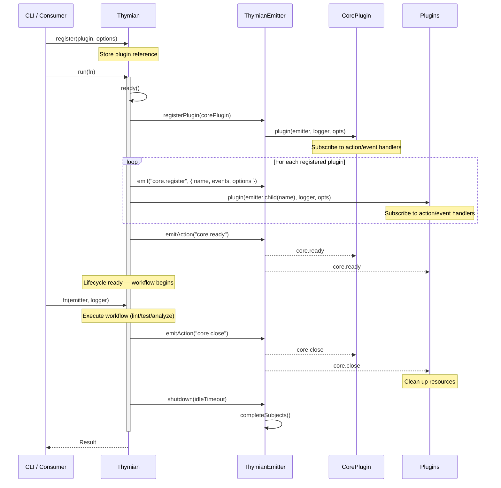
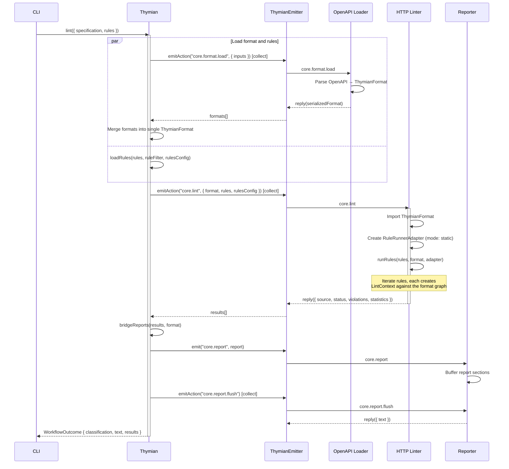
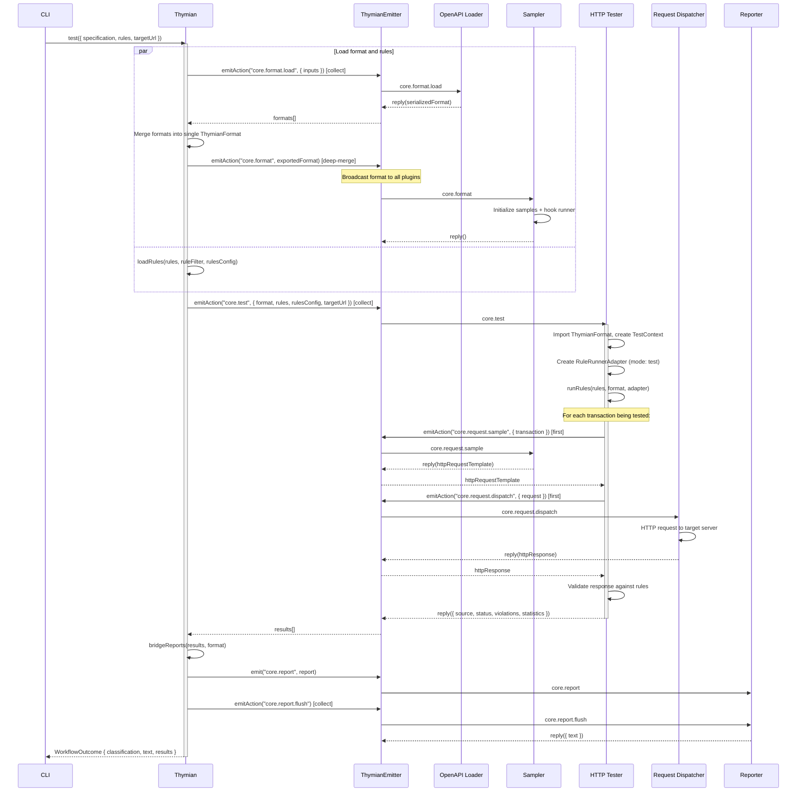
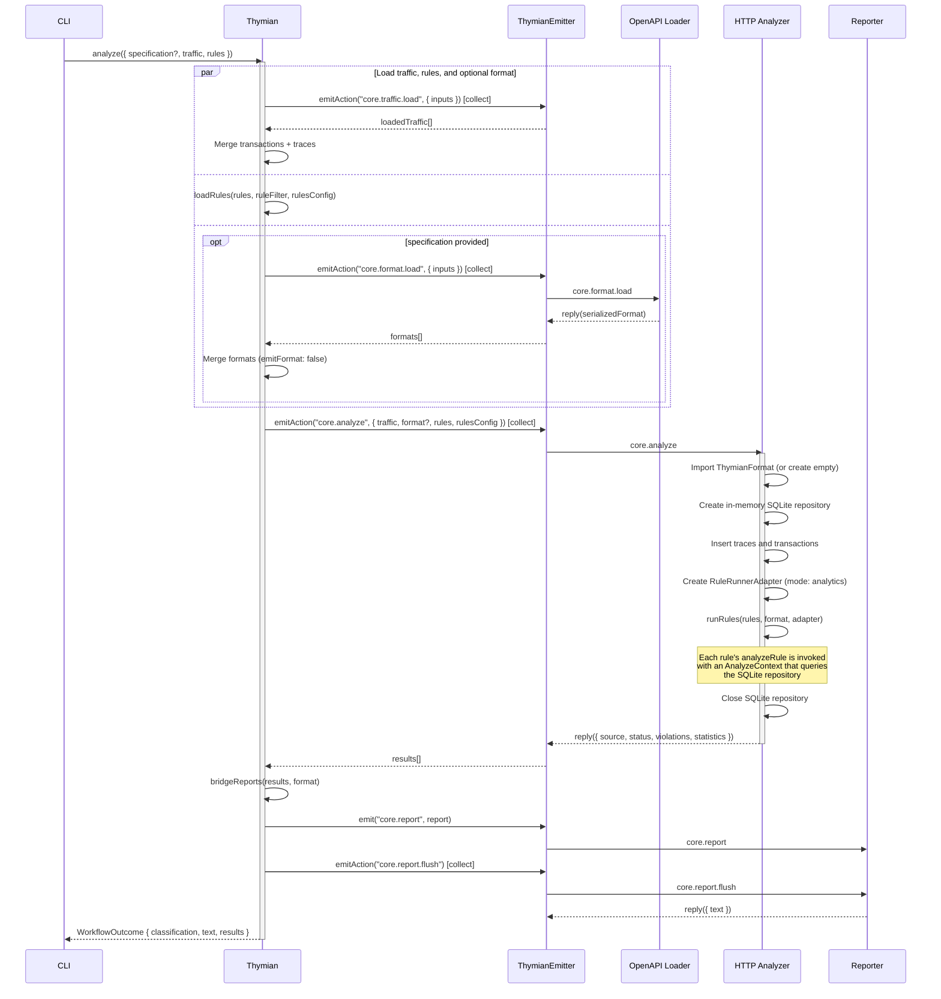

# 6. Runtime View

This chapter describes Thymian's key runtime scenarios. All three validation workflows (lint, test, analyze) follow a shared lifecycle and differ mainly in the data inputs and the plugins that respond to the core workflow action.

## 6.1 Plugin Lifecycle

Every Thymian run follows the same lifecycle, regardless of the specific workflow:

## 6.2 Lint Workflow

The lint workflow performs **static analysis** of an API specification without sending HTTP requests. Core loads the specification and rules in parallel, then delegates static linting to the HTTP Linter plugin via the `core.lint` action.

**Key characteristics:**

- No HTTP requests are sent — analysis is purely static against the ThymianFormat graph.
- `loadFormat` uses `emitFormat: false` — the format is not broadcast to other plugins.
- The `RuleRunnerAdapter` selects each rule's `lintRule` function and creates a `LintContext` (extending `ApiContext`).

## 6.3 Test Workflow

The test workflow performs **live HTTP testing** by generating sample requests from the specification, dispatching them to a target server, and validating the responses against rules.

**Key characteristics:**

- `loadFormat` uses `emitFormat: true` (default) — triggers `core.format` so the Sampler can initialize samples and hook runner.
- The HTTP Tester requests sample data via `core.request.sample` and dispatches HTTP requests via `core.request.dispatch`. Both are **core-owned infrastructure actions** (see [ADR-0010](adr/0010-core-owned-infrastructure-actions.md)).
- The Sampler optionally runs user-defined hooks (`http-testing.beforeRequest`, `http-testing.afterResponse`, `http-testing.authorize`) before/after each request.
- The `RuleRunnerAdapter` selects each rule's `testRule` function and creates a `TestContext`.

## 6.4 Analyze Workflow

The analyze workflow performs **post-hoc validation** of captured HTTP traffic against rules and (optionally) an API specification. Traffic is loaded from external sources (e.g., HAR files), inserted into a SQLite database, and validated by the HTTP Analyzer plugin.

**Key characteristics:**

- The specification is **optional** — the analyze workflow can run with traffic data alone.
- `loadFormat` uses `emitFormat: false` — the format is not broadcast (the Sampler is not involved).
- The HTTP Analyzer creates an ephemeral in-memory SQLite database to store the loaded traffic, enabling SQL-based querying from within `AnalyzeContext`.
- The `RuleRunnerAdapter` selects each rule's `analyzeRule` function and creates an `AnalyzeContext`.
- No HTTP requests are sent — analysis is performed against captured traffic.

## 6.5 Shared Patterns Across Workflows

All three workflows share these patterns:

1. **Parallel loading:** Format/traffic and rules are loaded in parallel using `Promise.all`.
2. **Core-owned orchestration:** The `Thymian` class orchestrates the workflow, while plugins implement the mode-specific execution. See [ADR-0007](adr/0007-core-owns-validation-entrypoints-plugins-own-execution.md).
3. **Action collection strategy:** Workflow actions use `{ strategy: 'collect' }` to gather responses from all listening plugins. Infrastructure actions use `{ strategy: 'first' }` since only one plugin provides the capability.
4. **Report bridging:** The `Thymian` class converts `ValidationResult` violations into structured `ThymianReport` events, which are consumed by the Reporter plugin.
5. **Classification:** Results are classified as `'clean-run'`, `'findings'`, or `'tool-error'` based on the presence and severity of violations.
