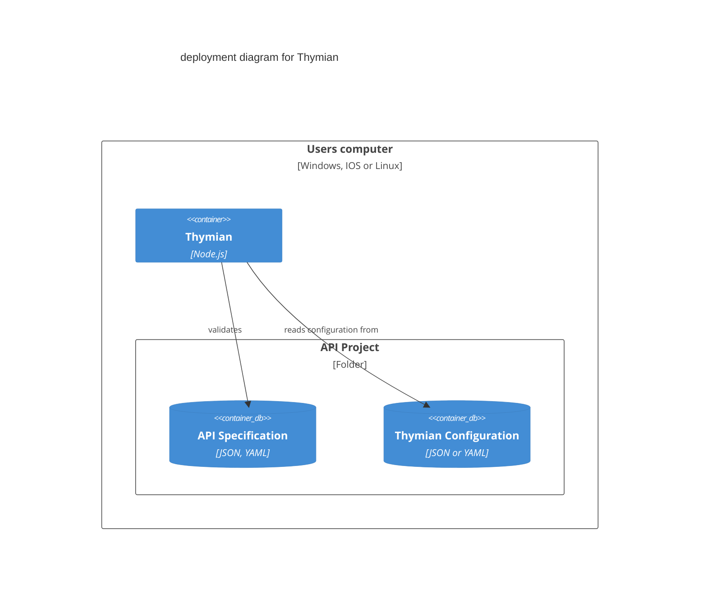
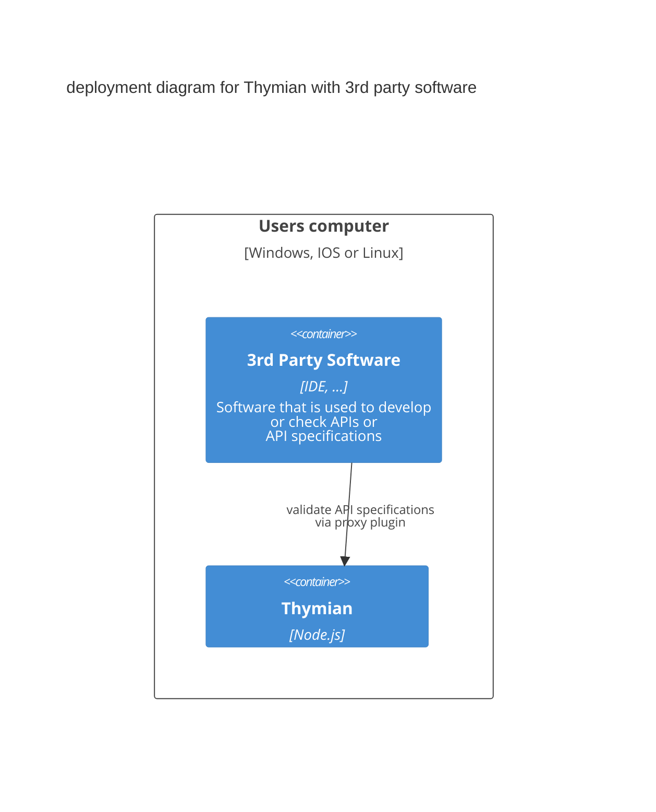

# 7. Deployment View

## 7.1 Deployment for direct use of Thymian

```mermaid
C4Deployment
  title deployment diagram for Thymian

  Deployment_Node(userComputer, "Users computer", "Windows, IOS or Linux") {
    Container(thymian, "Thymian", "Node.js")
    Deployment_Node(project, "API Project", "Folder") {
      ContainerDb(apiSpecification, "API Specification", "JSON, YAML")
      ContainerDb(thymianConfiguration, "Thymian Configuration", "JSON or YAML")
    }

    Rel(thymian, apiSpecification, "validates")
    Rel(thymian, thymianConfiguration, "reads configuration from")

    UpdateRelStyle(thymian, apiSpecification, $offsetX="-40", $offsetY="-10")
    UpdateRelStyle(thymian, thymianConfiguration, $offsetX="-80", $offsetY="-10")
  }
```

## 7.2 Deployment for use via 3rd-party software

```mermaid
C4Deployment
  title deployment diagram for Thymian with 3rd party software
  Deployment_Node(userComputer, "Users computer", "Windows, IOS or Linux") {
    Container(3rdPartySoftware, "3rd Party Software", "IDE, ...", "Software that is used to develop<br>or check APIs or<br>API specifications")
    Container(thymian, "Thymian", "Node.js")
  }

  Rel(3rdPartySoftware, thymian, "validate API specifications<br>via proxy plugin")

  UpdateRelStyle(3rdPartySoftware, thymian, $offsetX="-60")

  UpdateLayoutConfig($c4ShapeInRow="1", $c4BoundaryInRow="1")
```
