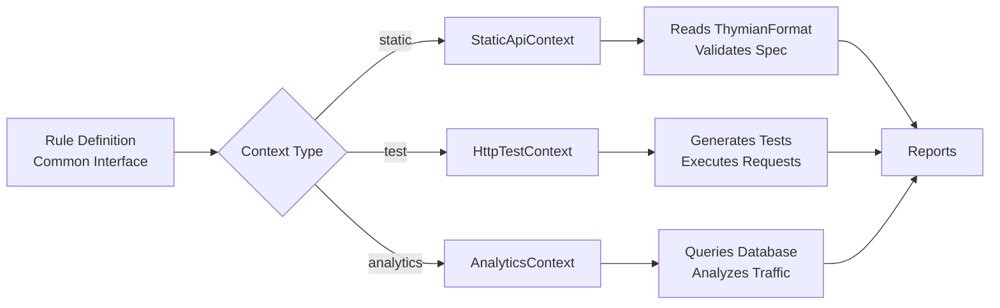

One of the most powerful features of Thymian is the ability to write a single rule that works across multiple validation contexts. This prevents API drift and ensures consistent governance throughout the development lifecycle.

## The Common Interface

The **common interface** allows you to write validation logic once and have it automatically work in static, test, and analytics contexts:

```typescript
import { httpRule } from '@thymian/http-linter';
import { statusCode, not, responseHeader } from '@thymian/core';

export default httpRule('hybrid-rule')
  .severity('error')
  .type('static', 'analytics', 'test') // All three contexts
  .description('401 responses must include WWW-Authenticate header')
  .appliesTo('server')
  .rule((ctx) => ctx.validateCommonHttpTransactions(statusCode(401), not(responseHeader('www-authenticate'))))
  .done();
```

This single rule:

- **Static** — Validates spec definitions
- **Test** — Tests live endpoints
- **Analytics** — Analyzes recorded traffic

## How It Works



The HTTP linter automatically adapts your rule logic to each context:

1. **In static mode** — Extracts transactions from OpenAPI spec
2. **In test mode** — Generates and executes HTTP tests
3. **In analytics mode** — Queries database and validates transactions

## When to Use Hybrid Rules

### Use Case 1: Prevent API Drift

Validate that your implementation matches your specification:

```typescript
import { httpRule } from '@thymian/http-linter';
import { not, requestHeader } from '@thymian/core';

export default httpRule('require-api-version-header')
  .severity('error')
  .type('static', 'test') // Spec AND implementation
  .description('All API requests must include X-API-Version header')
  .appliesTo('client')
  .rule((ctx) => ctx.validateCommonHttpTransactions(not(requestHeader('x-api-version'))))
  .done();
```

**Benefits:**

- Catches spec issues during design (static)
- Catches implementation issues during testing (test)
- Ensures spec and implementation stay in sync

### Use Case 2: Continuous Validation

Validate behavior from testing through production:

```typescript
import { httpRule } from '@thymian/http-linter';
import { statusCodeRange, not, responseMediaType } from '@thymian/core';

export default httpRule('errors-use-problem-details')
  .severity('warn')
  .type('test', 'analytics') // Testing AND production
  .description('Error responses should use application/problem+json')
  .appliesTo('server')
  .rule((ctx) => ctx.validateCommonHttpTransactions(statusCodeRange(400, 599), not(responseMediaType('application/problem+json'))))
  .done();
```

**Benefits:**

- Validates during integration testing (test)
- Monitors production traffic (analytics)
- Catches regressions in either environment

### Use Case 3: Complete Coverage

Validate at all stages of development:

```typescript
import { httpRule } from '@thymian/http-linter';
import { statusCode, not, responseHeader } from '@thymian/core';

export default httpRule('complete-coverage')
  .severity('error')
  .type('static', 'test', 'analytics') // Everywhere
  .description('500 responses must include Content-Type header')
  .appliesTo('server')
  .rule((ctx) => ctx.validateCommonHttpTransactions(statusCode(500), not(responseHeader('content-type'))))
  .done();
```

**Benefits:**

- Catches design issues (static)
- Validates implementation (test)
- Monitors production (analytics)
- Maximum confidence

## Context-Specific Overrides

Sometimes the common interface isn't sufficient and you need different logic for each context. Use override methods:

### Override Pattern

```typescript
export default httpRule('rule-with-overrides')
  .severity('error')
  .type('static', 'test', 'analytics')
  .description('Rule with context-specific logic')
  .appliesTo('server')
  // Common logic (optional when overriding)
  .rule((ctx) => ctx.validateCommonHttpTransactions(statusCode(401), not(responseHeader('www-authenticate'))))
  // Override for test context
  .overrideTest((ctx) => {
    // Custom test logic
  })
  .done();
```

### When to Override

Override a specific context when:

✅ Common interface is insufficient for that context
✅ You need access to context-specific APIs
✅ Performance optimization is needed
✅ The logic fundamentally differs between contexts

### Example: Override Test Context

```typescript
import { httpRule } from '@thymian/http-linter';
import { type JSONSchemaType } from '@thymian/core';
import { and, authorization, constant, method, not, or, responseHeader, responseWith, statusCode } from '@thymian/core';
import { singleTestCase } from '@thymian/http-testing';

type Options = {
  checkAllSecured?: boolean;
};

const optionSchema: JSONSchemaType<Options> = {
  type: 'object',
  additionalProperties: false,
  properties: {
    checkAllSecured: {
      nullable: true,
      type: 'boolean',
      default: false,
    },
  },
};

export default httpRule('401-with-custom-test')
  .severity('error')
  .type('static', 'analytics', 'test')
  .options<Options>(optionSchema)
  .description('401 responses must include WWW-Authenticate header')
  .appliesTo('server')
  // Common logic for static and analytics
  .rule((ctx) => ctx.validateCommonHttpTransactions(statusCode(401), not(responseHeader('www-authenticate'))))
  // Custom test logic
  .overrideTest((testContext, options) =>
    testContext.httpTest(
      singleTestCase()
        .forTransactionsWith(and(not(method('HEAD')), or(and(authorization(), constant(options.checkAllSecured)), responseWith(statusCode(401)))))
        .run()
        .expectForTransactions(responseHeader('www-authenticate'))
        .done(),
    ),
  )
  .done();
```

**Why override?**

- Static and analytics can use simple common logic
- Test needs sophisticated logic to decide which endpoints to test
- Uses rule options to control behavior
- Avoids testing unnecessary endpoints

## Common Hybrid Patterns

### Pattern 1: Static + Analytics

Perfect for validating design and production traffic without active testing:

```typescript
.type('static', 'analytics')
.rule((ctx) =>
  ctx.validateCommonHttpTransactions(
    and(method('DELETE'), statusCodeRange(200, 299)),
    not(or(statusCode(200), statusCode(204)))
  )
)
```

**Use when:**

- Design validation is important
- Production monitoring is needed
- Active testing is not feasible

### Pattern 2: Static + Test

Ideal for preventing drift between specification and implementation:

```typescript
.type('static', 'test')
.rule((ctx) =>
  ctx.validateCommonHttpTransactions(
    method('TRACE'),
    hasRequestBody()
  )
)
```

**Use when:**

- Specification-first workflow
- Integration testing is standard
- Production monitoring is not needed

### Pattern 3: Test + Analytics

Best for runtime validation without spec checking:

```typescript
.type('test', 'analytics')
.rule((ctx) =>
  ctx.validateCommonHttpTransactions(
    and(statusCode(200), requestHeader('if-none-match')),
    not(responseHeader('etag'))
  )
)
```

**Use when:**

- No formal specification exists
- Both testing and production validation are needed
- Design-time checking is not relevant

### Pattern 4: All Three Contexts

Maximum coverage across all stages:

```typescript
.type('static', 'test', 'analytics')
.rule((ctx) =>
  ctx.validateCommonHttpTransactions(
    statusCode(201),
    not(responseHeader('location'))
  )
)
```

**Use when:**

- Critical requirements need full coverage
- API governance is paramount
- Preventing issues at any stage is important

## Advanced: Grouped Validation

For rules that compare multiple transactions, use grouped validation:

```typescript
import { httpRule, type RuleViolation } from '@thymian/http-linter';
import { and, or, method, statusCode, url, equalsIgnoreCase } from '@thymian/core';

export default httpRule('head-matches-get-headers')
  .severity('warn')
  .type('static', 'analytics', 'test')
  .description('HEAD and GET responses should have same headers')
  .appliesTo('server')
  .rule((ctx) =>
    ctx.validateGroupedCommonHttpTransactions(
      and(statusCode(200), or(method('GET'), method('HEAD'))),
      url(), // Group by URL
      (_, transactions) => {
        const getTransaction = transactions.find(([req]) => equalsIgnoreCase(req.method, 'get'));
        const headTransaction = transactions.find(([req]) => equalsIgnoreCase(req.method, 'head'));

        if (!getTransaction || !headTransaction) {
          return undefined;
        }

        const getHeaders = getTransaction[1].headers;
        const headHeaders = headTransaction[1].headers;

        if (arraysEqual(getHeaders, headHeaders)) {
          return undefined;
        }

        return {
          location: {
            elementId: headTransaction[1].id,
            elementType: 'node',
          },
          message: 'HEAD response headers differ from GET',
        } satisfies RuleViolation;
      },
    ),
  )
  .done();

function arraysEqual(a: string[], b: string[]): boolean {
  return a.length === b.length && a.every((val, idx) => val === b[idx]);
}
```

This pattern works across all contexts because:

- **Static** — Groups transactions defined in spec
- **Test** — Generates both GET and HEAD tests, then compares
- **Analytics** — Groups recorded transactions by URL

## Accessing Full Transaction Data

When using the common interface but needing full transaction details:

```typescript
import { httpRule } from '@thymian/http-linter';
import { responseHeader } from '@thymian/core';

export default httpRule('validate-header-value')
  .severity('error')
  .type('static', 'analytics')
  .description('Content-Type header must include charset for text types')
  .appliesTo('server')
  .rule((ctx) =>
    ctx.validateCommonHttpTransactions(responseHeader('content-type'), (request, response) => {
      // Access full response node
      const fullResponse = ctx.format.getNode(response.id);
      if (!fullResponse) return false;

      // Get header value
      const contentType = fullResponse.headers['content-type'];

      // Custom validation
      if (contentType.startsWith('text/') && !contentType.includes('charset')) {
        return true; // Violation!
      }

      return false;
    }),
  )
  .done();
```

This pattern works in all contexts because `ctx.format` is available everywhere.

## Best Practices

### 1. Start with Common Interface

Always start with the common interface:

```typescript
// ✅ Good: Try common interface first
.rule((ctx) =>
  ctx.validateCommonHttpTransactions(filter, violation)
)
```

Only override when necessary:

```typescript
// ✅ Good: Override only when needed
.rule((ctx) => { /* common logic */ })
.overrideTest((ctx) => { /* test-specific logic */ })
```

### 2. Use Type Combinations Thoughtfully

Choose type combinations based on your needs:

```typescript
// ✅ Prevents drift
.type('static', 'test')

// ✅ Monitors testing and production
.type('test', 'analytics')

// ✅ Maximum coverage
.type('static', 'test', 'analytics')

// ❌ Redundant (choose based on need)
.type('static')  // When test or analytics would add value
```

### 3. Document Why Overrides Are Used

When overriding, add comments explaining why:

```typescript
.rule((ctx) => {
  // Common logic works for static and analytics
  return ctx.validateCommonHttpTransactions(...)
})
.overrideTest((ctx) => {
  // Test needs custom logic to avoid testing all secured endpoints
  // This prevents excessive load on the API during testing
  return ctx.httpTest(...)
})
```

### 4. Keep Rules Focused

Each rule should validate one thing:

```typescript
// ✅ Good: Focused validation
httpRule('require-correlation-id')
  .type('static', 'analytics')
  .rule((ctx) => {
    /* single concern */
  });

// ❌ Avoid: Multiple concerns in one rule
httpRule('request-requirements') // Too broad
  .rule((ctx) => {
    /* validates multiple things */
  });
```

### 5. Test Hybrid Rules

Ensure your hybrid rules work correctly in all specified contexts:

```bash
# Test static validation
thymian run --mode static

# Test with live API
thymian run --mode test

# Test with recorded traffic
thymian run --mode analytics
```

## Troubleshooting

### Rule Works in One Context but Not Others

**Problem:** Rule passes in static but fails in test

**Solution:** Check that your filters match differently between contexts:

```typescript
// Static context sees spec definitions
// Test context sees actual responses
// They may differ!

.rule((ctx) =>
  ctx.validateCommonHttpTransactions(
    statusCode(201),
    (req, res) => {
      // Add logging to see what's different
      console.log('Context:', ctx.constructor.name);
      console.log('Response:', res);
      return /* validation */;
    }
  )
)
```

### Common Interface Feels Limiting

**Problem:** Can't express complex logic with filters alone

**Solution:** Use custom validation functions or context overrides:

```typescript
// Instead of complex filters...
.rule((ctx) =>
  ctx.validateCommonHttpTransactions(
    responseHeader('cache-control'),
    (req, res) => {
      // Custom logic with full access
      const fullResponse = ctx.format.getNode(res.id);
      return customValidation(fullResponse);
    }
  )
)
```

## Next Steps

- See [how to use rules](./how-to-use-rules.md) in your projects
- Explore the [CLI tools](./cli.md) for managing rules
- Check the [API reference](https://docs.thymian.dev/api) for advanced patterns
