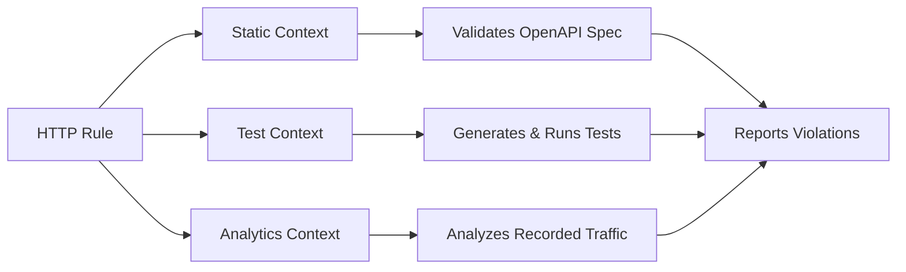

The **@thymian/http-linter** enables you to validate HTTP APIs at every stage of development—from design and implementation to testing and production monitoring. Write validation rules once and apply them across static specifications, live API tests, and recorded traffic analysis.

## Why HTTP Linting?

Modern API development faces several challenges:

- **API drift** between specification and implementation
- **Inconsistent behavior** across endpoints and versions
- **Compliance issues** with HTTP standards or internal guidelines
- **Breaking changes** that affect clients

HTTP linting addresses these challenges by providing automated validation that runs throughout your development lifecycle.

## Key Features

- **Write once, validate everywhere** — Rules work across static specs, live tests, and traffic analysis
- **Powerful filter DSL** — Declaratively match HTTP requests and responses
- **Type-safe** — Full TypeScript support with IDE autocomplete
- **Extensible** — Create and share custom rule sets as npm packages
- **CLI tools** — Generate, search, and manage rules from the command line

## Quick Start

Here's a simple rule that ensures all 401 responses include a `WWW-Authenticate` header:

```typescript
import { httpRule } from '@thymian/http-linter';
import { statusCode, not, responseHeader } from '@thymian/core';

export default httpRule('ensure-401-has-auth-header')
  .severity('error')
  .type('static', 'analytics', 'test')
  .description('401 responses must include WWW-Authenticate header')
  .appliesTo('server')
  .rule((ctx) => ctx.validateCommonHttpTransactions(statusCode(401), not(responseHeader('www-authenticate'))))
  .done();
```

This rule automatically validates:

- **Static specs** — Checks OpenAPI definitions
- **Live tests** — Tests running API endpoints
- **Traffic analysis** — Validates recorded HTTP transactions

## Use Cases

### Prevent API Drift

Validate that your running API matches its specification by applying the same rules to both:

```typescript
// Rule validates both spec and implementation
.type('static', 'test')
```

### Enforce API Governance

Create organization-wide rules for consistent API behavior:

```typescript
// Ensure all successful POST requests return 201
httpRule('post-must-return-201')
  .type('static', 'analytics')
  .rule((ctx) => ctx.validateCommonHttpTransactions(and(method('POST'), successfulStatusCode()), not(statusCode(201))))
  .done();
```

### Validate Production Traffic

Analyze recorded traffic to detect issues in production:

```typescript
// Analytics-only rule for production monitoring
.type('analytics')
```

## How It Works



The HTTP linter provides three validation contexts, each suited for different stages of development:

1. **Static** — Fast validation against API specifications
2. **Test** — Active testing of live endpoints
3. **Analytics** — Passive analysis of recorded HTTP traffic

Rules can target one or more contexts, and the linter automatically adapts the validation logic to each context.

## Documentation

1. [What is an HTTP Rule?](./what-is-an-http-rule.md) — Core concepts and rule anatomy
2. [Creating New Rules](./creating-new-rules.md) — Step-by-step guide to writing rules
3. [Rule Types](./rule-types.md) — Understanding static, test, and analytics contexts
4. [Combining Different Rule Types](./combining-types.md) — Writing hybrid rules
5. [How To Use Rules](./how-to-use-rules.md) — Integration and configuration
6. [CLI](./cli.md) — Command-line tools reference

## Next Steps

- Learn about [HTTP rule fundamentals](./what-is-an-http-rule.md)
- Follow the guide to [create your first rule](./creating-new-rules.md)
- Explore the [CLI tools](./cli.md) for rule generation and management
