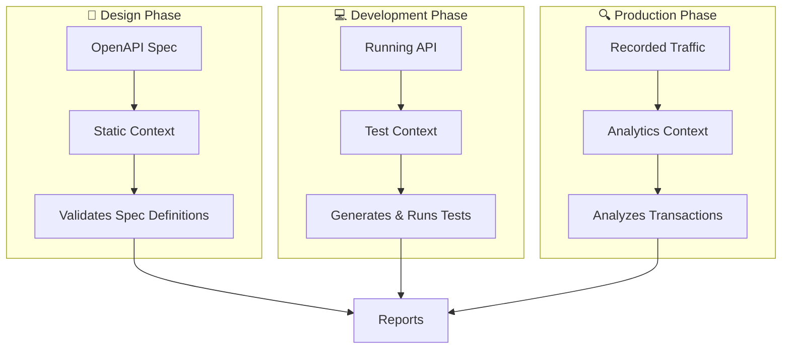

An HTTP rule in Thymian applies the familiar concept of linting—like ESLint for JavaScript—to HTTP APIs. Rules validate that your API follows HTTP specifications, industry best practices, or your organization's guidelines.

## Rules vs. Traditional API Validation

Unlike tools that only validate static OpenAPI documents (like Spectral), Thymian rules work across three contexts:

- **Static validation** — Checks API specifications before implementation
- **Live testing** — Actively tests running API endpoints
- **Traffic analysis** — Validates recorded HTTP transactions

This multi-context approach prevents API drift and ensures governance throughout the development lifecycle.

## Rule Anatomy

Every HTTP rule consists of several components:

```typescript
httpRule('rule-name')
  .severity('error')           // How critical is this rule?
  .type('static', 'test')      // Where does it run?
  .description('...')          // What does it validate?
  .appliesTo('server')         // Who must comply?
  .rule((ctx) => { ... })      // How to validate?
  .done();
```

### Core Components

| Component            | Purpose                 | Example                                    |
| -------------------- | ----------------------- | ------------------------------------------ |
| **Name**             | Unique identifier       | `'no-body-in-get-requests'`                |
| **Severity**         | Impact level            | `'error'`, `'warn'`, `'hint'`              |
| **Type**             | Validation contexts     | `'static'`, `'analytics'`, `'test'`        |
| **Description**      | What the rule validates | `'GET requests should not include a body'` |
| **Applies To**       | Target participant      | `'client'`, `'server'`, `'proxy'`          |
| **Validation Logic** | How to check compliance | Filter expressions or custom functions     |
| **URL** (optional)   | Reference documentation | RFC section or internal docs               |

## The Three Validation Contexts

Thymian provides three distinct contexts for running rules, each suited for different development stages:



### Static Context

**What it validates:** API specifications (OpenAPI documents)

**When to use:** During design and development to catch issues early

**Advantages:**

- Very fast (no network calls)
- Immediate feedback during development
- Prevents issues before implementation

**Example:**

```typescript
// Validates that all 201 responses define a Location header in the spec
.type('static')
.rule((ctx) =>
  ctx.validateCommonHttpTransactions(
    statusCode(201),
    not(responseHeader('location'))
  )
)
```

### Test Context

**What it validates:** Live API endpoints

**When to use:** During integration testing and CI/CD pipelines

**Advantages:**

- Tests actual implementation
- Discovers runtime issues
- Validates server behavior

**Example:**

```typescript
// Actively tests that servers support both GET and HEAD methods
.type('test')
.rule((ctx) =>
  ctx.validateCommonHttpTransactions(
    method('GET'),
    statusCode(501) // Not Implemented
  )
)
```

### Analytics Context

**What it validates:** Recorded HTTP transactions

**When to use:** For production monitoring and traffic analysis

**Advantages:**

- Validates real-world usage
- No impact on running services
- Discovers issues from actual traffic

**Example:**

```typescript
// Analyzes recorded traffic for missing authentication headers
.type('analytics')
.rule((ctx) =>
  ctx.validateCommonHttpTransactions(
    statusCode(401),
    not(responseHeader('www-authenticate'))
  )
)
```

## Comparison Table

| Feature           | Static                | Test                  | Analytics         |
| ----------------- | --------------------- | --------------------- | ----------------- |
| **Speed**         | ⚡ Very Fast          | 🐢 Slow               | ⚡ Fast           |
| **Data Source**   | OpenAPI spec          | Live API              | Recorded traffic  |
| **Network Calls** | No                    | Yes                   | No                |
| **When to Run**   | Design & dev          | CI/CD & dev           | Production & QA   |
| **Catches**       | Spec issues           | Implementation issues | Real-world issues |
| **Coverage**      | All defined endpoints | Tested endpoints      | Used endpoints    |

## The Common Interface

To simplify rule development, Thymian provides a **common interface** that works across all three contexts:

```typescript
httpRule('works-everywhere')
  .type('static', 'analytics', 'test') // Same rule, three contexts
  .rule((ctx) => ctx.validateCommonHttpTransactions(statusCode(500), not(responseHeader('content-type'))))
  .done();
```

This rule automatically:

- Validates spec definitions in **static** mode
- Tests live endpoints in **test** mode
- Analyzes recorded traffic in **analytics** mode

You write the logic once, and Thymian adapts it to each context.

## Rule Metadata

Rules can include additional metadata for documentation and organization:

```typescript
httpRule('comprehensive-rule').severity('error').type('static', 'analytics').url('https://www.rfc-editor.org/rfc/rfc9110.html#section-15.5.1').description('500 responses must include Content-Type header').summary('Missing Content-Type on 500 errors').tags('errors', 'headers', 'http-semantics').appliesTo('server', 'proxy').done();
```

**Use cases for metadata:**

- `url` — Link to specifications or internal documentation
- `summary` — Short description for search and listings
- `tags` — Categorize rules for filtering
- `appliesTo` — Clarify who must follow the rule

## Severity Levels

Rules have three severity levels that indicate their importance:

| Severity  | When to Use                                | Example                                          |
| --------- | ------------------------------------------ | ------------------------------------------------ |
| **error** | Must comply (MUST/MUST NOT in specs)       | `'401 must include WWW-Authenticate'`            |
| **warn**  | Should comply (SHOULD/SHOULD NOT in specs) | `'POST should return 201 for created resources'` |
| **hint**  | Optional (MAY in specs)                    | `'Consider adding Cache-Control headers'`        |

```typescript
// Critical requirement
.severity('error')

// Recommended practice
.severity('warn')

// Optional suggestion
.severity('hint')
```

## Preventing API Drift

One of the most powerful features is using the same rule in multiple contexts:

```typescript
httpRule('consistent-error-responses')
  .severity('error')
  .type('static', 'test') // Both design and implementation
  .description('Error responses must include problem details')
  .rule((ctx) => ctx.validateCommonHttpTransactions(statusCodeRange(400, 599), not(responseMediaType('application/problem+json'))))
  .done();
```

This rule ensures:

1. Your **spec** defines proper error responses (static)
2. Your **implementation** actually returns them (test)

If they diverge, violations are reported in one context or the other.

## Next Steps

Now that you understand what HTTP rules are and how they work:

- Learn [how to create your own rules](./creating-new-rules.md)
- Explore [rule types in depth](./rule-types.md)
- Discover [hybrid rule patterns](./combining-types.md)
