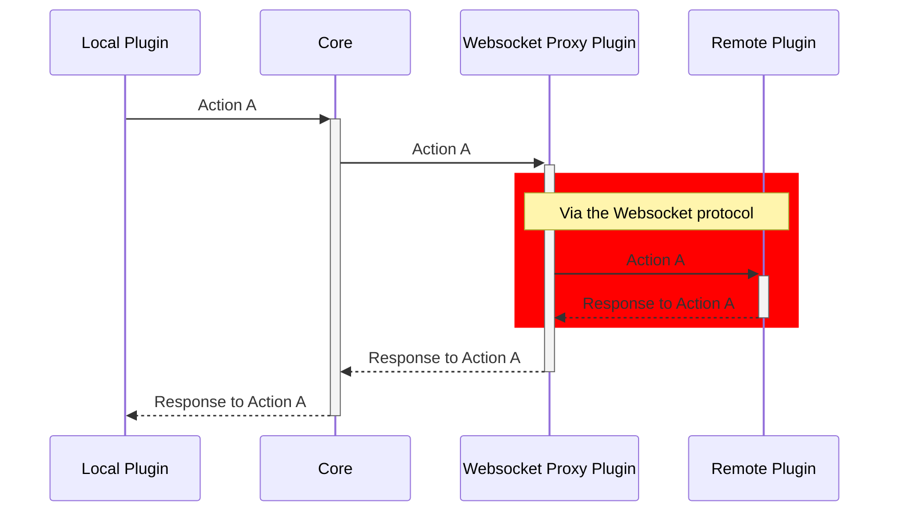

The Websocket Proxy Plugin connects remote plugins to Thymian via WebSockets. This allows plugins to be implemented in any programming language, as long as it supports communication via WebSockets.
Thereby, the Websocket Proxy Plugin provides an interface similar to the `ThymianEmitter` for remote plugins. If you just want to connect a plugin via Websockets, see [here](users-guide.md). If you want to implement a remote plugin using Websockets, see [here](./plugin-developers.md).

## The idea of the Websocket Proxy Plugin

The basic idea of this plugin is to provide an interface for plugins running in a separate process to communicate with Thymian. Therefore the plugin acts as a proxy between the two. It simply listens to every event and actions and forwards them to the remote plugins.
The logic for doing this via WebSockets is completely implemented in the proxy plugin. The core will never know whether an event comes from or goes to a local or remote plugin.

